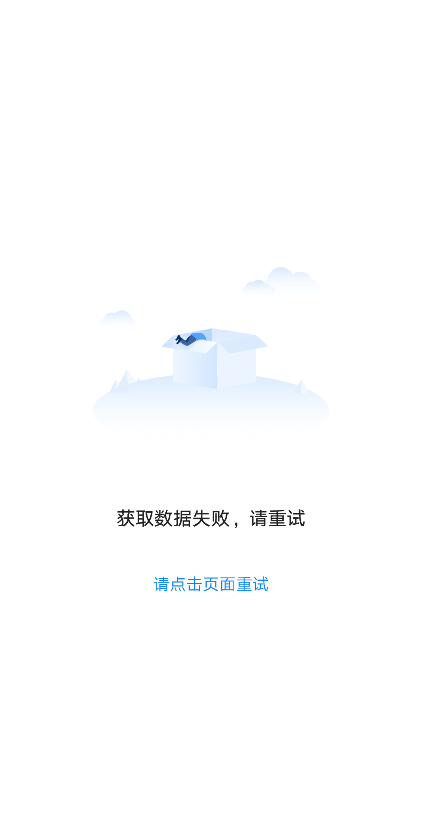

# BrnAbnormalStateWidget

## 一、效果总览


## 二、描述

### 适用场景

1. 页面数据为空的情况，如：网络错误、数据为空的提示和引导
2. 主要分为一下四个部分：
   单按钮：单 Button 样式属于引导比较强的空白页面，有强烈的引导用户点击跳转的功能
   双按钮：适用于所有同等级按钮的页面
   文字链：文字链按钮是操作区中引导最弱的按钮，一般用在网络比较差，引导用户“点击刷新”的页面
   小模块空态：小的内容模块的空态，只需清晰的文字说明即可。文字 与 单按钮、双按钮一般不同时存在

## 三、构造函数及参数说明

### 构造函数

```dart
BrnAbnormalStateWidget({
    this.img,
    this.title,
    this.content,
    this.operateAreaType: OperateAreaType.TextButton,
    this.operateTexts,
    this.action,
    this.enablePageTap: false,
    this.topOffset,
    this.bgColor: Colors.white,
    this.isCenterVertical = false,
    this.topPercent: 0.08,
    this.themeData,
  }) {
    this.themeData ??= BrnAbnormalStateConfig();
    this.themeData = BrnThemeConfigurator.instance
        .getConfig(configId: this.themeData!.configId)
        .abnormalStateConfig
        .merge(this.themeData);
  }
```

### 参数说明

| **参数名**       | **参数类型**                                                 | **描述**                                                     | **是否必填** | **默认值**                 |
| ---------------- | ------------------------------------------------------------ | ------------------------------------------------------------ | ------------ | -------------------------- |
| img              | Image?                                                       | 图片                                                         | 否           | null                       |
| title            | String?                                                      | 标题                                                         | 否           | null                       |
| content          | String?                                                      | 内容                                                         | 否           | null                       |
| operateAreaType  | enum OperateAreaType { SingleButton, DoubleButton, TextButton } | 操作区类型。SingleButton 为【单按钮】效果 DoubleButton 为【双按钮】效果 TextButton 为【文字链】效果 | 否           | OperateAreaType.TextButton |
| operateTexts     | `List<String>?`                                              | 操作区文案                                                   | 否           | null                       |
| action           | `BrnEmptyStatusIndexedActionClickCallback? = void Function(int index)index?` | 点击回调，在 SingleButton 类型或者 enablePageTap = true 点击空白区域时返回 0；其他根据点击的位置返回。 | 否           |                            |
| enablePageTap    | bool                                                         | 空白区域是否可点击                                           | 否           | false                      |
| topOffset        | double?                                                      | 顶部距离，默认为 null，走自动计算逻辑：父视图高度的 8%，可自己指定高度 | 否           | null                       |
| bgColor          | Color                                                        | 背景色                                                       | 否           | Colors.white               |
| isCenterVertical | bool                                                         | 内容是否垂直居中                                             | 否           | false                      |
| topPercent       | double                                                       | 距顶部高度百分比                                             | 否           | 0.08                       |
| themeData        | BrnAbnormalStateConfig?                                      | 主题配置                                                     | 否           | 无                         |

## 四、代码演示

### 效果 1：异常信息+操作


```dart
BrnAbnormalStateWidget(
    img: Image.asset(
      'assets/image/content_failed.png',
      scale: 3.0,
    ),
    isCenterVertical: true,
    title: "获取数据失败，请重试",
    operateTexts: <String>["请点击页面重试"],
    operateAreaType: OperateAreaType.textButton,
    action: (index) {
      BrnToast.show("获取数据失败，请重试", context);
    },
  )
```

### 效果 2：异常展示


```dart
BrnAbnormalStateWidget(
      img: Image.asset(
        'assets/image/network_error.png',
        scale: 3.0,
      ),
      title: '网络数据异常',
);
```

### 效果 3：大模块空态


```dart
BrnAbnormalStateWidget(
      img: Image.asset(
        'assets/image/no_data.png',
        scale: 3.0,
      ),
      content: '您的门店暂无用户',
);
```

### 效果 4:单按钮效果


```dart
BrnAbnormalStateWidget(
      img: Image.asset(
        'assets/image/no_data.png',
        scale: 3.0,
      ),
      title: "这是副标题内容这是副标题内容这是副标",
      content: '您的门店暂无用户',
      operateAreaType: OperateAreaType.singleButton,
      operateTexts: ["切换账号"],
      action: (_) {
        BrnToast.show("第$_个按钮被点击了", context);
      },
);
```

### 效果 5：双按钮效果


```dart
BrnAbnormalStateWidget(
      img: Image.asset(
        'assets/image/no_data.png',
        scale: 3.0,
      ),
      title: "暂无",
      content: '您还没有在维护的信息哦',
      operateAreaType: OperateAreaType.doubleButton,
      operateTexts: ['去添加', '去修改'],
      action: (_) {
        BrnToast.show("第$_个按钮被点击了", context);
      },
);
```
