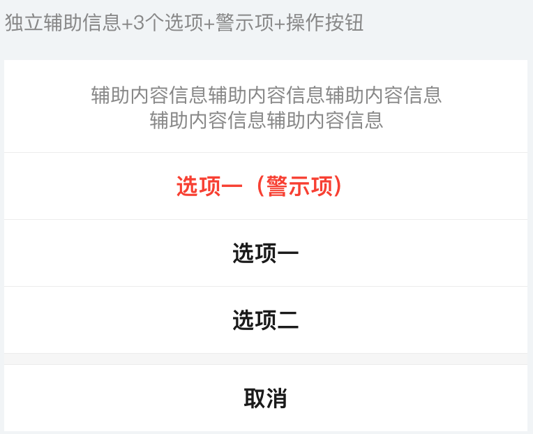
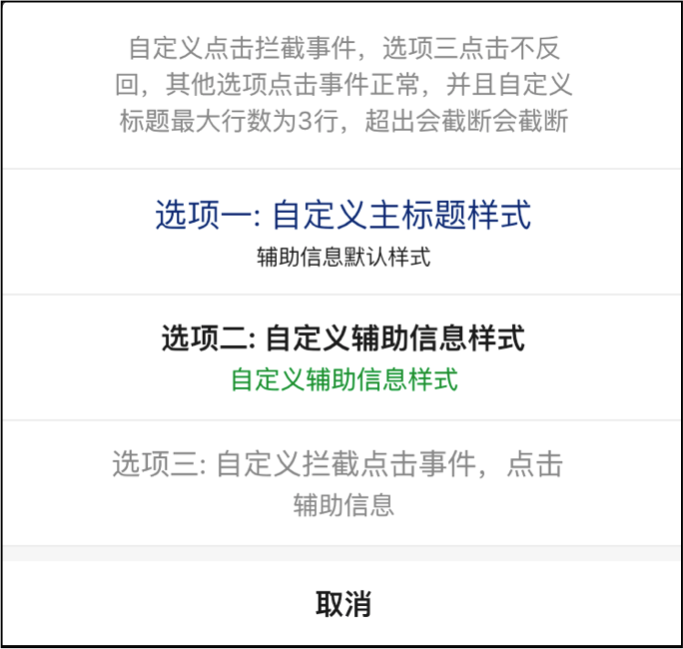
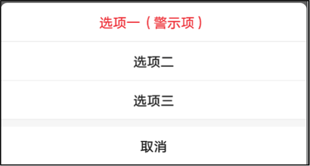
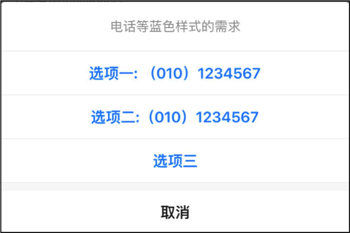

# BrnCommonActionSheet

通用 ActionSheet

## 一、效果总览




## 二、描述

### 适用场景

1. 吸底列表弹框
2. 可自定义列表标题文案（不传则不显示标题栏），列表内每行元素文案（包括：主标题，辅助信息），自定义“取消”按钮文案，及各项文案颜色。
3. 可自定义每行点击回调动作（默认除列表标题外，每行点击后 actionSheet 自动消失）
4. 可自定义拦截每行点击事件（拦截后自行处理，拦截返回 true则 actionSheet 自动消失并执行点击回调，否则不执行）
5. 可通过设定 style 属性来设定警示项或链接（警示项内所有文字颜色为红色，链接为蓝色）
6. 可自定义每行文案样式（主标题、辅助信息），自定义样式覆盖 style

## 三、构造函数及参数说明

### 构造函数

```dart
BrnCommonActionSheet({
  required this.actions,
  this.title,
  this.titleWidget,
  this.cancelTitle,
  this.clickCallBack,
  this.separatorLineColor,
  this.spaceColor = const Color(0xfff8f8f8),
  this.maxTitleLines = 2,
  this.maxSheetHeight = 0,
  this.onItemClickInterceptor,
  this.themeData,
}) {
  themeData ??= BrnActionSheetConfig();
  themeData = BrnThemeConfigurator.instance
      .getConfig(configId: themeData!.configId)
      .actionSheetConfig
      .merge(themeData);
}
```

### 参数说明

| **参数名**                                                   | **参数类型**                              | **描述**                                                     | **是否必填** | **默认值**                |
| ------------------------------------------------------------ | ----------------------------------------- | ------------------------------------------------------------ | ------------ | ------------------------- |
| actions                                                      | `List<BrnCommonActionSheetItem>`          | 用于存储每个选项的相关配置信息的列表（BrnActionItem 含有参数 title---选项标题文案(**必填**)，desc----辅助信息文案，actionEleStyle----普通项或警示项，titleStyle---自定义主标题文本样式（覆盖 actionEleStyle）descStyle---自定义辅助信息文本样式（覆盖 actionEleStyle）） | 是           | 空                        |
| title                                                        | String?                                   | 列表标题的文案                                               | 否           | 空                        |
| titleWidget                                                  | Widget?                                   | 列表标题区域自定义 Widget                                    | 否           | 空                        |
| cancelTitle                                                  | String?                                   | 取消按钮的文案                                               | 否           | ''取消''                  |
| maxTitleLines                                                | Int                                       | 列表标题文案最大行数                                         | 否           | 2                         |
| onItemClickInterceptor                                       | BrnCommonActionSheetItemClickInterceptor? | **返回值为 bool**，返回值用于判断是否拦截点击事件，如果为**true**将拦截，用户点击将**不会触发 clickCallBack**，当前 actionSheet 也**不会消失**。如果为**false**，则不会造成任何影响，只是提前拦截了一下点击事件。 | 否           | 空                        |
| clickCallBack(默认回调后会执行 pop 操作，如过不想 pop，请使用 onItemClickInterceptor) | BrnCommonActionSheetItemClickCallBack?    | **返回值为 void**，点击后回调方法（方法传参为被点击的按钮的**index**及相关配置信息**BrnActionItem**），使用者**根据参数自行配置响应动作**。 | 是           | 空                        |
| spaceColor                                                   | Color                                     | “取消”按钮上方间隔颜色                                       | 否           | **Color(0xfff8f8f8)**浅灰 |
| separatorLineColor                                           | Color?                                    | 分割线颜色                                                   | 否           | **Color(0xfff0f0f0)**浅灰 |
| maxSheetHeight                                               | double                                    | 列表最大高度限制                                             | 否           | 默认为0                   |
| themeData                                                    | BrnActionSheetConfig?                     | ActionSheet 主题配置类，支持配置字段详见 BrnActionSheetConfig | 否           |                           |

## 四、代码演示

### 效果 1：首行纯辅助信息+首项警示项


```dart
List<BrnCommonActionSheetItem> actions = [];
actions.add(BrnCommonActionSheetItem(
  '选项一（警示项）',
  desc: '辅助信息辅助信息辅助信息',
  actionStyle: BrnCommonActionSheetItemStyle.alert,
));
actions.add(BrnCommonActionSheetItem(
  '选项二',
  desc: '辅助信息辅助信息辅助信息',
  actionStyle: BrnCommonActionSheetItemStyle.normal,
));
actions.add(BrnCommonActionSheetItem(
  '选项三',
  desc: '辅助信息辅助信息辅助信息',
  actionStyle: BrnCommonActionSheetItemStyle.normal,
));

// 展示actionSheet
showModalBottomSheet(
  context: context,
  backgroundColor: Colors.transparent,
  builder: (BuildContext context) {
    return BrnCommonActionSheet(
      title: "辅助内容辅助内容辅助内容辅助内容辅助内容辅助内容辅助内容辅助内容辅助内容辅助内容辅助内容辅助内容",
      actions: actions,
      cancelTitle: "自定义取消名称",
      clickCallBack: (int index, BrnCommonActionSheetItem actionEle) {
        String title = actionEle.title;
        BrnToast.show("title: $title, index: $index", context);
      },
    );
  });
```

### 效果 2：无独立辅助信息+首项警示项+每项辅助信息



```dart
List<BrnCommonActionSheetItem> actions = [];
  actions.add(BrnCommonActionSheetItem(
    '选项一（警示项）',
    actionStyle: BrnCommonActionSheetItemStyle.alert,
  ));
  actions.add(BrnCommonActionSheetItem(
    '选项二',
    actionStyle: BrnCommonActionSheetItemStyle.normal,
  ));
  actions.add(BrnCommonActionSheetItem(
    '选项三',
    actionStyle: BrnCommonActionSheetItemStyle.normal,
  ));

  // 展示actionSheet
  showModalBottomSheet(
    context: context,
    backgroundColor: Colors.transparent,
    builder: (BuildContext context) {
      return BrnCommonActionSheet(
        actions: actions,
        clickCallBack: (
          int index,
          BrnCommonActionSheetItem actionEle,
        ) {
          String title = actionEle.title;
          BrnToast.show("title: $title, index: $index", context);
        },
      );
    });
```

### 效果 3：无独立辅助信息+蓝色样式



```dart
List<BrnCommonActionSheetItem> actions = [];
  actions.add(BrnCommonActionSheetItem(
    '选项一: （010）1234567',
    actionStyle: BrnCommonActionSheetItemStyle.link,
  ));
  actions.add(BrnCommonActionSheetItem(
    '选项二:（010）1234567',
    actionStyle: BrnCommonActionSheetItemStyle.link,
  ));
  actions.add(BrnCommonActionSheetItem(
    '选项三',
    actionStyle: BrnCommonActionSheetItemStyle.link,
  ));

  // 展示actionSheet
  showModalBottomSheet(
      context: context,
      backgroundColor: Colors.transparent,
      builder: (BuildContext context) {
        return BrnCommonActionSheet(
          title: "电话等蓝色样式的需求",
          actions: actions,
          clickCallBack: (
            int index,
            BrnCommonActionSheetItem actionEle,
          ) {
            String title = actionEle.title;
            BrnToast.show("title: $title, index: $index", context);
          },
        );
      });
```

### 效果 4：列表标题信息（自定义最大行数）+自定义选项文案样式+拦截选项三点击事件


```dart
List<BrnCommonActionSheetItem> actions = [];
actions.add(
  BrnCommonActionSheetItem(
    '选项一: 自定义主标题样式',
    desc: '辅助信息默认样式',
    titleStyle: TextStyle(
      fontSize: 18,
      color: Color(0xFF123984),
    ),
  ),
);
actions.add(
  BrnCommonActionSheetItem(
    '选项二: 自定义辅助信息样式',
    desc: '自定义辅助信息样式',
    descStyle: TextStyle(
      fontSize: 14,
      color: Color(0xFF129834),
    ),
  ),
);
actions.add(
  BrnCommonActionSheetItem(
    '选项三: 自定义拦截点击事件，点击无效',
    desc: '辅助信息',
    titleStyle: TextStyle(
      fontSize: 16,
      color: Color(0xFF999999),
    ),
    descStyle: TextStyle(
      fontSize: 14,
      color: Color(0xFF999999),
    ),
  ),
);

// 展示actionSheet
showModalBottomSheet(
  context: context,
  backgroundColor: Colors.transparent,
  builder: (BuildContext context) {
    return BrnCommonActionSheet(
      title: "自定义点击拦截事件，选项三点击不反回，其他选项点击事件正常，并且自定义标题最大行数为3行，超出会截断会截断会截断",
      actions: actions,
      maxTitleLines: 3,
      clickCallBack: (
        int index,
        BrnCommonActionSheetItem actionEle,
      ) {
        String title = actionEle.title;
        BrnToast.show("title: $title, index: $index", context);
      },
      onItemClickInterceptor: (
        int index,
        BrnCommonActionSheetItem actionEle,
      ) {
        // 选项三点击事件被拦截，不作处理
        if (index == 2) {
          BrnToast.show("被拦截了", context);
          return true;
        }
        // 其他选项正常
        return false;
      },
    );
  });
```
