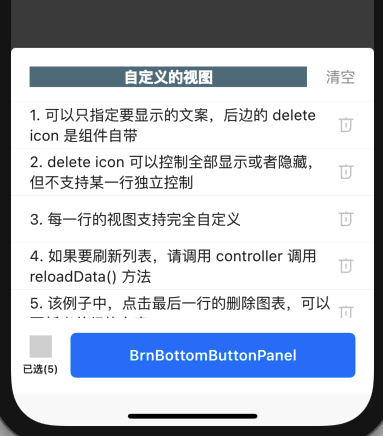
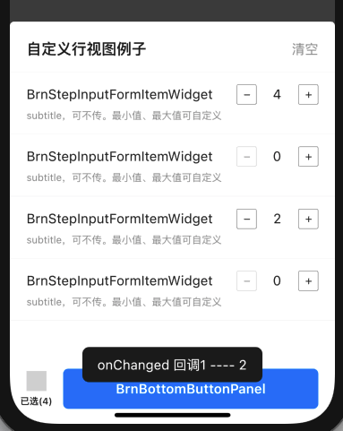
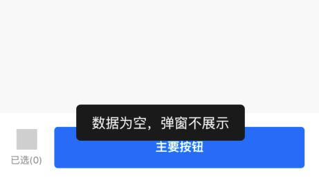

## BrnSelectedListActionSheet

已选列表 actionSheet 组件。

## 一、效果总览



## 二、描述

### 适用场景

需要弹窗编辑已选择的数据列表的业务场景。

### 交互规则

1. 通用的已选列表弹窗。包括顶部工具条和中间的数据列表两部分，不包括底部的按钮交互区域，底部的按钮Demo中使用的是 [BrnBottomButtonPanel](../widgets/brn-button-panel)。整体布局通过`OverlayEntry` 实现，将控制列表的控制功能和已选列表视图独立开来，一来可以更加方便的控制列表，二来可以充分自定义控制列表的功能区域。
2. 工具条：包括关闭弹窗和清空按钮。
3. 数据列表中每一行，从左至右依次是`icon`(高50，宽45)、文本和移除按钮。
4. 最小行高50，如果是自定义每行视图，则高度自动撑开。
5. 数据为空时不展示。

### 注意事项

外界需要自己监听 Android 上的系统返回按键点击事件，并且调用关闭组件的方法！否则，组件有可能不能正常关闭。可以通过如下方式拦截安卓系统返回事件，正确关闭已选列表。

```dart
WillPopScope(  
  onWillPop: () async {  
    // 判断已选列表是否显示，controller 需要外部初始化并传入到组件 
    if (!controller.isHidden) {  
      controller.dismiss();  
      return false;  
    }  
    return true;  
  },  
  // 自定义视图  
  child: Scaffold()
) 
```

## 二、构造函数和参数说明

### 构造函数

```dart
BrnSelectedListActionSheet(
  {required this.context,
  this.maxHeight = 290,
  this.bottomOffset = 82,
  this.title,
  this.titleWidget,
  this.isClearButtonHidden = false,
  this.isDeleteButtonHidden = false,
  this.itemIconImage,
  required this.items,
  required this.itemTitleBuilder,
  this.onClear,
  this.onClearConfirmed,
  this.onClearCanceled,
  this.onItemDelete,
  this.onListShowed,
  this.onListDismissed,
  this.controller});
```

### 参数配置

| **参数名** | **参数类型** | **作用** | **是否必填** | **默认值** |
| --- | --- | --- | --- | --- |
| `context` | `BuildContext` | 构建context | 是 | 无 |
| `items` | `List<T>` | 数据列表模型 | 是 | 无 |
| `itemTitleBuilder` | `void dynamic Function(int index, T entity)` | 每行视图构建的回调。可返回 `String`或者`Widget`。返回 `String` 的话，内部会通过默认方式创建 `Text`，自动折行并展示文字。返回 `widget` ，默认是业务方自定义每一行的视图，此时左侧的`itemIconImage`自动隐藏，自定义视图显示的范围为从最左到右边的删除按钮的左侧（可通过`isDeleteButtonHidden`隐藏删除按钮） | 是 | 无 |
| controller | `BrnSelectedItemListActionSheetWidgetController?` | 控制视图隐藏/刷新列表等方法 | 否 | 无 |
| `maxHeight` | `double` | 列表的最大高度，小于这个高度视图自适应，超过该值，组件高度固定，列表内容滑动。列表内容的高度=maxHeight-65 | 否 | 290 |
| `bottomOffset` | `double` | 列表关闭动画结束时底部的 y。0 会和屏幕的底部重合。不能为负值！ | 否 | 默认值 82 |
| `title` | `String?` | 弹窗标题 | 否 | 无，标题默认样式 `TextStyle(fontSize: 18,color: Color(0xff222222),fontWeight: FontWeight.w600,decoration: TextDecoration.none)` |
| `titleWidget` | `Widget?` | 自定义标题视图。默认外层有 `const EdgeInsets.fromLTRB(20, 20, 20, 15)` 的 padding，且优先级比 title 高 | 否 | 无 |
| `isClearButtonHidden` | `bool` | 是否隐藏顶部工具条中的清空按钮 | 否 | `false` |
| `isDeleteButtonHidden` | `bool` | 每一行删除按钮是否隐藏。如果不显示，自定义每一行 `widget` 时内容可以填充整行 | 否 | `false` |
| `itemIconImage` | `Image?` | 每一行前边的 `icon`，可不传，如果该 `image` 没有设置，并且 `itemTitleBuilder` 返回的是自定义 `widget`，则该 `widget`自动填充整行区域 | 否 | 无 |
| `onClear` | `VoidCallback?` | 清空按钮点击之后，确认弹窗 确定 按钮的点击回调 | 否 | 无 |
| `onClearCanceled` | `VoidCallback?` | 清空按钮点击之后，确认弹窗 `取消` 按钮的点击回调 | 否 | 无 |
| `onClearConfirmed` | `VoidCallback?` | 清空按钮点击显示默认确认弹窗之后，`确定` 按钮的点击回调 | 否 | 无 |
| `onItemDelete` | `bool Function(int deleteIdx, T deleteEntity)?` | 每一行删除按钮的点击回调。返回值：是否要删除该 entity，如果该回调没有实现或者返回 true，则删除 | 否 | 无 |
| `onListDismissed` | `void Function(bool isClosedByClearButton)?` | 视图隐藏时的回调，`isClosedByClearButton`是否是清空按钮触发的关闭视图 | 否 | 无 |
| `onListShowed` | `VoidCallback?` | 视图显示时的回调 | 否 | 无 |

| 方法名称                                                     | 作用                                                         |
| ------------------------------------------------------------ | ------------------------------------------------------------ |
| `void showWithTargetKey({required GlobalKey bottomWidgetKey})` | 显示已选列表。bottomWidgetKey: 已选列表下边操作视图绑定的 GlobalKey，组件内会自动与操作区域左右对齐，且从操作区域的顶部滑出 |
| `void show()`                                                | 展示列表。请通过 controller 控制关闭列表                     |

### 其他参数说明

#### BrnSelectedListActionSheetController

| 方法名称            | 作用                 |
| ------------------- | -------------------- |
| `void reloadData()` | 刷新整个列表数据     |
| `void dismiss()`    | 关闭列表             |
| `bool get isHidden` | 当前列表视图是否关闭 |

## 四、代码演示

###  效果1：列表显示文字+自定义标题视图


```dart
List _data = [
      '1. 可以只指定要显示的文案，后边的 delete icon 是组件自带',
      '2. delete icon 可以控制全部显示或者隐藏，但不支持某一行独立控制',
      '3. 每一行的视图支持完全自定义',
      '4. 如果要刷新列表，请调用 controller 调用 reloadData() 方法 ',
      '5. 该例子中，点击最后一行的删除图表，可以更新当前行的文案'
    ];
BrnSelectedListActionSheetController controller = BrnSelectedListActionSheetController();

@override
Widget build(BuildContext context) {
  /// 要拦截 Android 的系统返回行为，请务必自行添加以下 WillPopScope 逻辑
  return WillPopScope(
    onWillPop: () async {
      if (!controller.isHidden) {
        controller.dismiss();
        return false;
      }
      return true;
    },
    child: Scaffold(
        appBar: BrnAppBar(
          title: '已选菜单列表',
        ),
        body: SafeArea(
          child: Column(
            mainAxisAlignment: MainAxisAlignment.end,
            children: <Widget>[
              BrnBottomButtonPanel(
                  mainButtonName: 'BrnBottomButtonPanel',
                  mainButtonOnTap: () {
                    BrnToast.show('确定！sheet 的数据源长度 ${_data.length}', context);
                  },
                  iconButtonList: [
                    BrnVerticalIconButton(
                        name: '已选(${_data.length})',
                        iconWidget: BrunoTools.getAssetImage(
                            'icons/grey_place_holder.png'),
                        onTap: () {
                          if (!controller.isHidden) {
                            controller.dismiss();
                          } else {
                            if ( _data.length <= 0) {
                              BrnToast.show('数据为空，弹窗不展示', context);
                              return;
                            }
                            BrnSelectedListActionSheet<String>(
                                context: context,
                                isClearButtonHidden: false,
                                isDeleteButtonHidden: false,
                                items: _data,
                                bottomOffset: 82,
                                controller: controller,
                                title: '已选标题，优先级没有titleWidget高',
                                titleWidget: Container(
                                  color: Colors.blueGrey,
                                  child: Center(
                                    child: Text(
                                      '自定义的视图',
                                      style: TextStyle(
                                        color: Colors.white,
                                        fontSize: 16,
                                        decoration: TextDecoration.none,
                                      ),
                                    ),
                                  ),
                                ),
                                itemTitleBuilder: (int index, String entity) {
                                  return entity;
                                },
                                onClear: () {
                                  controller.dismiss();
                                  // 自定义清空的操作，可以不实现，会走默认的清空操作。
                                  BrnDialogManager.showConfirmDialog(context,
                                      title: "确定要清空已选列表吗?",
                                      cancel: '取消',
                                      confirm: '确定', onConfirm: () {
                                    setState(() {});
                                    _data.clear();
                                  }, onCancel: () {});
                                },
                                onClearCanceled: () {
                                  BrnToast.show("取消!!!!", context);
                                },
                                onClearConfirmed: () {
                                  setState(() {});
                                  BrnToast.show("确定!!!!", context);
                                },
                                onListDismissed:
                                    (bool isClosedByClearButton) {
                                  BrnToast.show(
                                      "消失了!!!!$isClosedByClearButton",
                                      context);
                                },
                                onListShowed: () {
                                  BrnToast.show("显示了哦~~", context);
                                },
                                onItemDelete: (int idx, String entity) {
                                  _data[idx] = '$idx 变化了哈';
                                  controller.reloadData();
                                  BrnToast.show("$idx 奇数行无法删除", context);
                                  return true;
                                }).show();
                          }
                        })
                  ]),
            ],
          ),
        )),
  );
}
```
### 效果2：自定义列表每行视图




```dart
List _data = ['数据源1', '数据源2', '数据源3', '数据源4']; 
var _bottomActionKey = GlobalKey();  
controller = BrnSelectedItemListActionSheetWidgetController();  
  
@override
Widget build(BuildContext context) {
  /// 要拦截 Android 的系统返回行为，请务必自行添加以下 WillPopScope 逻辑
  return WillPopScope(
    onWillPop: () async {
      if (!controller.isHidden) {
        controller.dismiss();
        return false;
      }
      return true;
    },
    child: Scaffold(
        appBar: BrnAppBar(
          title: '已选菜单列表',
        ),
        body: Column(
          mainAxisAlignment: MainAxisAlignment.end,
          children: <Widget>[
            BrnBottomButtonPanel(
                key: _bottomActionKey,
                mainButtonName: 'BrnBottomButtonPanel',
                mainButtonOnTap: () {
                  BrnToast.show('确定！sheet 的数据源长度 ${_data.length}', context);
                },
                iconButtonList: [
                  BrnVerticalIconButton(
                      name: '已选(${_data.length})',
                      iconWidget: BrunoTools.getAssetImage(
                          'icons/grey_place_holder.png'),
                      onTap: () {
                        if (!controller.isHidden) {
                          controller.dismiss();
                        } else {
                          if (_data.length <= 0) {
                            BrnToast.show('数据为空，弹窗不展示', context);
                            return;
                          }
                          BrnSelectedListActionSheet<String>(
                                  context: context,
                                  isClearButtonHidden: false,
                                  isDeleteButtonHidden: true,
                                  items: _data,
                                  bottomOffset: 82,
                                  maxHeight: 400,
                                  controller: controller,
                                  title: '自定义行视图例子',
                                  itemTitleBuilder: (int index, String entity) {
                                    return Material(
                                      child: BrnStepInputFormItem(
                                        title: 'BrnStepInputFormItemWidget',
                                        subTitle: 'subtitle，可不传。最小值、最大值可自定义',
                                        minLimit: 0,
                                        maxLimit: 10,
                                        onChanged:
                                            (int oldValue, int newValue) {
                                          BrnToast.show(
                                              "onChanged 回调$oldValue ---- $newValue",
                                              context);
                                        },
                                      ),
                                    );
                                  },
                                  onClear: () {
                                    controller.dismiss();
                                    // 自定义清空的操作，可以不实现，会走默认的清空操作。
                                    BrnDialogManager.showConfirmDialog(
                                        context,
                                        title: "确定要清空已选列表吗?",
                                        cancel: '取消',
                                        confirm: '确定', onConfirm: () {
                                      setState(() {});
                                      _data.clear();
                                    }, onCancel: () {});
                                  })
                              .showWithTargetKey(
                                  bottomWidgetKey: _bottomActionKey);
                        }
                      })
                ]),
          ],
        )),
  );
}
```

### 效果3：空数据

