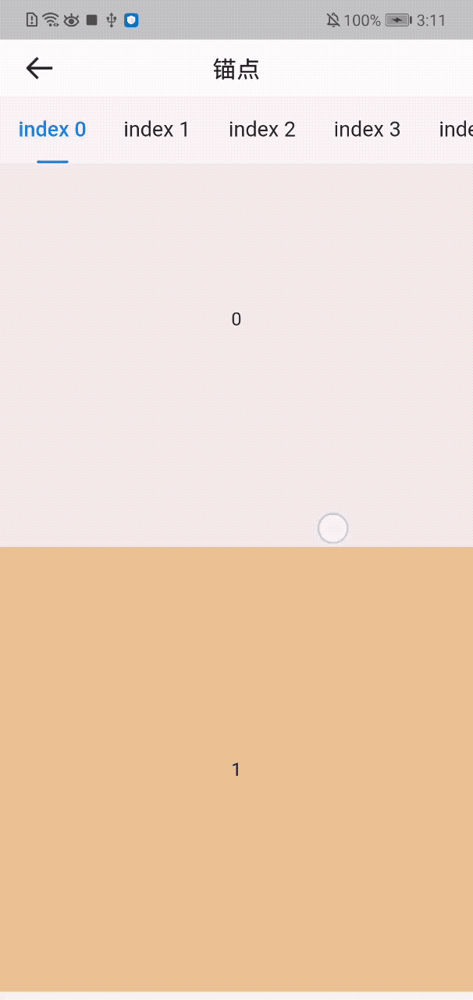

# BrnAnchorTab

锚点定位

## 一、效果总览




## 二、描述

### 注意事项

1. 该组件提供了tab和下面list绑定滑动的功能，使用者只需要提供tab的widget和待滚动的数组widget即可。

2. 由于flutter不支持预加载，因此异步的卡片，会造成计算不准确。

## 三、构造函数和参数说明

### 构造函数

```dart
BrnAnchorTab(
  {required this.widgetIndexedBuilder,
  required this.tabIndexedBuilder,
  required this.itemCount,
  this.tabDivider,
  this.tabBarStyle = const BrnAnchorTabBarStyle()});
```


### 参数说明

| **参数名** | **参数类型** | **描述** | **是否必填** | **默认值** |
| --- | --- | --- | --- | --- |
| tabBarStyle | TabBarStyle | 自定义Tab的样式，比如是否可滑动，选中的颜色等等 | 否 | 默认为不可滑动 |
| widgetIndexedBuilder | ScrollWidgetIndexedBuilder | 指定index的卡片widget | 是 | 无 |
| tabIndexedBuilder | TabIndexedBuilder | 指定index的Tab | 是 | 无 |
| itemCount | int | Tab和卡片Widget的数量 | 是 | 无 |
| tabDivider | Widget? | tab间填充的Widget | 否 | 无 |

## 四、效果及代码展示

###  效果1

 

```dart
@override
Widget build(BuildContext context) {
  return Scaffold(
    appBar: BrnAppBar(
      title: '锚点',
    ),
    body: BrnAnchorTab(
      itemCount: 10,
      widgetIndexedBuilder: (context, index) {
        return Container(
          child: Center(child: Text('$index')),
          height: Random().nextInt(400).toDouble(),
          color: Color.fromARGB(Random().nextInt(255), Random().nextInt(255),
              Random().nextInt(255), Random().nextInt(255)),
        );
      },
      tabIndexedBuilder: (context, index) {
        return BadgeTab(
          text: 'index $index'
        );
      },
    ),
  );
}
```
