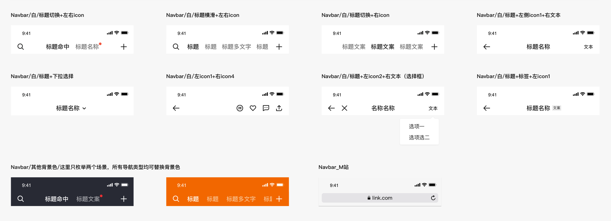
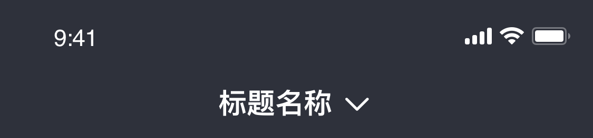
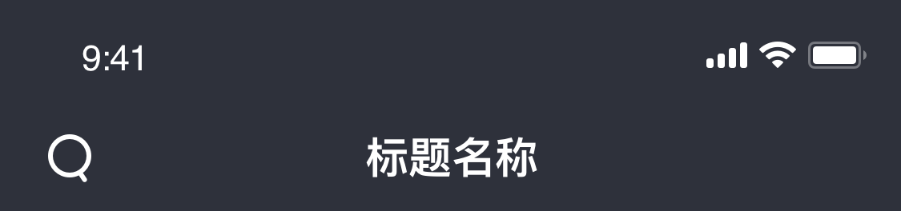
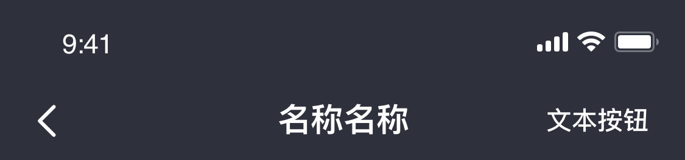
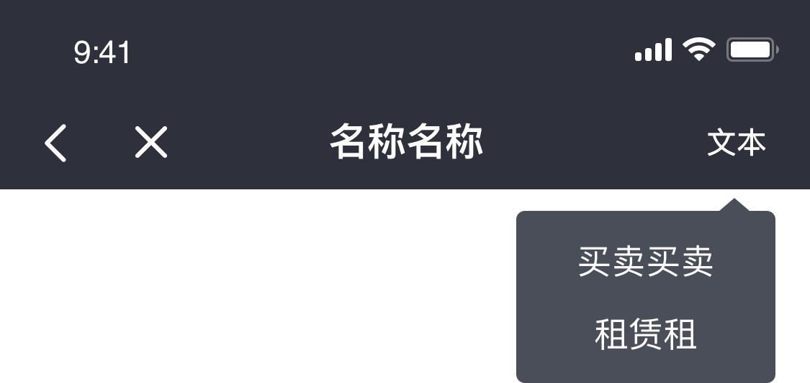
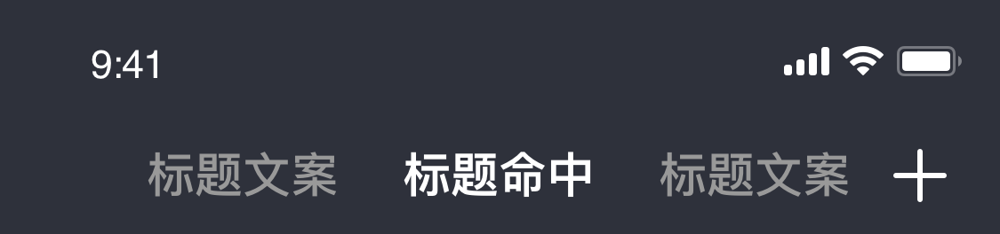
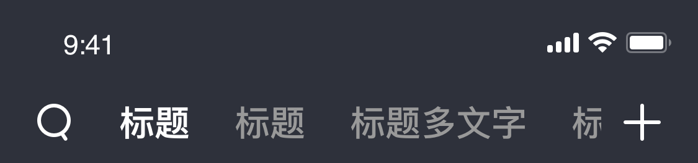
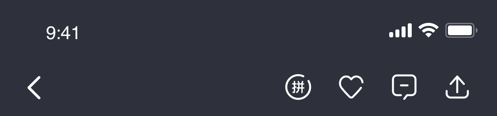

# BrnAppBar

适用于页面顶部存在导航栏的情况。

## 一、效果总览



## 二、描述

### 适用场景

1. 通用的AppBar，支持黑白背景切换，支持随意组合 title、action和lead
2. BrnAppBar即提供了默认的返回操作（maybePop），有支持自定义返回事件
3. 该类文件提供了常用的BrnTextAction、BrnIconAction、BrnBackLeading以及BrnDoubleLeading

### 注意事项

当 AppBar 为浅色主题时（brightness = Brightness.light），底部默认显示分割线，可通过 showDefaultBottom 字段设置隐藏。

## 三、构造函数及参数说明


``` dart
BrnAppBar(
      {Key? key,
      this.leading,
      this.showLeadingDivider = false,
      this.title,
      this.actions,
      this.backgroundColor,
      this.bottom,
      this.elevation = 0,
      this.automaticallyImplyLeading = true,
      this.toolbarOpacity = 1.0,
      this.bottomOpacity = 1.0,
      this.titleAlignment = Alignment.center,
      this.flexibleSpace,
      this.backLeadCallback,
      this.showDefaultBottom,
      this.themeData,
      this.leadingWidth,
      this.shadowColor,
      this.shape,
      this.iconTheme,
      this.actionsIconTheme,
      this.excludeHeaderSemantics = false,
      this.primary = true,
      this.systemOverlayStyle,
      this.titleSpacing})
      : assert(
            actions == null || actions is Widget || (actions is List<Widget>)),
        assert(title == null || title is String || title is Widget),
        super(key: key, child: Container(), preferredSize: Size(0, 0));
```


| **参数名** | **参数类型** | **作用** | **是否必填** | **默认值** |
| --- | --- | --- | --- | --- |
| leading | Widget? | 导航栏左侧显示的Widget | 否 | automaticallyImplyLeading为true时，默认赋值为点击事件为maybePop的返回Icon |
| title | dynamic | AppBar中间显示的内容 | 否 | 必须是String或者Widget。为String时,会使用[BrnAppBarTitle]来加载title |
| actions | dynamic | 标题右侧的内容 | 否 | 为了方便业务使用，可以设置为Widget或者`List<Widget>`，传入的Widget会自动添加边距并转化为`List<Widget>`，传入的`List<Widget>`会自动添加右边距和action之间的间距 |
| automaticallyImplyLeading | bool | 是否自动添加Leading实现 | 否 | true |
| backgroundColor | Color? | AppBar的背景色 | 否 | 深色主题为白色，白色主题为深色 |
| bottom | PreferredSizeWidget? | AppBar底部紧挨着的Widget | 否 | 无 |
| bottomOpacity | double | AppBar 底部Widget透明度，即 bottom 字段的透明度 | 否 | 1.0 |
| elevation | double | AppBar 阴影高度 | 否 | 0 |
| toolbarOpacity | double | Appbar 透明度 |  否 | 1.0 |
| titleAlignment | Alignment | title 对齐方式 | 否 | Alignment.center |
| backLeadCallback | VoidCallback? | 自定义的返回事件 | 否 | 无 |
| showDefaultBottom | bool | 是否展示 AppBar 底部分割线（浅色主题时生效） | 否 | true |
| showLeadingDivider | bool  | 搜索场景下是否展示leading的分割线 | 否 | true |
| flexibleSpace | Widget? | 一个可以显示在appbar下方的控件，高度和APpbar高度一样 | 否 |  |
| shadowColor | Color? | 阴影颜色 | 否 |  |
| shape | ShapeBorder? | 边框形状，只有当elevation大于0的时候展示 | 否 |  |
| iconTheme | IconThemeData? | icon样式定制 | 否 |  |
| actionsIconTheme | IconThemeData? | icon主题定制 | 否 |  |
| systemOverlayStyle | SystemUiOverlayStyle? | 同 Appbar systemOverlayStyle | 否 |  |
| primary | bool | 此应用栏是否显示在屏幕顶部 | 否 |  |
| excludeHeaderSemantics | bool | 是否用Semantics包裹 | 否 |  |
| themeData | BrnAppBarConfig? | BrnAppBar对应的主题定制类 | 否 | |

## 四、效果及代码展示

### 效果1：深色+无左右icon+自定义title

 




``` dart
BrnAppBar(
  themeData: BrnAppBarConfig.dark(),
  title: Row(
    mainAxisSize: MainAxisSize.min,
    crossAxisAlignment: CrossAxisAlignment.center,
    children: <Widget>[
      Text(
        "标题名称",
        style: commonHeiStyle,
      ),
      Padding(
        padding: const EdgeInsets.only(left: 4),
        child: Image.asset(
          'assets/image/icon_navbar_xiala_bai.png',
          scale: 3.0,
          width: 20,
          height: 20,
        ),
      )
    ],
  ),
  );
```
### 效果2：深色+无左侧Icon+右侧Icon+文本title

 

  


```dart
BrnAppBar(  
  //自定义左侧icon
  leading: Image.asset(  
    'assets/image/icon_navbar_sousuo_bai.png',  
    scale: 3.0,  
    width: 20,  
    height: 20,  
  ),
  themeData: BrnAppBarConfig.dark(),
  //文本title
  title: '标题名称',  
);
```
### 效果3：深色+默认返回+右侧Icon+文本title

 




``` dart
BrnAppBar(  
  //默认显示返回按钮
  automaticallyImplyLeading: true,  
  title: '名称名称',  
  //自定义的右侧文本
  actions: BrnTextAction(  
    '文本按钮',  
    //设置为深色背景，则显示白色
    themeData: BrnAppBarConfig.dark(),
  ),  
)  
```
### 效果4：（深色+左侧多icon+文本title+文本action）

 




``` dart
var actionKey = GlobalKey();  

BrnAppBar(
  title: '标题名称',
  themeData: BrnAppBarConfig.dark(),
  leading: BrnDoubleLeading(
    first: BrnBackLeading(),
    second: BrnBackLeading(
      child: Image.asset(
        'assets/image/icon_navbar_close_bai.png',
        scale: 3.0,
        height: 20,
        width: 20,
      ),
    ),
  ),
  actions: BrnTextAction(
    '弹出菜单',
    key: actionKey,
    iconPressed: () {
      BrnPopupListWindow.showPopListWindow(context, actionKey,
          offset: 10, data: ["买卖买卖", "租赁租"]);
    },
  ),
);
```
### 效果5：（无左侧Icon+三个Tab+右侧Icon）

 




``` dart
BrnAppBar(  
  themeData: BrnAppBarConfig.dark(), 
  automaticallyImplyLeading: false,  
  //自定义显示的title 为切换的row
  title: Row(  
    mainAxisSize: MainAxisSize.min,  
    crossAxisAlignment: CrossAxisAlignment.start,  
    children: <Widget>[  
      _buildTab(0),  
      SizedBox(  
        width: 24,  
      ),  
      _buildTab(1),  
      SizedBox(  
        width: 24,  
      ),  
      _buildTab(2)  
    ],  
  ),  
  //自定义右侧action
  actions: BrnIconAction(  
    child: Image.asset(  
      'assets/image/icon_navbar_add_bai.png',  
      scale: 3.0,  
      height: 20,  
      width: 20,  
    ),  
    iconPressed: () {},  
  ),  
)  
  
Widget _buildTab(int index) {  
return GestureDetector(  
  onTap: () {  
    currentIndex = index;  
    setState(() {});  
  },  
  child: Text(  
    currentIndex == index ? '标题命中' : '标题文案',  
    style: currentIndex == 0 ? selectedHeiStyle : unSelectedHeiStyle,  
  ),  
)  
}
```
### 效果六：深色+左右横滑+左右侧Icon

 




``` dart
BrnAppBar(  
  themeData: BrnAppBarConfig.dark(), 
  //自定义leading
  leading: BrnBackLeading(  
    child: Image.asset(  
      'assets/image/icon_navbar_sousuo_bai.png',  
      scale: 3.0,  
      height: 20,  
      width: 20,  
    ),  
  ),  
  //自定义title
  title: Container(  
    height: 44,  
    padding: EdgeInsets.only(left: 24,right: 12),  
    child: ListView.separated(  
      itemCount: 10,  
      //横滑
      scrollDirection: Axis.horizontal,  
      itemBuilder: (context, index) {  
        return GestureDetector(  
          onTap: () {  
            setState(() {  
              this.currentIndex = index;  
            });  
          },  
          child: Center(  
            child: Text(  
              index == 2 ?'标题' : '标题多文字',  
              style: index == currentIndex  
                  ? selectedHeiStyle  
                  : unSelectedHeiStyle,  
            ),  
          ),  
        );  
      },  
      separatorBuilder: (context, index) {  
        return SizedBox(  
          width: 24,  
        );  
      },  
    ),  
  ),  
  actions: BrnIconAction(  
    child: Image.asset(  
      'assets/image/icon_navbar_add_bai.png',  
      scale: 3.0,  
      height: 20,  
      width: 20,  
    ),  
    iconPressed: () {},  
  ),  
);  
```
### 效果7：深色+多icon

 




``` dart
BrnAppBar( 
  themeData: BrnAppBarConfig.dark(),
  automaticallyImplyLeading: true,  
  //多icon
  actions: <Widget>[  
    BrnIconAction(  
      iconPressed: () {},  
      child: Image.asset(  
        'assets/image/icon_navbar_pin_bai.png',  
        scale: 3.0,  
        height: 20,  
        width: 20,  
      ),  
    ),  
    BrnIconAction(  
      iconPressed: () {},  
      child: Image.asset(  
        'assets/image/icon_navbar_focus_bai.png',  
        scale: 3.0,  
        height: 20,  
        width: 20,  
      ),  
    ),  
    BrnIconAction(  
      iconPressed: () {},  
      child: Image.asset(  
        'assets/image/icon_navbar_im_hei.png',  
        scale: 3.0,  
        height: 20,  
        width: 20,  
        color: Colors.white,  
      ),  
    ),  
    BrnIconAction(  
      iconPressed: () {},  
      child: Image.asset(  
        'assets/image/icon_navbar_share_bai.png',  
        scale: 3.0,  
        height: 20,  
        width: 20,  
      ),  
    ),  
  ],  
)  
```
### 效果8：白色+默认返回+右侧Icon+文本title

``` dart
BrnAppBar(
  //默认显示返回按钮
  automaticallyImplyLeading: true,
  themeData: BrnAppBarConfig.light(),
  title: '名称名称',
  //自定义的右侧文本
  actions: BrnTextAction(  
    '文本按钮',  
    //设置为深色背景，则显示白色
    themeData: BrnAppBarConfig.light(),
  ),  
)
```
