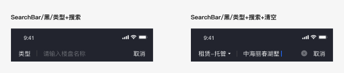
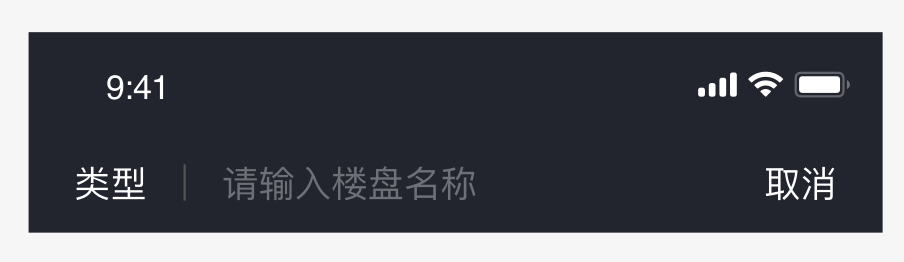
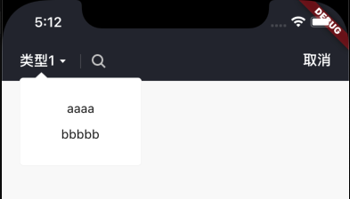

# BrnSearchAppbar

适用于页面顶部Appbar 存在搜索功能的情况。

## 一、效果概览



## 二、描述

### 适用场景

1. 该组件适用于搜索的AppBar，使用者可以设置输入框的输入回调、提交回调来实现搜索功能

2. 设置Action的点击和Leading的点击回调实现 清空文本库和sug的功能

## 三、构造函数及参数说明


```dart
const BrnSearchAppbar(
  {this.controller,
  this.focusNode,
  this.leading,
  this.leadClickCallback,
  this.dismissClickCallback,
  this.searchBarInputChangeCallback,
  this.searchBarInputSubmitCallback,
  this.hint,
  this.hintStyle,
  this.dismissStyle,
  this.showDivider = true,
  this.autoFocus = true,
  this.brightness = Brightness.dark,
  this.onClearTap,
  this.inputTextStyle})
  : super(child: const Center(), preferredSize: const Size(0, 0));
```


| **参数名** | **参数类型** | **描述** | **是否必填** | **默认值** |
| --- | --- | --- | --- | --- |
| controller | TextEditingController? | 输入框的文本控制器 | 否 | 无 |
| focusNode | FocusNode? | 搜索框的焦点控制器 | 否 | 无 |
| leading | dynamic | String 或者 Widget。输入框左侧的Leading，可以是字符串也可以是widget | 否 | 无 |
| leadClickCallback | BrnSearchBarLeadClickCallback? | 搜索框左侧的点击回调，参数为文本控制器和setState方法 | 否 | 无 |
| dismissClickCallback | BrnSearchBarDismissClickCallback? | 搜索框右侧Action的点击回调, 参数为文本控制器和setState方法 | 否 | 无 |
| searchBarInputChangeCallback | BrnSearchBarInputChangeCallback? | 搜索框的文本变化监听 | 否 | 无 |
| searchBarInputSubmitCallback | BrnSearchBarInputSubmitCallback? | 搜索框提交的回调 | 否 | 无 |
| hint | String? | 搜索框的hint内容 | 否 | 无 |
| hintStyle | TextStyle? | 输入框的hint的Style | 否 | 无 |
| inputTextStyle | TextStyle? | 输入框的文本Style | 否 | 无 |
| dismissStyle | TextStyle? | 右侧Action的文本Style | 否 | 无 |
| showDivider | bool | 是否展示底部分割线 | 否 | bool |
| autoFocus | bool | 是否自动聚焦 | 否 | bool |
| brightness | Brightness | 主题配置 | 否 | Brightness.dark |
| onClearTap | VoidCallback? | 点击清除按钮回调 | 否 |  |

## 四、效果及代码展示

### 效果1：文本Leading




```dart
BrnSearchAppbar(  
  leading: '类型',   
  leadClickCallback: (controller, update) {  
    BrnToast.show(controller.text, context);  
  },  
  searchBarInputChangeCallback: (input) {  
    BrnToast.show(input, context);  
  },  
  searchBarInputSubmitCallback: (input) {  
    BrnToast.show(input, context);  
  },   
  controller: textEditingController,   
  focusNode: focusNode,  
  dismissClickCallback: (controller, update) {  
    BrnToast.show(textEditingController.text, context);  
  },  
)
```
### 效果2: 自定义Leading+白色主题

 




```dart
BrnSearchAppbar(
  brightness: Brightness.light,
  showDivider: true,
  //自定义的leading显示
  leading: Padding(
    padding: const EdgeInsets.only(right: 16),
    child: Row(
      key: keyleading,
      crossAxisAlignment: CrossAxisAlignment.center,
      children: <Widget>[
        Text(
          '类型1',
          style: TextStyle(color: Color(0xFF222222), height: 1, fontSize: 16),
        ),
        Padding(
          padding: const EdgeInsets.only(left: 5),
          child: Image.asset(
            'assets/image/icon_triangle.png',
            color: Colors.grey,
            scale: 3.0,
            height: 7,
            width: 7,
          ),
        )
      ],
    ),
  ),
  //点击 leading的回调
  leadClickCallback: (controller, update) {
    //controller 是文本控制器，通过controller 可以拿到输入的内容 以及 对输入的内容更改
    //update 是setState方法的方法命，update() 就可以刷新输入框
    BrnPopupListWindow.showPopListWindow(context, keyleading, data: ["aaaa", "bbbbb"], offset: 10);
  },
  //输入框 文本内容变化的监听
  searchBarInputChangeCallback: (input) {
    BrnToast.show(input, context);
  },
  //输入框 键盘确定的监听
  searchBarInputSubmitCallback: (input) {
    BrnToast.show(input, context);
  },
  //为输入框添加 文本控制器，如果不传则使用默认的
  controller: textEditingController,
  //为输入框添加 焦点控制器，如果不传则使用默认的
  focusNode: focusNode,
  //右侧取消action的点击回调
  //参数同leadClickCallback 一样
  dismissClickCallback: (controller, update) {
    Navigator.of(context).pop();
  },
);
```
