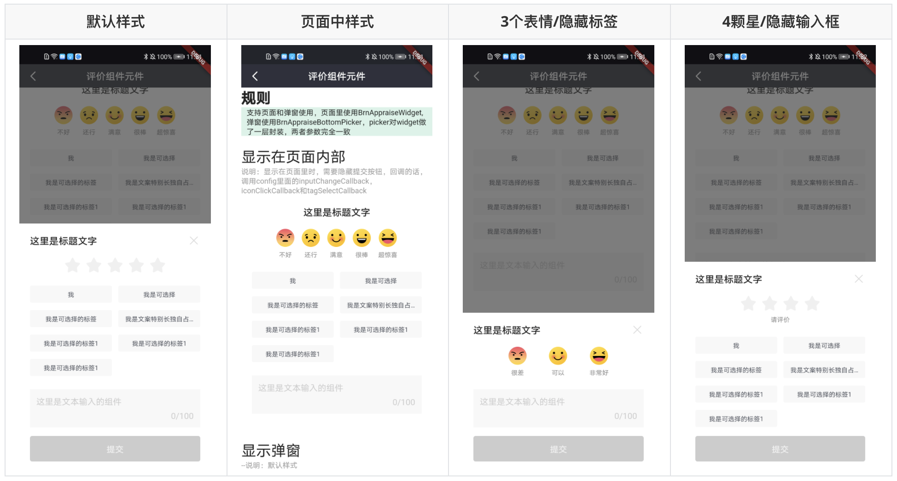
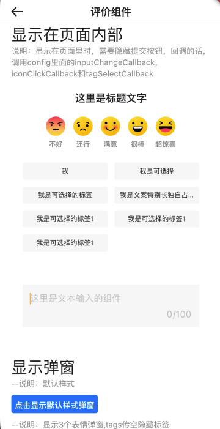
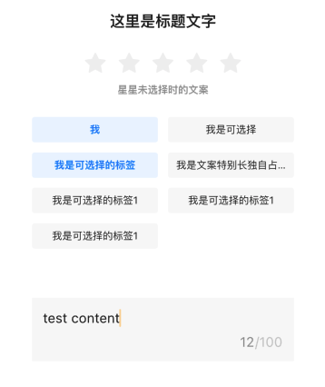
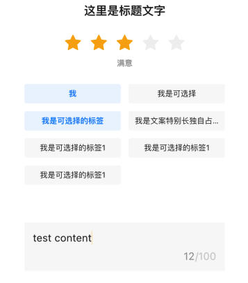

# BrnAppraise

带有等级、选择项和输入内容的评价组件。

## 一、效果总览



## 二、描述

### 适用场景

需要收集用户评价和反馈的业务场景。

### 交互规则

1. BrnAppraise：评价组件，支持表情包和五角星两种，可使用在页面和弹窗里。
2. [BrnAppraiseBottomPicker](../widgets/brn-appraise-bottom-picker)：评价组件底部弹窗，对 BrnAppraise 做了一层 picker 的封装，参数与 BrnAppraise 完全一致。

### 使用规范

组件主要分为以下几个部分：

#### header 部分

包括标题和关闭按钮。

1. 标题有两种样式，默认为第一种样式。

   1. 标题和关闭图标位于两侧，多用于弹窗。
   2. 标题居中，关闭图标隐藏，多用于页面中。

2. header 整体可隐藏。

##### 打分

打分等级可选择表情包或五角星两种样式，默认为五角星样式。

##### 五角星样式

1. 默认为 5 颗星，可设置点击后的等级提示文字，根据选择的等级显示对应等级的文案。

2. 五角星的数目也可自定义，此时提示文字 list 的长度**不能小于**五角星的数目。

##### 表情包样式

1. 默认支持 5 个表情，每个表情下有默认的文案（title）说明，文案也可自定义。
2. 表情包时文案 list 的长度**必须**是 5，不够 5 个时，多余的请使用空字符串 '' 补全，例如 `titles = ['很差', '', '可以', '', '非常好']`。
3. 支持设置默认的 5 个表情包中只显示部分几个，传入对应的 index 即可， 比如`indexes = [0,2,4]`，则表情包只显示第 1、3、5 个。

#### 标签部分

1. 可选择标签，默认两列展示，可自定义列数。
2. 支持单选和多选。
3. 标签数据不传或者传 null 时，不显示标签部分。

#### 输入框

1. 支持隐藏。
2. 支持设置文字的最大长度和输入框的最大高度。

#### 提交按钮

1. 默认显示，支持隐藏。提交按钮隐藏时，可配置 config 里的 iconClickCallback，inputChangeCallback 和 tagSelectCallback 三个回调，获取对应部分修改的状态和参数。
2. 默认文案"提交"，可自定义文案。
3. 默认为 disable 禁用状态，有打分（点击表情或者五角星）之后按钮切换为 enable 可点击状态。按钮是否可用的状态外界可自定义。

## 三、构造函数及参数说明

### 构造函数

```dart
BrnAppraise(
    {Key? key,
    this.title = '',
    this.headerType = BrnAppraiseHeaderType.spaceBetween,
    this.type = BrnAppraiseType.Star,
    this.iconDescriptions = _defaultIconDescriptions,
    this.tags,
    this.inputHintText = '',
    this.onConfirm,
    this.config = cConfig})
    : super(key: key);
```

### 参数说明

| **参数名**       | **参数类型**                                                 | **作用**                                                     | **是否必填** | **默认值**                             |
| ---------------- | ------------------------------------------------------------ | ------------------------------------------------------------ | ------------ | -------------------------------------- |
| title            | String                                                       | 标题                                                         | 否           | ''                                     |
| headerType       | BrnAppraiseHeaderType                                        | 标题类型，居中还是两侧                                       | 否           | BrnAppraiseHeaderType.spaceBetween     |
| type             | BrnAppraiseType                                              | 评价组件类型，表情包还是五角星                               | 否           | BrnAppraiseType.Star                   |
| iconDescriptions | `List<String>`                                               | 点击表情时对应等级的提示文案。若 `type=BrnAppraiseType.Emoji`，则 list 长度为 5，不足 5 个时请在对应位置补空字符串。若 `type=BrnAppraiseType.Star`，list 长度不能比传入的 BrnAppraiseConfig 中的 count 小。 | 否           | ['不好','还行','满意','很棒','超惊喜'] |
| tags             | `List<String>?`                                              | 供选择的标签数据                                             | 否           | 无                                     |
| inputHintText    | String                                                       | 输入框的提示文字                                             | 否           | ''                                     |
| onConfirm        | `void Function(int index, List<String> selectedTags, String input)?` | 点击提交时的回调，其中 index 是选中的表情或者五角星的 index，selectedTags 是选中的标签，input 是输入框的内容 | 否           | 无                                     |
| config           | BrnAppraiseConfig                                            | 配置类，具体见下边其他参数说明                               | 否           | BrnAppraiseConfig()                    |

### 其他参数说明

#### BrnAppraiseConfig

| **参数名**              | **参数类型**                                | **作用**                                                     | **是否必填** | **默认值**                                                   |
| ----------------------- | ------------------------------------------- | ------------------------------------------------------------ | ------------ | ------------------------------------------------------------ |
| showHeader              | bool                                        | 是否显示顶部标题和关闭按钮的 header 视图                     | 否           | true                                                         |
| headerPadding           | EdgeInsets?                                 | header 部分的 padding，只有居中样式支持设置                  | 否           | `headerType=BrnAppraiseHeader.center`时，为 `EdgeInsets.only(top: 20, bottom: 20)`，其余为 `EdgeInsets.only(left: 20, top: 16, right: 16, bottom: 20)` |
| titleMaxLines           | int                                         | 标题的最大行数                                               | 否           | 1                                                            |
| onCancel                | `void Function(BuildContext context)?`      | 点击关闭按钮时的回调                                         | 否           | 无                                                           |
| count                   | int                                         | `type=BrnAppraiseType.Star`时所需五角星的个数                | 否           | 5                                                            |
| iconDescriptions        | `List<String>`                              | 点击表情时的文案。`type=BrnAppraiseType.Star`时，该列表的数据个数不能比 count 少。`type=BrnAppraiseType.Emoji`时，list 长度应为 5，不足 5 个时请在对应位置补空字符串 | 否           | ['不好', '还行', '满意', '很棒', '超惊喜']                   |
| indexes                 | `List<int>`                                 | 表情包打分组件所需表情的 index                               | 否           | [0,1,2,3,4]                                                  |
| starAppraiseHint        | String                                      | 五角星未打分时的提示文案                                     | 否           | ''                                                           |
| multiSelect             | bool                                        | 标签是否支持多选                                             | 否           | true                                                         |
| tagCountEachRow         | int                                         | 每行显示的标签数                                             | 否           | 2                                                            |
| showTextInput           | bool                                        | 是否显示输入框                                               | 否           | true                                                         |
| maxLength               | int                                         | 输入框能输入文字的最大长度                                   | 否           | 100                                                          |
| maxHintLines            | int                                         | 提示文案的最大行数                                           | 否           | 1                                                            |
| inputDefaultText        | String?                                     | 输入框默认文案                                               | 否           | 无                                                           |
| inputMaxHeight          | double                                      | 输入框的最大高度                                             | 否           | 120                                                          |
| showConfirmButton       | bool                                        | 是否显示提交按钮                                             | 否           | true                                                         |
| confirmButtonText       | String                                      | 提交按钮自定义文案                                           | 否           | '提交'                                                       |
| isConfirmButtonEnabled  | bool                                        | 提交按钮的可用状态                                           | 否           | 默认 null，在打分之后 enable                                 |
| iconClickCallback       | `void Function(int index)?`                 | 点击打分时的回调                                             | 否           | 无                                                           |
| inputTextChangeCallback | `void Function(String input)?`              | 输入框内容改变的回调                                         | 否           | 无                                                           |
| tagSelectCallback       | `void Function(List<String> selectedTags)?` | 选择标签时的回调                                             | 否           | 无                                                           |

```dart
const BrnAppraiseConfig({
    this.showHeader = true,
    this.headerPadding,
    this.titleMaxLines = 1,
    this.onCancel,
    this.indexes = const [0, 1, 2, 3, 4],
    this.count = 5,
    this.starAppraiseHint = '',
    this.multiSelect = true,
    this.tagCountEachRow = 2,
    this.showTextInput = true,
    this.maxLength = 100,
    this.maxHintLines = 1,
    this.inputDefaultText,
    this.inputMaxHeight = 120,
    this.showConfirmButton = true,
    this.confirmButtonText = '提交',
    this.isConfirmButtonEnabled,
    this.iconClickCallback,
    this.inputTextChangeCallback,
    this.tagSelectCallback,
  });
```


## 四、代码演示

### 效果 1：隐藏提交，表情评分，页面内展示



```dart
List<String> tags = [
    '我',
    '我是可选择',
    '我是可选择的标签',
    '我是文案特别长独自占一行的样式哦',
    '我是可选择的标签1',
    '我是可选择的标签1',
    '我是可选择的标签1',
];

BrnAppraise(
    title: "这里是标题文字",
    headerType: BrnAppraiseHeaderType.center,
    type: BrnAppraiseType.Emoji,
    tags: tags,
    inputHintText: '这里是文本输入的组件',
    config: BrnAppraiseConfig(
        showConfirmButton: false,
        inputTextChangeCallback: (input) {
          BrnToast.show('输入的内容为' + input, context);
        },
        iconClickCallback: (index) {
          BrnToast.show('选中的评价为${index}', context);
        },
        tagSelectCallback: (list) {
          BrnToast.show('选中的标签为:' + list.toString(), context);
        }),
  ),
```

### 效果 2：隐藏提交，星星评分，页面内展示

 

```dart
List<String> tags = [
  '我',
  '我是可选择',
  '我是可选择的标签',
  '我是文案特别长独自占一行的样式哦',
  '我是可选择的标签1',
  '我是可选择的标签1',
  '我是可选择的标签1',
];

BrnAppraise(
  title: "这里是标题文字",
  headerType: BrnAppraiseHeaderType.center,
  type: BrnAppraiseType.Star,
  tags: tags,
  inputHintText: '这里是文本输入的组件',
  iconDescriptions: [
    '一星',
    '二星',
    '三星',
    '四星',
    '五星',
  ],
  config: BrnAppraiseConfig(
      showConfirmButton: false,
      starAppraiseHint: '星星未选择时的文案',
      inputDefaultText: '这是一段默认文字',
      inputTextChangeCallback: (input) {
        BrnToast.show('输入的内容为' + input, context);
      },
      iconClickCallback: (index) {
        BrnToast.show('选中的评价为$index', context);
      },
      tagSelectCallback: (list) {
        BrnToast.show('选中的标签为:' + list.toString(), context);
      }),
)
```
