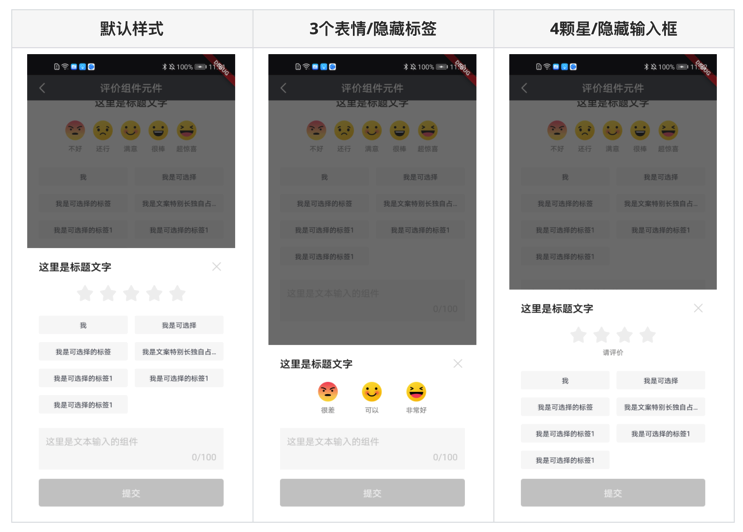
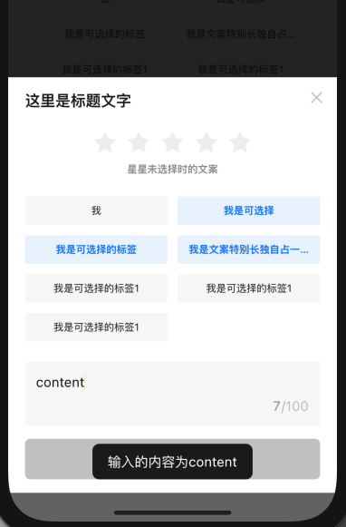
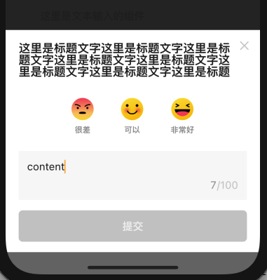

# BrnAppraiseBottomPicker

以 picker 样式展现的评价组件。具体参数和 [BrnAppraise](../widgets/brn-appraise) 一样。

## 一、效果总览


## 二、描述

### 适用场景

需要收集用户评价和反馈的业务场景，并以弹窗形式展示。页面交互规则和使用规范参见 [BrnAppraise](../widgets/brn-appraise)。

## 三、构造函数及参数说明

### 构造函数

```dart
BrnAppraiseBottomPicker({
    Key? key,
    this.title = '',
    this.headerType = BrnAppraiseHeaderType.spaceBetween,
    this.type = BrnAppraiseType.Star,
    this.iconDescriptions = _defaultIconDescriptions,
    this.tags,
    this.inputHintText = '',
    this.onConfirm,
    this.config = const BrnAppraiseConfig(),
  }) : super(key: key);
```

### 参数说明

| **参数名** | **参数类型** | **作用** | **是否必填** | **默认值** |
| --- | --- | --- | --- | --- |
| title | String | 标题 | 否 | '' |
| headerType | BrnAppraiseHeaderType | 标题类型，居中还是两侧 | 否 | BrnAppraiseHeaderType.spaceBetween |
| type | BrnAppraiseType | 评价组件类型，表情包还是五角星 | 否 | BrnAppraiseType.Star |
| iconDescriptions | `List<String>` | 点击表情时对应等级的提示文案。若 `type=BrnAppraiseType.Emoji`，则list长度为5，不足5个时请在对应位置补空字符串。若 `type=BrnAppraiseType.Star`，list长度不能比传入的 BrnAppraiseConfig中的 count 小。 | 否 | ['不好', '还行', '满意', '很棒', '超惊喜'] |
| tags | `List<String>?` | 供选择的标签数据 | 否 | 无 |
| inputHintText | String | 输入框的提示文字 | 否 | '' |
| onConfirm | `void Function(int index, List<String> selectedTags, String input)?` | 点击提交时的回调，其中index是选中的表情或者五角星的index，selectedTags是选中的标签，input是输入框的内容 | 否 | 无 |
| config | BrnAppraiseConfig | 配置类，具体参见 [BrnAppraise](../widgets/brn-appraise) | 否 | BrnAppraiseConfig() |

### 四、代码演示

### 效果1：星星评分+默认样式



```dart
showDialog(
  context: context,
  builder: (context) {
    return BrnAppraiseBottomPicker(
      title: "这里是标题文字",
      tags: tags,
      inputHintText: '这里是文本输入的组件',
      onConfirm: (index, list, input) {
        showToast(index, list, input, context);
        Navigator.pop(context);
      },
      config: BrnAppraiseConfig(
          showConfirmButton: true,
          count: 5,
          starAppraiseHint: '星星未选择时的文案',
          inputTextChangeCallback: (input) {
            BrnToast.show('输入的内容为' + input, context);
          },
          iconClickCallback: (index) {
            BrnToast.show('选中的评价为$index', context);
          },
          tagSelectCallback: (list) {
            BrnToast.show(
                '选中的标签为:' + list.toString(), context);
          }),
    );
  });
```

### 效果2：3个表情+无标签视图+弹窗



```dart
showDialog(
  context: context,
  builder: (context) {
    return BrnAppraiseBottomPicker(
      title:
          "这里是标题文字这里是标题文字这里是标题文字这里是标题文字这里是标题文字这里是标题文字这里是标题文字这里是标题文字",
      inputHintText: '这里是文本输入的组件',
      onConfirm: (index, list, input) {
        showToast(index, list, input, context);
        Navigator.pop(context);
      },

      ///必须传入5个字符串，没有的位置传''
      type: BrnAppraiseType.Emoji,
      iconDescriptions: ['很差', '', '可以', '', '非常好'],
      config: BrnAppraiseConfig(
          indexes: [0, 2, 4], titleMaxLines: 3),
    );
  });
```

### 效果2：4颗星评分+无评价内容输入框+弹窗


```dart
showDialog(
  context: context,
  builder: (context) {
    return BrnAppraiseBottomPicker(
      title: "这里是标题文字",
      tags: tags,
      onConfirm: (index, list, input) {
        showToast(index, list, input, context);
        Navigator.pop(context);
      },
      type: BrnAppraiseType.Star,
      iconDescriptions: ['很差', '不行', '可以', '好'],
      config: BrnAppraiseConfig(
          showTextInput: false,
          count: 4,
          starAppraiseHint: '请评价'),
    );
  });
```