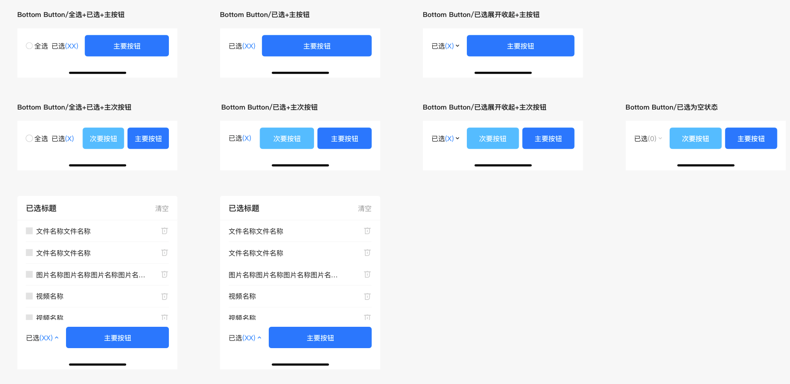

# BrnMultipleBottomButton

用于多选状态页面底部的组合按钮

## 一、效果总览




## 二、描述

### 适用场景

1. 常用于多选状态页面底部的组合按钮
2. 支持**[全选]+[选中状态]+[次要按钮]+[主要按钮]**的功能，功能可任意组合

## 三、构造函数及参数说明

### 构造函数

```dart
const BrnMultipleBottomButton(
      {Key? key,
      this.mainButton,
      this.subButton,
      this.onMainButtonTap,
      this.onSubButtonTap,
      this.onSelectedButtonTap,
      this.onSelectAll,
      this.hasArrow = false,
      this.bottomController})
      : super(key: key);
```


### 参数说明

#### BrnMultipleBottomButton

| **参数名** | **参数类型** | **描述** | **是否必填** | **默认值** |
| --- | --- | --- | --- | --- |
| mainButton | dynamic | 主按钮的显示文案，传入String即使用默认的Text样式，传入其他样式则使用对应的Widget | 否 |  |
| onMainButtonTap | VoidCallback? | 主按钮点击回调 | 否 |  |
| subButton | dynamic | 次按钮的显示文案，传入String即使用默认的Text样式，传入其他样式则使用对应的Widget | 否 |  |
| onSubButtonTap | VoidCallback? | 次按钮点击回调 | 否 |  |
| onSelectedButtonTap | Function(BrnMultipleButtonArrowState)? | selectedButtonOnTap', '点击已选的回调，存在三种状态：-1:不可展开（当value为0的时候），0：收起，1：展开 | 否 |  |
| onSelectAll | void Function(bool?)? | 全选的点击回调，不传则不展示多选按钮，回传参数true表示选中全选，false表示取消全选 | 否 |  |
| hasArrow | bool | 已选侧边是否需要小箭头 | 否 | false |
| bottomController | BrnMultipleBottomController? | 暴露给外界设置按钮状态的控制器 | 否 |  |


#### MultiSelectState

用于需要控制底部按钮栏的场景包括：全选状态是否选中、已选（）中的数量、主按钮，次按钮是否置灰以及小三角的方向控制。

| **参数名** | **参数类型** | **描述** | **是否必填** | **默认值** |
| --- | --- | --- | --- | --- |
| selectedCount | int | 设置已选中的数量 | 否 | 0 |
| selectAllState | bool | 设置全选状态是否选中（不会触发selectAllOnTap的回调） | 否 | false |
| mainButtonState | bool | 设置主按钮是否置灰 （置灰后任然会响应点击回调） | 否 | true |
| subButtonState | bool | 设置次按钮是否置灰 （置灰后任然会响应点击回调） | 否 | true |
| arrowStatus | int | 控制箭头的状态 枚举值为:// cantUnfold = -1;// fold = 0;// unfold = 1; | 否 | 0 |


#### BrnMultipleButtonArrowState

```dart
/// 已选部分箭头状态的枚举值，共四种
enum BrnMultipleButtonArrowState {
  /// 箭头不可展开
  cantUnfold,

  /// 箭头处于收起状态
  fold,

  /// 箭头处于展开状态
  unfold,

  /// 默认
  defaultStatus,
}
```


## 四、代码演示

### 效果1：展示所有的按钮

 


```dart
BrnMultipleBottomController controller = BrnMultipleBottomController();

BrnMultipleBottomButton(
  bottomController: controller,
  onSelectAll: (state) {
    BrnToast.show('全选状态为 : $state', context);
  },
  onSelectedButtonTap: selectedButtonOnTap,
  hasArrow: true,
  mainButton: '主要按钮',
  subButton: '次要按钮',
  onMainButtonTap: () {
    controller.setState(selectedCount: 11);
    BrnToast.show('已选数量置为 : 11', context);
  },
  onSubButtonTap: () {
    controller.setState(selectedCount: 0);
    BrnToast.show('已选数量置为 : 0', context);
  },
)

  void selectedButtonOnTap(BrnMultipleButtonArrowState state) {
    String info = "";
    switch (state) {
      case BrnMultipleButtonArrowState.unfold:
        info = '展开状态';
        break;
      case BrnMultipleButtonArrowState.cantUnfold:
        info = '无法展开状态';
        break;
      case BrnMultipleButtonArrowState.fold:
        info = '收起状态';
        break;
      case BrnMultipleButtonArrowState.defaultStatus:
        break;
    }
    BrnToast.show('已选择状态为 : $info', context);
  }
```


### 效果2：展示已选和主按钮，带小箭头

 

```dart
BrnMultipleBottomButton(
  onSelectedButtonTap: selectedButtonOnTap,
  hasArrow: true,
  mainButton: '主要按钮',
  onMainButtonTap: () {
    BrnToast.show('主按钮点击', context);
  },
)

void selectedButtonOnTap(BrnMultipleButtonArrowState state) {
  String info = "";
  switch (state) {
    case BrnMultipleButtonArrowState.unfold:
      info = '展开状态';
      break;
    case BrnMultipleButtonArrowState.cantUnfold:
      info = '无法展开状态';
      break;
    case BrnMultipleButtonArrowState.fold:
      info = '收起状态';
      break;
    case BrnMultipleButtonArrowState.defaultStatus:
      break;
  }
  BrnToast.show('已选择状态为 : $info', context);
}
```


### 效果3：只有已选和主按钮，不带小箭头

  
```dart
BrnMultipleBottomButton(
  onSelectedButtonTap: selectedButtonOnTap,
  hasArrow: false,
  mainButton: '主要按钮',
  onMainButtonTap: () {
    BrnToast.show('主按钮点击', context);
  },
)

void selectedButtonOnTap(BrnMultipleButtonArrowState state) {
  String info = "";
  switch (state) {
    case BrnMultipleButtonArrowState.unfold:
      info = '展开状态';
      break;
    case BrnMultipleButtonArrowState.cantUnfold:
      info = '无法展开状态';
      break;
    case BrnMultipleButtonArrowState.fold:
      info = '收起状态';
      break;
    case BrnMultipleButtonArrowState.defaultStatus:
      break;
  }
  BrnToast.show('已选择状态为 : $info', context);
}
```


### 效果4：已选+次要按钮+主要按钮

 

```dart

BrnMultipleBottomButton(
  bottomController: BrnMultipleBottomController(
      initMultiSelectState: MultiSelectState(selectedCount: 99)),
  onSelectedButtonTap: selectedButtonOnTap,
  hasArrow: false,
  mainButton: '主要按钮',
  onMainButtonTap: () {
    BrnToast.show('主按钮点击', context);
  },
  subButton: '次要按钮',
)

void selectedButtonOnTap(BrnMultipleButtonArrowState state) {
  String info = "";
  switch (state) {
    case BrnMultipleButtonArrowState.unfold:
      info = '展开状态';
      break;
    case BrnMultipleButtonArrowState.cantUnfold:
      info = '无法展开状态';
      break;
    case BrnMultipleButtonArrowState.fold:
      info = '收起状态';
      break;
    case BrnMultipleButtonArrowState.defaultStatus:
      break;
  }
  BrnToast.show('已选择状态为 : $info', context);
}
```