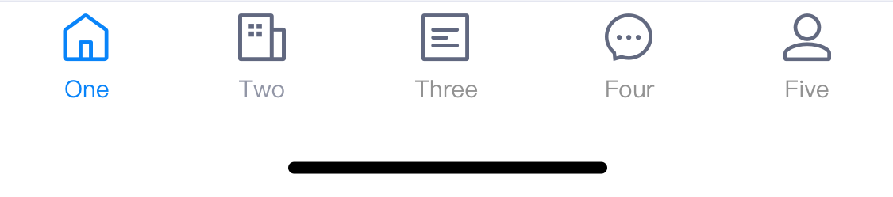

# BrnBottomTabBar

一般用于首页，或者功能模块底部

## 一、效果总览



## 二、描述
### 适用场景

1. 通用的导航栏，该类定义了一个导航栏容器，容器的结构为导航栏图标、标题
2. BottomTabBar为主容器，其中包含多个BottomTabBarItem，组成每个选项

## 三、构造函数及参数说明


```dart
BrnBottomTabBar({
  Key? key,
  required this.items,
  this.onTap,
  this.currentIndex = 0,
  this.type = BrnBottomTabBarDisplayType.fixed,
  this.fixedColor,
  this.iconSize = 24.0,
  this.isAnimation = false,
  this.badgeColor,
  this.isInkResponse = false,
})  : assert(items.length >= 1),
      assert(
        items.every((BrnBottomTabBarItem item) => item.title != null) == true,
        'Every item must have a non-null title',
      ),
      assert(0 <= currentIndex && currentIndex < items.length),
      super(key: key);
```


| **参数名** | **参数类型** | **描述** | **是否必填** | **默认值** |
| --- | --- | --- | --- | --- |
| items | `List<BrnBottomTabBarItem>` | Tab 数据 |  是 | 无 |
| fixedColor | Color? | 选中item后的颜色 | 否 | 无 |
| currentIndex | int | 当前选中的item索引值 | 否 | 无alert |
| onTap | `ValueChanged<int>?` | 导航项点击回调的点击回调 | 否 | 无 |
| type | BottomTabBarType | Tab样式(固定、动画) | 否 | BottomTabBarType.fixed |
| iconSize | double | tab icon 大小 | 否 | 24 |
| isAnimation | bool | 是否开启字体放大动画 | 否 | false |
| isInkResponse | bool | 是否开启聚焦动画 | 否 | false |
| badgeColor | Color? | 未读信息Badge背景颜色 | 否 | Colors.Red |

#### BrnBottomTabBarItem

```dart
const BrnBottomTabBarItem({
 this.title,
 required this.icon,
 Widget? activeIcon,
 this.selectedTextStyle,
 this.unSelectedTextStyle,
 this.backgroundColor,
 this.badge,
 this.badgeNo,
 this.maxBadgeNo = 99,
}) : activeIcon = activeIcon ?? icon;
```


| **参数名** | **参数类型** | **描述** | **是否必填** | **默认值** |
| --- | --- | --- | --- | --- |
| icon | Widget | 未选中时的icon | 是 | 无 |
| activeIcon | Widget | 选中时的icon | 否 | 无 |
| title | Widget? | Tab标题名调 | 否 | 无 |
| selectedTextStyle | TextStyle? | tab 选中文本样式 | 否 | 否 |
| unSelectedTextStyle | TextStyle? | tab 未选中文本样式 | 否 | 否 |
| backgroundColor | Color? | 背景色 | 否 | 无 |
| badge | Widget? | 未读信息 | 否 | 无 |
| badgeNo | String? | 未读信息个数 | 否 | 无 |
| maxBadgeNo | int | 未读消息最大个数 | 否 | 99 |


## 四、代码演示

### 效果1


```dart
var titles = ['One', 'Two', 'Three', 'Four', 'Five','Six'];  
BrnBottomTabBar(  
  fixedColor: Colors.blue,  
  currentIndex: _selectedIndex,  
  onTap: _onItemSelected,  
  badgeColor: Colors.red,  
  items: <BottomTabBarItem>[  
    BottomTabBarItem(  
      icon: Image(image: AssetImage("assets/icons/navbar\_fangyuan.png")),activeIcon: Image(image: AssetImage("assets/icons/navbar\_fangyuan.png")), title: Text(titles[0])),  
    BottomTabBarItem(icon: Image(image: AssetImage("assets/icons/navbar\_fangyuan.png")), title: Text(titles[1])),  
    BottomTabBarItem(icon: Image(image: AssetImage("assets/icons/navbar\_fangyuan.png")), title: Text(titles[2])),  
    BottomTabBarItem(  
      icon: Image(image: AssetImage("assets/icons/navbar\_fangyuan.png")),  
      activeIcon: Image(image: AssetImage("assets/icons/navbar\_fangyuan.png")),  
      title: Text(titles[3])),  
    BottomTabBarItem(icon: Image(image: AssetImage("assets/icons/navbar\_fangyuan.png")), title: Text(titles[4])),  
    BottomTabBarItem(icon: Image(image: AssetImage("assets/icons/navbar\_fangyuan.png")), title: Text(titles[5])),  
  ],  
)
```
