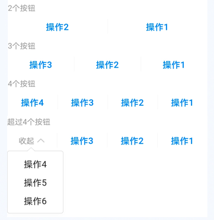
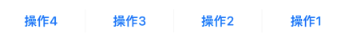
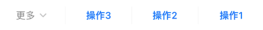
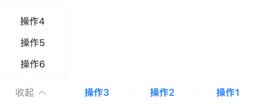

# BrnTextButtonPanel

多个文字按钮组成的按钮集合。

## 一、效果总览



## 二、描述

### 适用场景

文本按钮的操作面板，一般在卡片或者页面的底部。

### 交互规则

1. 文本按钮不超过4个时，平分屏幕，超过4个时，显示3个按钮和更多，点击更多以后，弹窗展示剩余按钮。弹窗的方向可设置为向上或者向下。弹窗展开后，'更多'文案变为'收起'。
2. 当文案过长时，宽度依旧平分，显示不下的文案以 .. .截断显示。如果只有一个按钮，则居中显示。
3. 按钮文本左右有 4 的 padding 间距。

## 三、构造函数及参数说明

### 构造函数

```dart
const BrnTextButtonPanel({
    Key? key,
    required this.nameList,
    this.onTap,
    this.popDirection = BrnPopupDirection.bottom,
  }) : super(key: key);
```
### 参数说明

| **参数名** | **参数类型** | **描述** | **是否必填** | **默认值** |
| --- | --- | --- | --- | --- |
| nameList | `List<String>` | 按钮文案列表 | 是 | 无 |
| onTap | void Function(int index) | 按钮点击时的回调，index 为按钮文案的索引值 | 否 | 无 |
| popDirection | BrnPopupDirection | 点击更多时弹窗的位置 | 否 | BrnPopupDirection.bottom |

## 四、代码演示

### 效果1：一个按钮


```dart
BrnTextButtonPanel(
  nameList: ['操作1'],
  onTap: (index) {
    BrnToast.show('第$index个操作', context);
  },
),
```

### 效果2：四个按钮


```dart
BrnTextButtonPanel(
  nameList: ['操作1', '操作2', '操作3', '操作4'],
  onTap: (index) {
    BrnToast.show('第$index个操作', context);
  },
),
```

### 效果3：按钮文本过长


```dart
BrnTextButtonPanel(
  nameList: ['操作1操作1操作1操作1操作1操作1操作1操作1', '操作2', '操作3'],
  onTap: (index) {
    BrnToast.show('第$index个操作', context);
  },
)
```

### 效果4：更多
#### 更多弹窗收起状态：



#### 更多弹窗展开状态：



```dart
BrnTextButtonPanel(
  nameList: ['操作1', '操作2', '操作3', '操作4', '操作5', '操作6'],
  popDirection: BrnPopupDirection.top,
  onTap: (index) {
    BrnToast.show('第$index个操作', context);
  },
),
```