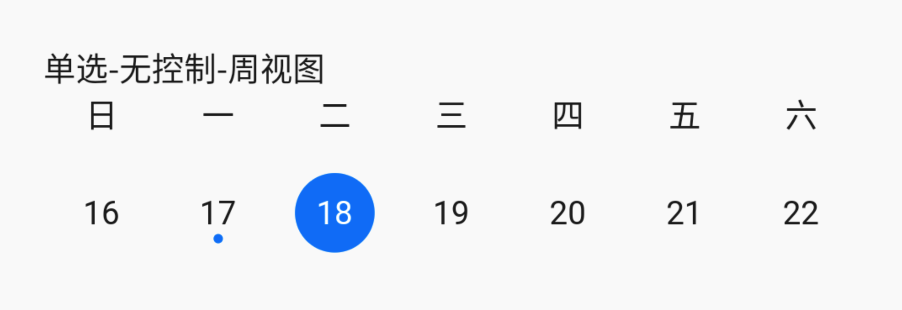
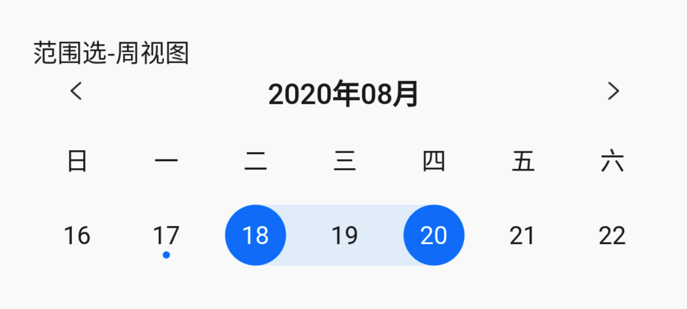
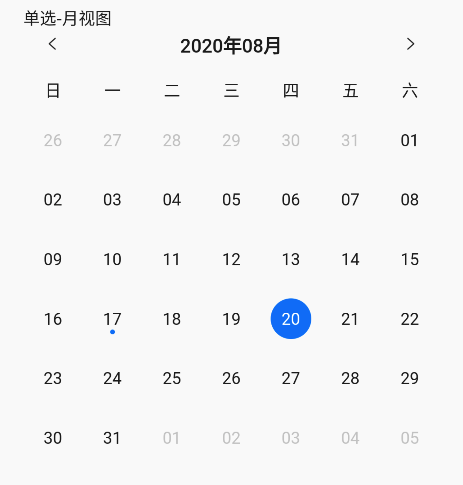
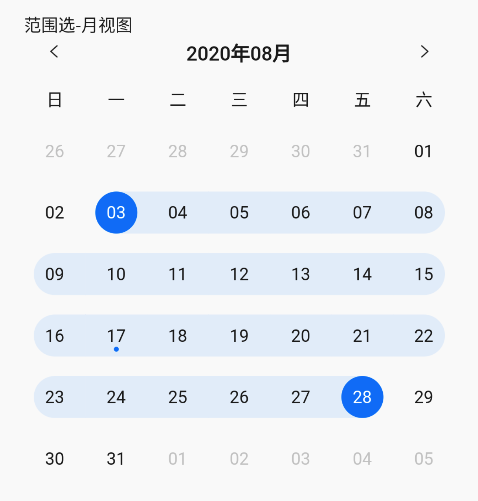
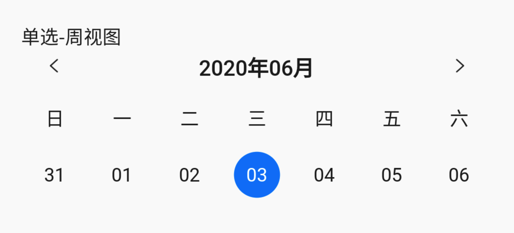

# BrnCalendarView

日历视图。

## 一、效果图

&nbsp;
&nbsp;
&nbsp;
&nbsp;
&nbsp;

## 二、描述

### 适用场景简介

1. 适用于日历时间的展示场景，包括时间点选择、时间范围选择
2. 日历组件显示视图包括【周视图】 和【月视图】

## 三、构造函数及参数配置

### 构造函数

```dart
BrnCalendarView(
  {Key key,
  this.selectMode = SelectMode.SINGLE,
  this.displayMode = DisplayMode.Month,
  this.weekNames,
  this.showControllerBar = true,
  this.initStartSelectedDate,
  this.initEndSelectedDate,
  this.initDisplayDate,
  this.startEndDateChange,
  this.minDate,
  this.maxDate})
```

### 参数说明

| **参数名**            | **参数类型**                                                   | **作用**                                                   | **是否必填** | **默认值**         |
| --------------------- | -------------------------------------------------------------- | ---------------------------------------------------------- | ------------ | ------------------ |
| selectMode            | SelectMode                                                     | 选择模式，是范围选择 RANGE 还是单点选择 SINGLE             | 否           | SINGLE             |
| displayMode           | DisplatMode                                                    | 展示模式，是周视图 WEEK 还是月视图 MONTH                   | 否           | MONTH              |
| weekNames             | List                                                           | 自定义星期名字，以【周日】开始排列                         | 否           | 默认值为国际化配置文本 \_defaultWeekNames |
| showControllerBar     | bool                                                           | 是否展示顶部切换日期控制按钮                               | 否           | true               |
| initStartSelectedDate | DateTime                                                       | 初始选中开始时间                                           | 否           | 无                 |
| initEndSelectedDate   | DateTime                                                       | 初始选中结束时间                                           | 否           | 无                 |
| initDisplayDate       | DateTime                                                       | 初始展示月份                                               | 否           | 当前时间所在月份   |
| startEndDateChange    | Function(DateTime startSelectedDate, DateTime endSelectedDate) | 选中日期的回调，其中范围选择时会在结束时间选择后回调该函数 | 否           | 无                 |
| minDate               | DateTime                                                       | 最小展示时间                                               | 否           | 1970               |
| maxDate               | DateTime                                                       | 最大展示时间                                               | 否           | 2100               |

## 四、效果及代码展示

### 效果 1：单选、无控制 bar、周视图

&nbsp;

```dart
BrnCalendarView(
  displayMode: DisplayMode.Week,
  selectMode: SelectMode.SINGLE,
  showControllerBar: false,
  startEndDateChange: (startDate, endDate){
    BrnToast.show('开始时间： $startDate , 结束时间：$endDate', context);
  },
);
```

### 效果 2：单选、无控制、周视图、自定义 week name

&nbsp;

```dart
BrnCalendarView(
  displayMode: DisplayMode.Week,
  selectMode: SelectMode.SINGLE,
  showControllerBar: false,
  weekNames: ['星期天','星期一', '星期二', '星期三', '星期四', '星期五', '星期六'],
  startEndDateChange: (startDate, endDate){
    BrnToast.show('开始时间： $startDate , 结束时间：$endDate', context);
  },
);
```

### 效果 3：单选、周视图、控制 bar

&nbsp;

```dart
BrnCalendarView(
  displayMode: DisplayMode.Week,
  selectMode: SelectMode.SINGLE,
  startEndDateChange: (startDate, endDate){
    BrnToast.show('开始时间： $startDate , 结束时间：$endDate', context);
  },
);
```

### 效果 4：范围选、周视图、控制 bar

&nbsp;

```dart
BrnCalendarView(
  displayMode: DisplayMode.Week,
  selectMode: SelectMode.RANGE,
  startEndDateChange: (startDate, endDate){
    BrnToast.show('开始时间： $startDate , 结束时间：$endDate', context);
  },
);
```

### 效果 5：单选、月视图、控制 bar

&nbsp;

```dart
BrnCalendarView(
  displayMode: DisplayMode.Week,
  selectMode: SelectMode.RANGE,
  startEndDateChange: (startDate, endDate){
    BrnToast.show('开始时间： $startDate , 结束时间：$endDate', context);
  },
);
```

### 效果 6：范围选、月视图、控制 bar

&nbsp;

```dart
BrnCalendarView(
  displayMode: DisplayMode.Week,
  selectMode: SelectMode.RANGE,
  startEndDateChange: (startDate, endDate){
    BrnToast.show('开始时间： $startDate , 结束时间：$endDate', context);
  },
);
```
