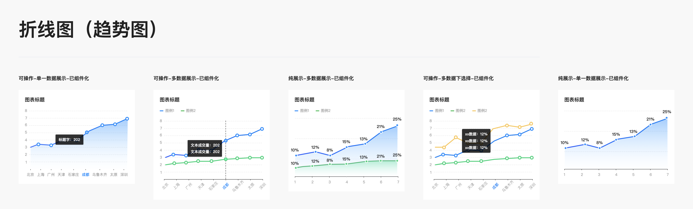
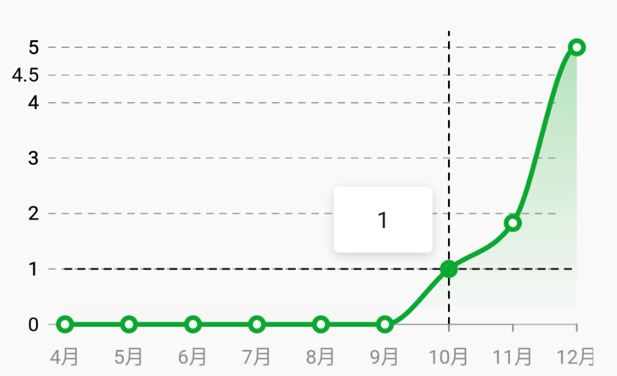
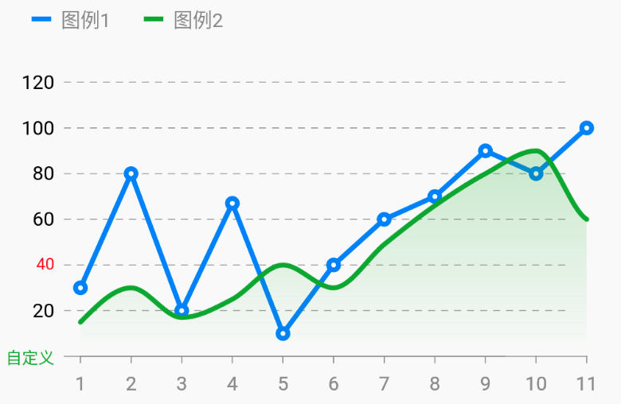

# BrnBrokenLine

折线图，可显示多条线。

## 一、效果总览



## 二、组件描述

### 使用场景

适用于需要折线图，曲线图的场景。

### 交互规则

1. 支持数据过多时左右滑动查看数据
2. 支持 X、Y 轴自定义展示文本内容

## 三、构造函数与参数配置

### 构造函数

```dart
BrnBrokenLine({
  Key? key,
  required this.size,
  required this.lines,
  this.contentPadding = const EdgeInsets.only(left: 10, right: 10),
  this.backgroundColor,
  this.xyDialLineWidth = 2,
  this.xDialColor,
  this.yDialColor,
  this.yHintLineOffset = 20.0,
  this.showPointDashLine = true,
  this.dialWidth = 4,
  this.xDialMin,
  this.xDialMax,
  this.xDialValues,
  required this.yDialMin,
  required this.yDialMax,
  this.yDialValues,
  this.isShowXHintLine = true,
  this.isShowYHintLine = false,
  this.isHintLineSolid = true,
  this.hintLineColor,
  this.isTipWindowAutoDismiss = true,
  this.isShowXDialText = false,
  this.isShowYDialText = false,
  this.isShowXDial = true
}) : super(key: key) {
  // 设置自定义 X 轴时，检查 x轴的最大、最小刻度范围
  if (xDialValues != null) {
    assert(xDialMin != null);
    assert(xDialMax != null);
  }
}
```

### 参数说明：

| 参数名                 | 参数类型              | 作用                                                         | 是否必填 | 默认值                               | 备注 |
| ---------------------- | --------------------- | ------------------------------------------------------------ | -------- | ------------------------------------ | ---- |
| size                   | Size                  | 表格宽高                                                     | 是       |                                      |      |
| lines                  | `List<BrnPointsLine>` | 要绘制的折线集合                                             | 是       |                                      |      |
| contentPadding         | EdgeInsets            | 图标内容区域 padding(不包含坐标轴)                           | 否       | EdgeInsets.only(left: 10, right: 10) |      |
| backgroundColor        | Color？               | 绘制表格的背景色                                             | 否       |                                      |      |
| xyDialLineWidth        | double                | xy 轴线条的宽度                                              | 否       | 2                                    |      |
| xDialColor             | Color？               | x 轴的颜色                                                   | 否       |                                      |      |
| yDialColor             | Color？               | y 轴的颜色                                                   | 否       |                                      |      |
| yHintLineOffset        | double                | Y 轴辅助线向右偏移量，默认 20（X 轴刻度线也会跟随该偏移量向右偏移） | 否       | 20.0                                 |      |
| showPointDashLine      | bool                  | 是否展示数据点选中时的辅助线                                 | 否       | true                                 |      |
| dialWidth              | double                | Y 轴刻度的宽度，和 X 轴刻度的高度                            | 否       | 4                                    |      |
| xDialMin               | double?                | X 轴展示范围最小值                                           | 否       |                                      |      |
| xDialMax               | double?                | X 轴展示范围最大值                                           | 否       |                                      |      |
| yDialMin               | double                | Y 轴展示范围最小值                                           | 是       |                                      |      |
| yDialMax               | double                | Y 轴展示范围最大值                                           | 是       |                                      |      |
| xDialValues            | `List<BrnDialItem>?`  | X 轴刻度数据                                                 | 否       |                                      |      |
| yDialValues            | `List<BrnDialItem>?` | Y 轴刻度数据                                                 | 否       |                                      |      |
| isShowXHintLine        | bool                  | 是否展示 X 轴辅助线                                          | 否 | true                                 |      |
| isShowYHintLine        | bool                  | 是否展示 Y 轴辅助线                                          | 否 | false                                |      |
| isHintLineSolid        | bool                  | 辅助线是否为虚线                                             | 否 | true                                 |      |
| hintLineColor          | Color？               | 辅助线颜色                                                   | 否 |                                      |      |
| isTipWindowAutoDismiss | bool                  | 点击弹出的 tip 提示框，是否自动消失                          | 否 | true                                 |      |
| isShowXDialText        | bool                  | 是否展示 X 坐标刻度文案                                      | 否 | false                                |      |
| isShowYDialText        | bool                  | 是否展示 Y 坐标刻度文案                                      | 否 | false                                |      |
| isShowXDial | bool | 是否绘制 x 刻度 | 是 | true | |

### 其他数据结构

#### BrnPointData: 折线中的数据点

```dart
class BrnPointData {
  /// x点的值
  double x;

  /// y点的值
  double y;

  /// PointData展示的相对偏移量
  Offset offset;

  /// 点要展示的内容
  String? pointText;

  /// 点展示内容样式
  TextStyle? pointTextStyle;

  /// 折线节点的点击击事件是否可用
  bool isClickable;

  BrnLineTouchData lineTouchData;
}
```

#### BrnLineTouchData 每个点的点击行为配置数据

```dart
class BrnLineTouchData {
  /// 用于临时存储要展示 tip 内容在坐标的位置
  double? x, y;

  /// 要展示 tip 的相对偏移量
  Offset tipOffset;

  /// 要展示的 tip 的宽高
  Size tipWindowSize;

  /// 点击回调，由于返回 展示内容（String 或 Widget）
  Function()? onTouch;
}
```

#### BrnPointsLine，折线

```dart
class BrnPointsLine {

  /// 点集合
  List<BrnPointData> points;

  /// 线宽
  double lineWidth;

  /// Line渐变色，从曲线到x轴从上到下的闭合颜色集
  List<Color>? shaderColors;

  /// 曲线或折线的颜色
  Color lineColor;

  /// 点外圈的颜色
  Color? pointColor;

  /// 点的外半径参数
  double pointRadius;

  /// 点内圈的颜色
  Color? pointInnerColor;

  /// 点内圈的半径
  double? pointInnerRadius;

  /// 是否显示x轴的文字，用来处理多个线条绘制的时候，同一x轴坐标不需要绘制多次，则只需要将多条线中一个标记绘制即可
  bool isShowXDial;

  /// 标记是否为曲线
  bool isCurve;

  /// 是否绘制折线节点。
  bool isShowPoint;

  ///  是否展示节点的文本
  bool isShowPointText;
}
```

#### BrnDialItem 数据图表的 X、Y 轴配置

```dart
class BrnDialItem {
  /// 刻度标志内容
  String? dialText;

  /// 刻度标志样式
  TextStyle? dialTextStyle;

  /// 刻度选中样式
  TextStyle? selectedDialTextStyle;
  
  /// x,y 轴刻度值。用于刻度在坐标的真实定位
  double value;
}
```

## 四、效果及代码展示：

#### 效果一 （单条线、带阴影）

json 数据见 brokenline_data.json 文件



```dart
Widget _brokenLineDemo1(context, List<DBDataNodeModel> brokenData) {
    if (brokenData == null) return Container();
    return Container(
      child: Column(
        children: <Widget>[
          SizedBox(
            height: 20,
          ),
          BrnBrokenLine(
            showPointDashLine: true,
            yHintLineOffset: 30,
            isTipWindowAutoDismiss: false,
            lines: [
              BrnPointsLine(
                isShowPointText: true,
                isShowXDial: true,
                lineWidth: 3,
                pointRadius: 4,
                isShowPoint: true,
                isCurve: true,
                points: _linePointsForDemo1(brokenData),
                shaderColors: [Colors.green.withOpacity(0.3), Colors.green.withOpacity(0.01)],
                lineColor: Colors.green,
              )
            ],
            size: Size(MediaQuery.of(context).size.width * 1 - 100 * 2,
                MediaQuery.of(context).size.height / 5 * 1.6 - 20 * 2),
            isShowXHintLine: true,
            xDialValues: _getXDialValuesForDemo1(brokenData),
            xDialMin: 0,
            xDialMax: _getXDialValuesForDemo1(brokenData).length.toDouble(),
            yDialValues: _getYDialValuesForDemo1(brokenData),
            yDialMin: _getMinValueForDemo1(brokenData),
            yDialMax: _getMaxValueForDemo1(brokenData),
            isHintLineSolid: false,
            isShowYDialText: true,
          ),
        ],
        crossAxisAlignment: CrossAxisAlignment.start,
      ),
    );
  }

  List<BrnPointData> _linePointsForDemo1(List<DBDataNodeModel> brokenData) {
    return brokenData
        .map((_) => BrnPointData(
            pointText: _.value,
            x: brokenData.indexOf(_).toDouble(),
            y: double.parse(_.value),
            lineTouchData: BrnLineTouchData(

                tipWindowSize: Size(60, 40),
                onTouch: () {
                  return _.value;
                })))
        .toList();
  }

  List<BrnDialItem> _getYDialValuesForDemo1(List<DBDataNodeModel> brokenData) {
    double min = _getMinValueForDemo1(brokenData);
    double max = _getMaxValueForDemo1(brokenData);
    double dValue = (max - min) / 10;
    List<BrnDialItem> _yDialValue = [];
    for (int index = 0; index <= 10; index++) {
      _yDialValue.add(BrnDialItem(
        dialText: '${(min + index * dValue).ceil()}',
        dialTextStyle: TextStyle(fontSize: 12.0, color: Color(0xFF999999)),
        value: (min + index * dValue).ceilToDouble(),
      ));
    }
    _yDialValue.add(BrnDialItem(
      dialText: '4.5',
      dialTextStyle: TextStyle(fontSize: 12.0, color: Color(0xFF999999)),
      value: 4.5,
    ));
    return _yDialValue;
  }

  double _getMinValueForDemo1(List<DBDataNodeModel> brokenData) {
    double minValue = double.tryParse(brokenData[0]?.value) ?? 0;
    for (DBDataNodeModel point in brokenData) {
      minValue = min(double.tryParse(point.value) ?? 0, minValue);
    }
    return minValue;
  }

  double _getMaxValueForDemo1(List<DBDataNodeModel> brokenData) {
    double maxValue = double.tryParse(brokenData[0]?.value) ?? 0;
    for (DBDataNodeModel point in brokenData) {
      maxValue = max(double.tryParse(point.value) ?? 0, maxValue);
    }
    return maxValue;
  }

  List<BrnDialItem> _getXDialValuesForDemo1(List<DBDataNodeModel> brokenData) {
    List<BrnDialItem> _xDialValue = [];
    for (int index = 0; index < brokenData.length; index++) {
      _xDialValue.add(BrnDialItem(
        dialText: brokenData[index].name,
        dialTextStyle: TextStyle(fontSize: 12.0, color: Color(0xFF999999)),
        value: index.toDouble(),
      ));
    }
    return _xDialValue;
  }
```

### 效果二 双线展示（一折线，一平滑曲线）



```dart
Widget _brokenLineDemo3(context) {
  var chartLine = BrnBrokenLine(
    showPointDashLine: false,
    yHintLineOffset: 40,
    lines: _getPointsLinesForDemo3(),
    size: Size(MediaQuery.of(context).size.width - 50 * 2,
        MediaQuery.of(context).size.height / 5 * 1.6 - 20 * 2),
    isShowXHintLine: true,
    yDialValues: getYDialValuesForDemo3(),
    xDialValues: _getXDialValuesForDemo3(_getPointsLinesForDemo3()),
    yDialMin: 0,
    yDialMax: 120,
    xDialMin: 1,
    xDialMax: 11,
    isHintLineSolid: false,
    isShowYDialText: true,
  );
  return Container(
    child: Column(
      children: <Widget>[
        _buildIdentificationList(),
        SizedBox(
          height: 16,
        ),
        chartLine,
      ],
      crossAxisAlignment: CrossAxisAlignment.start,
    ),
  );
}

List<BrnPointsLine> _getPointsLinesForDemo3() {
  BrnPointsLine pointsLine, _pointsLine2;
  List<BrnPointsLine> pointsLineList = List();
  pointsLine = BrnPointsLine(
    isShowXDial: true,
    lineWidth: 3,
    pointRadius: 4,
    isShowPoint: true,
    isCurve: false,
    points: [
      BrnPointData(
          pointText: '30',
          y: 30,
          x: 1,
          lineTouchData: BrnLineTouchData(

              tipWindowSize: Size(60, 40),
              onTouch: () {
                return Container(
                  alignment: Alignment.center,
                  width: 40,
                  height: 40,
                  child: SingleChildScrollView(
                    child: Column(
                      children: [
                        Container(
                          height: 30,
                          color: Colors.orange,
                        ),
                        Container(
                          height: 30,
                          color: Colors.greenAccent,
                        ),
                        Container(height: 20, color: Colors.green),
                        Container(height: 20, color: Colors.green),
                        Container(height: 20, color: Colors.blue)
                      ],
                    ),
                  ),
                );
              })),
      BrnPointData(
          pointText: '88',
          y: 80,
          x: 2,
          lineTouchData: BrnLineTouchData(

              onTouch: () {
                return Container(
                  padding: EdgeInsets.only(left: 10, right: 10, top: 8, bottom: 8),
                  child: Center(
                      child: Text(
                        'content',
                        style:
                        TextStyle(fontSize: 12, fontWeight: FontWeight.w500, color: Colors.white),
                      )),
                  decoration: BoxDecoration(
                    color: Colors.black.withOpacity(0.8),
                    borderRadius: BorderRadius.circular(2.0),
                    boxShadow: [
                      BoxShadow(
                        color: Colors.black12,
                        offset: Offset(0.0, 2.0), //阴影xy轴偏移量
                        blurRadius: 4.0, //阴影模糊程度
                      )
                    ],
                  ),
                );
              })),
      BrnPointData(
          pointText: '20',
          y: 20,
          x: 3,
          lineTouchData: BrnLineTouchData(

              onTouch: () {
                return '20';
              })),
      BrnPointData(
          pointText: '67',
          y: 67,
          x: 4,
          lineTouchData: BrnLineTouchData(

              onTouch: () {
                return '66';
              })),
      BrnPointData(
          pointText: '10',
          y: 10,
          x: 5,
          lineTouchData: BrnLineTouchData(

              tipWindowSize: Size(60, 40),
              onTouch: () {
                return '10';
              })),
      BrnPointData(
          pointText: '40',
          y: 40,
          x: 6,
          lineTouchData: BrnLineTouchData(

              tipWindowSize: Size(60, 40),
              onTouch: () {
                return '40';
              })),
      BrnPointData(
          pointText: '100',
          y: 60,
          x: 7,
          lineTouchData: BrnLineTouchData(

              tipWindowSize: Size(60, 40),
              onTouch: () {
                return '100';
              })),
      BrnPointData(
          pointText: '100',
          y: 70,
          x: 8,
          lineTouchData: BrnLineTouchData(

              tipWindowSize: Size(60, 40),
              onTouch: () {
                return '100';
              })),
      BrnPointData(
          pointText: '100',
          y: 90,
          x: 9,
          lineTouchData: BrnLineTouchData(

              tipWindowSize: Size(60, 40),
              onTouch: () {
                return '100';
              })),
      BrnPointData(
          pointText: '100',
          y: 80,
          x: 10,
          lineTouchData: BrnLineTouchData(

              tipWindowSize: Size(60, 40),
              onTouch: () {
                return '11';
              })),
      BrnPointData(
          pointText: '100',
          y: 100,
          x: 11,
          lineTouchData: BrnLineTouchData(

              tipWindowSize: Size(60, 40),
              onTouch: () {
                return '100';
              })),
    ],
    lineColor: Colors.blue,
  );

  _pointsLine2 = BrnPointsLine(
    isShowXDial: true,
    lineWidth: 3,
    pointRadius: 4,
    isShowPoint: false,
    isCurve: true,
    points: [
      BrnPointData(
          pointText: '15',
          y: 15,
          x: 1,
          lineTouchData: BrnLineTouchData(

              tipWindowSize: Size(60, 40),
              onTouch: () {
                return '15';
              })),
      BrnPointData(
          pointText: '30',
          y: 30,
          x: 2,
          lineTouchData: BrnLineTouchData(

              tipWindowSize: Size(60, 40),
              onTouch: () {
                return '30';
              })),
      BrnPointData(
          pointText: '17',
          y: 17,
          x: 3,
          lineTouchData: BrnLineTouchData(

              tipWindowSize: Size(60, 40),
              onTouch: () {
                return '17';
              })),
      BrnPointData(
          pointText: '18',
          y: 25,
          x: 4,
          lineTouchData: BrnLineTouchData(

              tipWindowSize: Size(60, 40),
              onTouch: () {
                return '18';
              })),
      BrnPointData(
          pointText: '13',
          y: 40,
          x: 5,
          lineTouchData: BrnLineTouchData(

              tipWindowSize: Size(60, 40),
              onTouch: () {
                return '13';
              })),
      BrnPointData(
          pointText: '16',
          y: 30,
          x: 6,
          lineTouchData: BrnLineTouchData(

              tipWindowSize: Size(60, 40),
              onTouch: () {
                return '16';
              })),
      BrnPointData(
          pointText: '49',
          y: 49,
          x: 7,
          lineTouchData: BrnLineTouchData(

              tipWindowSize: Size(60, 40),
              onTouch: () {
                return '49';
              })),
      BrnPointData(
          pointText: '66',
          y: 66,
          x: 8,
          lineTouchData: BrnLineTouchData(

              onTouch: () {
                return '66';
              })),
      BrnPointData(
          pointText: '77',
          y: 80,
          x: 9,
          lineTouchData: BrnLineTouchData(

              tipWindowSize: Size(60, 40),
              onTouch: () {
                return '77';
              })),
      BrnPointData(
          pointText: '88',
          y: 90,
          x: 10,
          lineTouchData: BrnLineTouchData(

              tipWindowSize: Size(60, 40),
              onTouch: () {
                return '88';
              })),
      BrnPointData(
          pointText: '99',
          y: 60,
          x: 11,
          lineTouchData: BrnLineTouchData(

              tipWindowSize: Size(60, 40),
              onTouch: () {
                return '99';
              })),
    ],
    shaderColors: [Colors.green.withOpacity(0.3), Colors.green.withOpacity(0.01)],
    lineColor: Colors.green,
  );

  pointsLineList.add(pointsLine);
  pointsLineList.add(_pointsLine2);
  return pointsLineList;
}

List<BrnDialItem> getYDialValuesForDemo3() {
  return [
    BrnDialItem(
      dialText: '自定义',
      dialTextStyle: TextStyle(fontSize: 10.0, color: Colors.green),
      value: 0,
    ),
    BrnDialItem(
      dialText: '20',
      dialTextStyle: TextStyle(fontSize: 12.0, color: Color(0xFF999999)),
      value: 20,
    ),
    BrnDialItem(
      dialText: '40',
      dialTextStyle: TextStyle(fontSize: 10.0, color: Colors.red),
      value: 40,
    ),
    BrnDialItem(
      dialText: '60',
      dialTextStyle: TextStyle(fontSize: 12.0, color: Color(0xFF999999)),
      value: 60,
    ),
    BrnDialItem(
      dialText: '80',
      dialTextStyle: TextStyle(fontSize: 12.0, color: Color(0xFF999999)),
      value: 80,
    ),
    BrnDialItem(
      dialText: '100',
      dialTextStyle: TextStyle(fontSize: 12.0, color: Color(0xFF999999)),
      value: 100,
    ),
    BrnDialItem(
      dialText: '120',
      dialTextStyle: TextStyle(fontSize: 12.0, color: Color(0xFF999999)),
      value: 120,
    )
  ];
}

_getXDialValuesForDemo3(List<BrnPointsLine> lines) {
  List<BrnDialItem> _xDialValue = [];
  for (int index = 0; index < lines[0].points.length; index++) {
    _xDialValue.add(BrnDialItem(
      dialText: '${lines[0].points[index].x}',
      dialTextStyle: TextStyle(fontSize: 12.0, color: Color(0xFF999999)),
      value: lines[0].points[index].x,
    ));
  }
  return _xDialValue;
}
```
