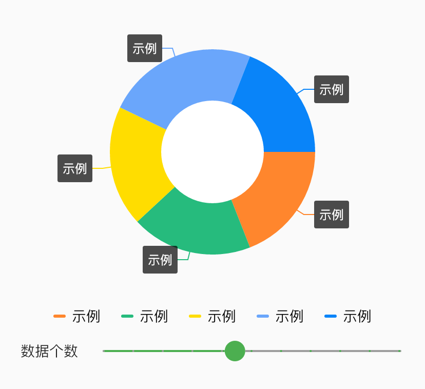

# BrnDoughnutChart

环状图通过扇形区块的面积，弧度和颜色等视觉标记，展现数据的分类和占比情况。它的特点是展现部分与部分之间，以及部分与整体的关系。部分相加之和等于整体的 100%，用整圆表示

## 一、效果总览

 

## 二、描述

### 适用场景

1. 饼图主要包括图形、标签、图例等内容

2. 展现部分与部分之间，以及部分与整体的关系

3. 部分相加之和等于整体的 100%，用整圆表示

## 三、构造函数及参数说明

### 构造函数


```dart
BrnDoughnutChart(
    {this.width = 0,
    this.height = 0,
    this.padding = EdgeInsets.zero,
    this.ringWidth = 50,
    required this.data,
    this.fontSize = 12,
    this.fontColor = Colors.white,
    this.selectedItem,
    this.showTitleWhenSelected = false,
    this.selectCallback});
```
### 参数说明

| **参数名** | **参数类型** | **描述** | **是否必填** | **默认值** |
| --- | --- | --- | --- | --- |
| width | double | 宽 | 否 | 0 |
| height | double | 高 | 否 | 0 |
| padding | EdgeInsetsGeometry | 内边距 | 否 | EdgeInsets.zero |
| ringWidth | int | 圆环宽度 | 否 | 50 |
| data | `List<BrnDoughnutDataItem>` | 饼图数据 | 是 |  |
| fontSize | double | 选中时展示文字大小 | 否 | 12 |
| fontColor | Color | 选中时展示文字颜色 | 否 | Colors.white |
| selectedItem | BrnDoughnutDataItem? | 选中的项目 | 否 |  |
| selectCallback | BrnDoughnutSelectCallback? | 选中项目时候的回掉 | 否 |  |
| showTitleWhenSelected | bool | 是否仅在选中时展示 title  | 否 | false |

### 其他数据


```dart
DoughnutChartLegend(
      {this.legendStyle = BrnDoughnutChartLegendStyle.wrap,
      required this.data});
```
## 四、代码演示

### 效果一


```dart
Column(
  children: <Widget>[
    BrnDoughnutChart(
      padding: EdgeInsets.all(50),
      width: 200,
      height: 200,
      data: dataList,
      selectedItem: selectedItem,
      showTitleWhenSelected: true,
      selectCallback: (BrnDoughnutDataItem? selectedItem) {
        setState(() {
          this.selectedItem = selectedItem;
        });
      },
    ),
    DoughnutChartLegend(data: this.dataList, legendStyle: BrnDoughnutChartLegendStyle.wrap),
    Row(
      crossAxisAlignment: CrossAxisAlignment.center,
      children: <Widget>[
        Padding(
          padding: EdgeInsets.only(left: 20),
          child: Text('数据个数'),
        ),
        Expanded(
          child: Slider(
              value: count.toDouble(),
              divisions: 10,
              onChanged: (data) {
                setState(() {
                  this.count = data.toInt();
                  dataList.clear();
                  for (int i = 0; i < count; i++) {
                    dataList.add(BrnDoughnutDataItem(
                        title: '示例',
                        value: random(1, 5).toDouble(),
                        color: getColorWithIndex(i)));
                  }
                });
              },
              onChangeStart: (data) {},
              onChangeEnd: (data) {},
              min: 1,
              max: 10,
              label: '$count',
              activeColor: Colors.green,
              inactiveColor: Colors.grey,
              semanticFormatterCallback: (double newValue) {
                return '${newValue.round()}}';
              }),
        ),
      ],
    ),
  ],
)
```

