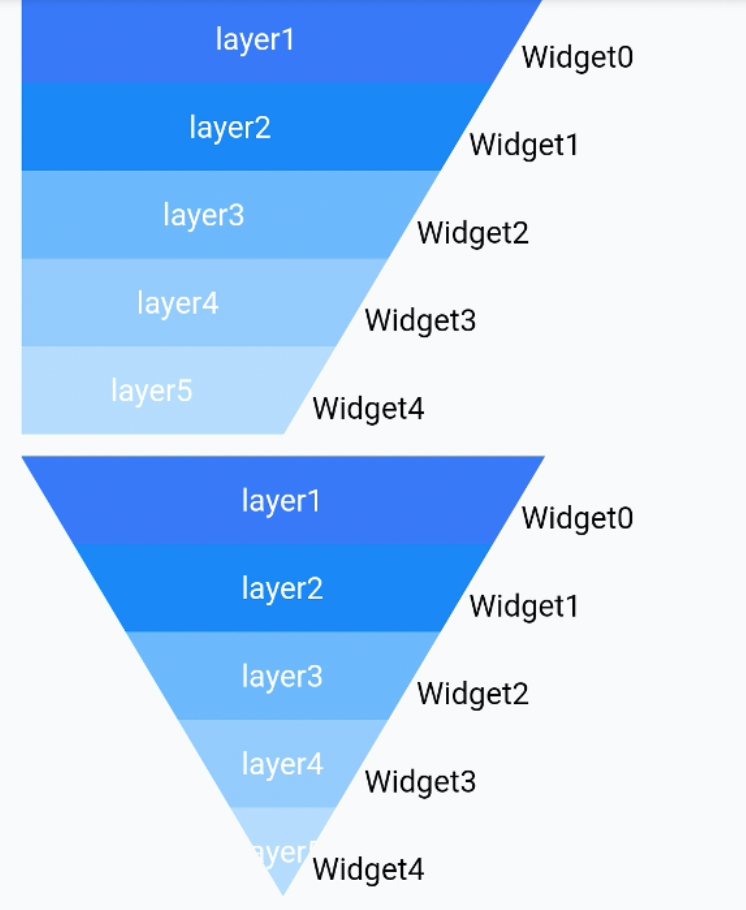
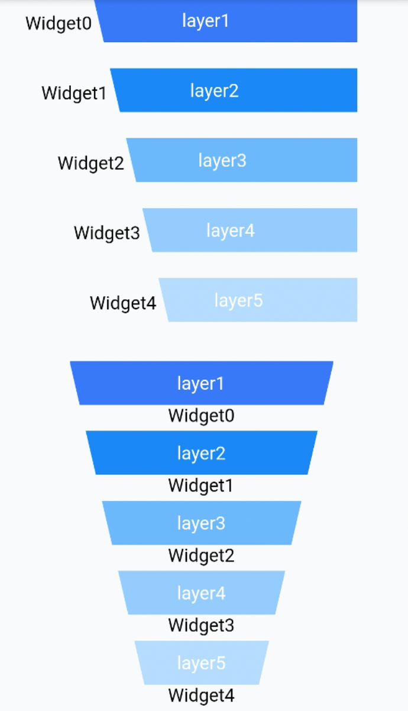
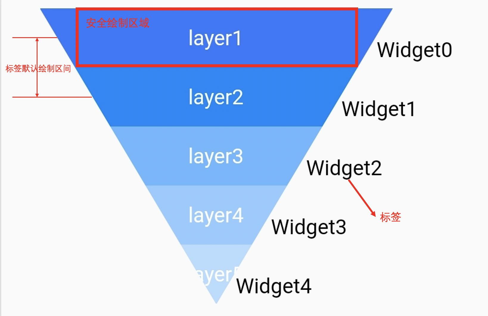
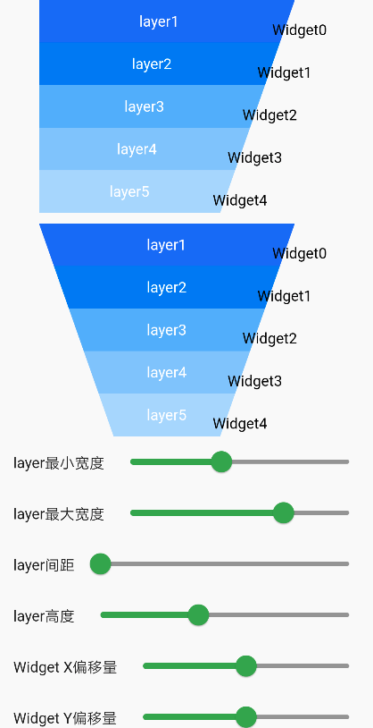

# BrnFunnelChart

漏斗图

## 一、效果总览

 
<br/>


## 二、描述

### 使用场景

1. 通常用于表达转化率的场景

2. 需要定制化漏斗图的场景

### 使用方式

在介绍使用方式前，先介绍漏斗图的几个基础概念。



如图是一个标准的漏斗图：

`layer` 代表漏斗的每一层，每一层之间的间距是可调整的。

`Widget` 是我们的标签，用户可以使用 Text 外其他 Widget。

一般来说标签的个数比 layer 的个数少一个，因为标签一般用于标识 layer 之间的关系。

这些标签的默认摆放位置如图上左上角标识出来，即 top 为上一层 layer 的中点，bottom 为下一层 layer 的中点。用户可以通过修改 XY 偏移量来进行调整摆放的位置。

在每层 layer 中可以自行绘制文案，如图中的 layer1，layer2。图中所标识的安全绘制区域表示在这区域内文案不会被裁剪，超出这个区域就有被裁剪的可能。这个区域会在回调中提供给使用者。

## 三、构造方法及参数说明

### 构造函数

```dart
BrnFunnelChart({
    Key? key,
    required this.layerCount,
    required this.markerCount,
    required this.layerPainter,
    required MarkerBuilder builder,
    this.shape = FunnelShape.leftAndRight,
    this.maxLayerWidth = 200,
    this.minLayerWidth = 0,
    this.layerHeight = 40,
    this.layerMargin = 0,
    this.childOffset = Offset.zero,
    this.alignment = MarkerAlignment.right,
  }) 
```

### 参数说明

| 参数名        | 参数类型              | 描述                        | 是否必填 | 默认值                   | 备注                                                         |
| ------------- | --------------------- | --------------------------- | -------- | ------------------------ | ------------------------------------------------------------ |
| layerCount    | int                   | 漏斗图的层级数              | 是       |                          |                                                              |
| markerCount   | int                   | 漏斗图的标签个数            | 是       |                          | 标签个数和层技数必须相等或者是少一个                         |
| layerPainer   | BrnFunnelLayerPainter | 用于控制绘制每一次层的文案  | 是       |                          | 见详细 BrnFunnelLayerPainter 介绍                            |
| builder       | Function              | 用于提供每一层的标签 Widget | 是       |                          |                                                              |
| shape         | FunnelShape           | 用于控制漏斗的形状          | 否       | FunnelShape.LeftAndRight | FunnelShape.LeftAndRight 表示倒三角的漏斗图形状 FunnelShape.LeftorRight 表示梯形形状的漏斗图 |
| maxLayerWidth | double                | 漏斗每层的最大宽度          | 否       | 200                      |                                                              |
| minLayerWidth | double                | 漏斗每层的最小宽度          | 否       | 0                        |                                                              |
| layerHeight   | double                | 漏斗每层的高度              | 否       | 40                       |                                                              |
| layerMargin   | double                | 漏斗每层的间距              | 否       | 0                        |                                                              |
| childOffset   | Offset                | 标签的偏移量                | 否       | Offset.Zero              | 标签在初始摆放位置上的相对偏移量                             |
| alignment     | MarkerAlignment       | 标签的对齐方式              | 否       | MarkerAlignment.right    | 总共有三种情况偏左，居中和偏右。当漏斗 shape 为 FunnelShape.leftOrRight 时不能设置成居中 |

#### BrnFunnelLayerPainter

用于控制每一层文案的绘制

```dart
abstract class BrnFunnelLayerPainter {
  ///该层layer的颜色是否渐变
  bool isGradient(int layerIndex);

  ///该层layer的颜色值
  List<Color> getLayerColors(int layerIndex);

  ///当需要绘制Layer的时候，会调用该方法。子类在该方法里实现自己的绘制逻辑。
  ///[canvas] 提供的画布，对画布进行旋转裁剪等特殊操作，一定要调用[canvas.save()]操作。
  ///[left],[top],[right],[bottom]是提供给调用者绘制的一个安全区域，超过这个区域限制，可能会被截断
  ///[layerIndex] 漏斗的layer index。
  void paintLayer(Canvas canvas, double left, double top, double right,
      double bottom, int layerIndex);
}
```

## 四、代码演示

### 效果1：



```dart
BrnFunnelChart(
  shape: FunnelShape.leftOrRight,
  alignment: MarkerAlignment.right,
  maxLayerWidth: maxLayerWidth,
  minLayerWidth: minLayerWidth,
  layerMargin: layerMargin,
  layerHeight: layerHeight,
  markerCount: 5,
  childOffset: Offset(offsetX, offsetY),
  layerPainter: BrnDefaultFunnelLayerPainter(
      titles: ['layer1', 'layer2', 'layer3', 'layer4', 'layer5']),
  layerCount: 5,
  builder: (index) {
    return Container(
      child: Row(
          crossAxisAlignment: CrossAxisAlignment.center,
          mainAxisSize: MainAxisSize.min,
          children: <Widget>[
            Text(
              'Widget${index.toString()}',
              style: TextStyle(color: Colors.black, fontSize: 14),
            ),
          ]),
    );
  },
)
```

```dart
BrnFunnelChart(
  shape: FunnelShape.LeftAndRight,
  alignment: alignment,
  maxLayerWidth: maxLayerWidth,
  minLayerWidth: minLayerWidth,
  layerMargin: layerMargin,
  layerHeight: layerHeight,
  markerCount: 5,
  childOffset: Offset(offsetX, offsetY),
  layerPainter: BrnDefaultFunnelLayerPainter(
      titles: ['layer1', 'layer2', 'layer3', 'layer4', 'layer5']),
  layerCount: 5,
  builder: (index) {
    return Container(
      child: Row(
          crossAxisAlignment: CrossAxisAlignment.center,
          mainAxisSize: MainAxisSize.min,
          children: <Widget>[
            Text(
              'Widget${index.toString()}',
              style: TextStyle(color: Colors.black, fontSize: 14),
            ),
          ]),
    );
  },
)
```