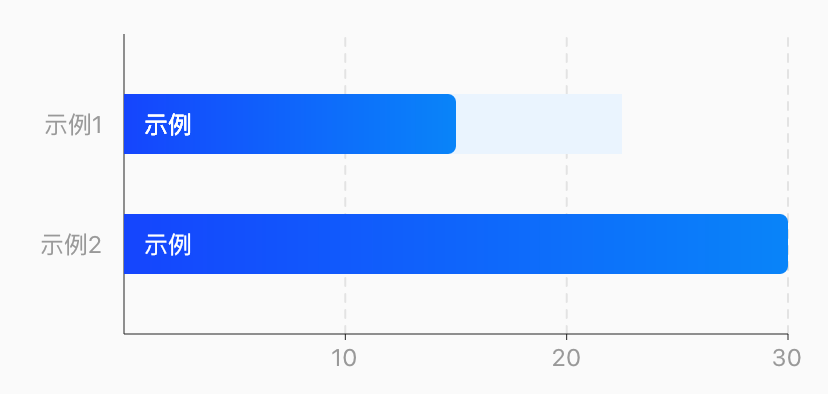
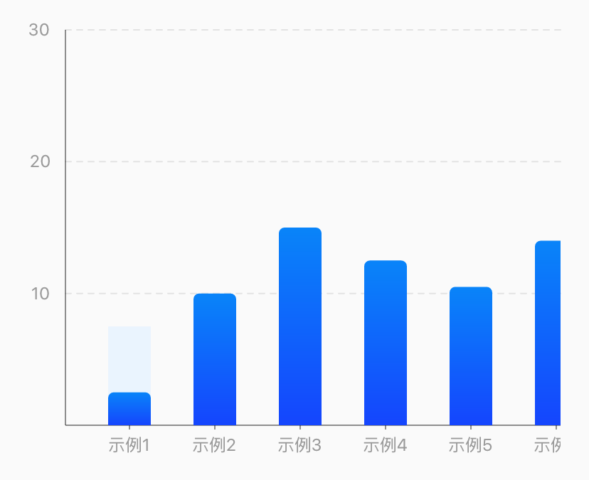

# BrnProgressBarChart

数据条形柱状图。

## 一、效果总览

 
<br/>
 

## 二、描述

### 适用场景

柱状图用于描述分类数据之间的对比，如果我们把时间周期，如周、月、年，也理解为一种分类数据，那么柱状图也可以用于描述时间周期之间的数值比较。该组件不仅可满足普通使用柱状图图的场景，也支持定制化。

### 使用规范

竖状布局建议默认五项数值，超出可做横滑操作，最多建议支持9项，再多需采用条形图展示。

## 三、构造函数及参数说明

### 构造函数


```dart
BrnProgressBarChart(
      {Key? key,
      this.minWidth = 0,
      this.padding = const EdgeInsets.all(20),
      this.barChartStyle = BarChartStyle.vertical,
      required this.xAxis,
      required this.yAxis,
      required this.barBundleList,
      this.barGroupSpace = 30,
      this.singleBarWidth = 30,
      this.barMaxValue = 0,
      this.selectedHintTextColor = Colors.white,
      this.selectedHintTextBackgroundColor = Colors.black,
      this.onBarItemClickInterceptor,
      this.barChartSelectCallback,
      this.height = 300})
      : super(key: key) {
    if (BarChartStyle.horizontal == barChartStyle) {
      assert(barBundleList[0].barList.length == yAxis.axisItemList.length,
          '水平柱状图个数与Y轴坐标数目要相等');
    } else if (BarChartStyle.vertical == barChartStyle) {
      assert(barBundleList[0].barList.length == xAxis.axisItemList.length,
          '竖直柱状图个数与X轴坐标数目要相等');
    }
  }
```
### 参数说明

| **参数名** | **参数类型** | **描述** | **是否必填** | **默认值** |
| --- | --- | --- | --- | --- |
| minWidth | double | 最小宽度 | 否 | 0 |
| height | double | 图标高度 | 否 | 300 |
| padding | EdgeInsetsGeometry | 内边距 | 否 | EdgeInsets.all(20) |
| barChartStyle | BarChartStyle | 水平/竖直方向条形图 | 否 | BarChartStyle.vertical |
| xAxis | ChartAxis | x轴数据 | 是 |  |
| yAxis | ChartAxis | y轴数据 | 是 |  |
| barBundleList | `List<BrnProgressBarBundle>` | 柱形数据 | 是 |  |
| barGroupSpace | double | 柱状图间距 | 否 | 30 |
| singleBarWidth | double | 条形宽度 | 否 | 30 |
| barMaxValue | double | 柱状图最大值 | 否 | 0 |
| selectedHintTextColor | Color | 选中柱状图提示文案文本颜色 | 否 | Colors.white |
| selectedHintTextBackgroundColor | Color | 选中柱状图提示文案文本背景颜色 | 否 | Colors.black |
| barChartSelectCallback | BrnProgressBarChartSelectCallback | 选中柱状图时候的回调 | 否 |  |
| onBarItemClickInterceptor | OnBarItemClickInterceptor | 柱状图是否可点击回调 | 否 |  |


### 其他类型说明

#### ChartAxis

x、y 轴刻度配置

``` dart
ChartAxis({
  required this.axisItemList, /// 刻度数据集合
  this.axisStyle = AxisStyle.axisStyleSolid,  /// 刻度线风格：实线/虚线/无
  this.inclineText = false,  /// 倾斜坐标轴文本，避免文本距离过近，目前仅针对X轴文本有效
});
```


#### BrnProgressBarBundle

柱状图中的一组数据，

``` dart
BrnProgressBarBundle({
  required this.barList, /// 一组数据集
  this.colors = _defaultColor, /// Progress 值对应的颜色
  this.hintColors = _defaultHintColor, /// 柱状背景色
});
```


#### BrnProgressBarItem

BrnProgressBarBundle 一组数据中单个柱状的配置

``` dart
BrnProgressBarItem({
  this.text, /// 柱状数据的描述文本(仅水平方向会展示)
  required this.value, /// 当前值
  this.hintValue, /// 最大值
  this.selectedHintText, /// 选中时气泡文字
  this.showBarValueText, /// 展示柱形的值
  this.showBarValueTextStyle = _showBarValueTextStyle, ///展示柱形值文本样式
});
```


## 四、代码演示

### 效果1：




```dart
BrnProgressBarChart(
  barChartStyle: BarChartStyle.vertical,
  xAxis: ChartAxis(axisItemList: [
    AxisItem(showText: '示例1'),
    AxisItem(showText: '示例2'),
    AxisItem(showText: '示例3'),
    AxisItem(showText: '示例4'),
    AxisItem(showText: '示例5'),
    AxisItem(showText: '示例6'),
    AxisItem(showText: '示例7'),
    AxisItem(showText: '示例8'),
    AxisItem(showText: '示例9'),
    AxisItem(showText: '示例10'),
  ]),
  barBundleList: [
    BrnProgressBarBundle(barList: [
      BrnProgressBarItem(
          text: '示例11', value: 5, hintValue: 15, showBarValueText: "1122334"),
      BrnProgressBarItem(text: '示例12', value: 20, selectedHintText: '示例12:20'),
      BrnProgressBarItem(
          text: '示例13',
          value: 30,
          selectedHintText: '示例13:30\n示例13:30\n示例13:30\n示例13:30\n示例13:30\n示例13:30'),
      BrnProgressBarItem(text: '示例14', value: 25),
      BrnProgressBarItem(text: '示例15', value: 21),
      BrnProgressBarItem(text: '示例16', value: 28),
      BrnProgressBarItem(text: '示例17', value: 15),
      BrnProgressBarItem(text: '示例18', value: 11),
      BrnProgressBarItem(text: '示例19', value: 30),
      BrnProgressBarItem(text: '示例110', value: 24),
    ], colors: [
      Color(0xff1545FD),
      Color(0xff0984F9)
    ]),
    BrnProgressBarBundle(barList: [
      BrnProgressBarItem(text: '示例21', value: 20, hintValue: 15),
      BrnProgressBarItem(text: '示例22', value: 15, selectedHintText: '示例12:20'),
      BrnProgressBarItem(
          text: '示例23',
          value: 30,
          selectedHintText: '示例13:30\n示例13:30\n示例13:30\n示例13:30\n示例13:30\n示例13:30'),
      BrnProgressBarItem(text: '示例24', value: 20),
      BrnProgressBarItem(text: '示例25', value: 28),
      BrnProgressBarItem(text: '示例26', value: 25),
      BrnProgressBarItem(text: '示例27', value: 17),
      BrnProgressBarItem(text: '示例28', value: 14),
      BrnProgressBarItem(text: '示例29', value: 36),
      BrnProgressBarItem(text: '示例210', value: 29),
    ], colors: [
      Color(0xff01D57D),
      Color(0xff01D57D)
    ]),
  ],
  yAxis: ChartAxis(axisItemList: [
    AxisItem(showText: '10'),
    AxisItem(showText: '20'),
    AxisItem(showText: '30')
  ]),
  singleBarWidth: 30,
  barGroupSpace: 30,
  barMaxValue: 60,
  onBarItemClickInterceptor: (barBundleIndex, barBundle, barGroupIndex, barItem) {
    return true;
  },
)
```
### 效果2：


```dart
BrnProgressBarChart(
  barChartStyle: BarChartStyle.horizontal,
  xAxis: ChartAxis(axisItemList: [
    AxisItem(showText: '10'),
    AxisItem(showText: '20'),
    AxisItem(showText: '30')
  ]),
  yAxis: ChartAxis(axisItemList: [AxisItem(showText: '示例1'), AxisItem(showText: '示例2')]),
  singleBarWidth: 30,
  barBundleList: [
    BrnProgressBarBundle(barList: [
      BrnProgressBarItem(text: '示例', value: 10, hintValue: 15),
      BrnProgressBarItem(text: '示例', value: 20)
    ], colors: [
      Color(0xff1545FD),
      Color(0xff0984F9)
    ]),
  ],
)
```