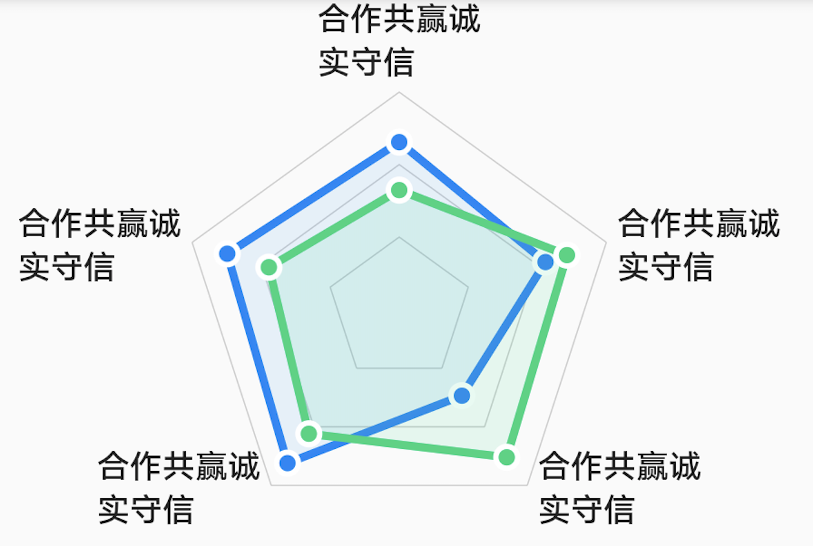
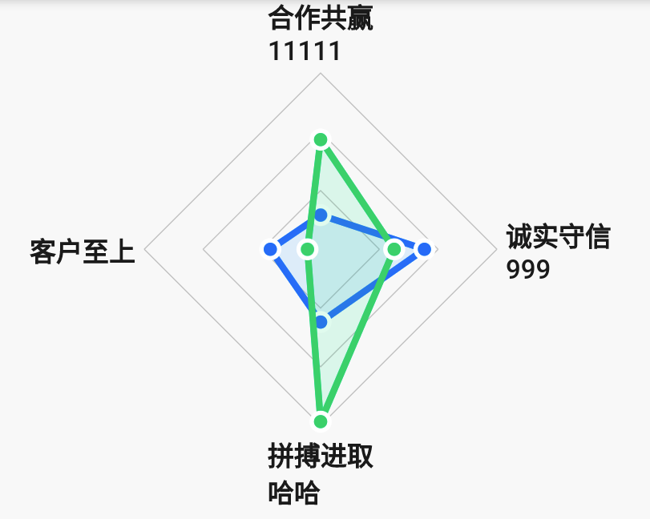
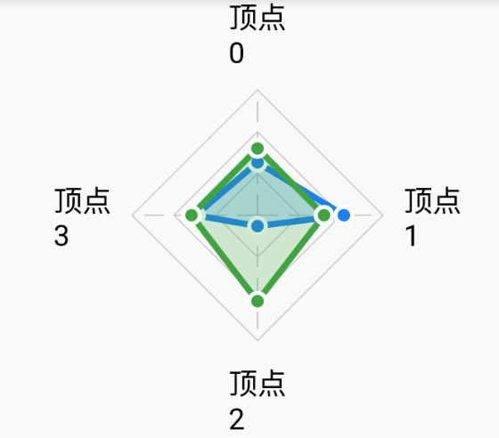

# BrnRadarChart

雷达图

## 一、效果总览



## 二、描述

### 适用场景

1. 满足普通使用雷达图的场景

2. 雷达图文案需要定制化的场景

### 使用方式

雷达图提供两种方式进行创建：

1. 默认风格，通过使用命名构造函数 BrnRadarChart.defautStyle()进行创建，创建出的雷达图将与设计规范完全一致。特点：使用者只需提供一些少量的基础参数，便能创建一个满足设计规范的雷达图。但是，使用者无法做一些定制化效果，没有点击效果，并且对提供的参数也会有一些限制。
2. 定制风格，通过使用默认的构造函数，可以创建出一个更加定制化的雷达图。特点：使用者可以添加自定义控件，自定义点击事件，但是需要提供较多的一些参数。

### 注意事项

默认设计风格最大允许同时显示 6 个雷达图，超过这个数将会报错！

## 三、构造函数及参数说明

### 构造函数

```dart
BrnRadarChart({
    Key? key,
    required this.provider,
    required MarkerBuilder builder,
    this.radius = 50,
    this.levelCount = 3,
    this.maxValue = 10,
    this.minValue = 0,
    this.markerMargin = 4,
    this.sidesCount = 5,
    this.offset,
    this.axisLineColor = const Color(0xFFCCCCCC),
    this.crossedAxisLine = false,
    this.animateProgress = 1.0,
    this.rotateAngle = 0,
  })  : assert(minValue < maxValue),
        assert(sidesCount >= 3),
        super(
            key: key,
            children: () {
              List<Widget> children = [];
              for (int i = 0; i < sidesCount; i++) {
                children.add(builder(i));
              }
              return children;
            }());
```

#### 默认风格

使用 Bruno 默认风格，通过使用命名构造函数 `BrnRadarChart.defautStyle()` 进行创建。

```dart
BrnRadarChart.defaultStyle({
    Key? key,
    this.radius = 50,
    this.levelCount = 3,
    this.maxValue = 10,
    this.minValue = 0,
    this.markerMargin = 4,
    this.sidesCount = 5,
    this.rotateAngle = 0,
    this.crossedAxisLine = false,
    this.offset,
    required List<String> tagNames,
    required List<List<double>> data,
  })  : assert(sidesCount >= 3),
        assert(tagNames.length == sidesCount),
        assert(minValue < maxValue),
        assert(data.length <= defaultRadarChartStyles.length),
        this.animateProgress = 1.0,
        this.axisLineColor = const Color(0xFFCCCCCC),
        this.provider = DefaultRadarProvider(data),
        super(
            key: key,
            children: () {
              List<Widget> children = [];
              for (int i = 0; i < sidesCount; i++) {
                children.add(Container(
                  constraints: BoxConstraints(
                    maxWidth: 60,
                    maxHeight: 32,
                  ),
                  child: Text(
                    tagNames[i],
                    maxLines: 2,
                    overflow: TextOverflow.ellipsis,
                    style: TextStyle(
                        color: Color(0xFF222222),
                        fontSize: 12,
                        fontWeight: FontWeight.w600),
                  ),
                ));
              }
              return children;
            }());
```

### 参数说明

| 参数名          | 参数类型                  | 作用                                           | 是否必填                                             | 默认值            | 备注                                                         |
| --------------- | ------------------------- | ---------------------------------------------- | ---------------------------------------------------- | ----------------- | ------------------------------------------------------------ |
| radius          | double                    | 雷达图半径（多边形外接圆的半径）               | 否                                                   | 50                |                                                              |
| levelCount      | int                       | 数据可划分的区间个数                           | 否                                                   | 3                 | 每个区间取值范围等分                                         |
| maxValue        | double                    | 数据的最大值                                   | 否                                                   | 10                | 提供的数据要不大于最大值，否则当最大值处理                   |
| minValue        | double                    | 数据的最小值                                   | 否                                                   | 0                 | 提供的数据要不小于最小值，否则当最小值处理                   |
| markerMargin    | double                    | 标签和雷达图顶点的间距                         | 否                                                   | 4                 |                                                              |
| sidesCount      | int                       | 雷达数据的维度（多边形的边数）                 | 否                                                   | 5                 | 边数应该和单个雷达数据的个数一致，否则可能出错               |
| data            | `List<List<Double>>`      | 提供所需绘制的雷达图个数以及各雷达图顶点的数值 | 是                                                   |                   | 是个二维数组，第一维决定了需要绘制多少个雷达在图表中，第二维表示每雷达每一个顶点的数值 |
| tagNames        | `List<String>`            | 各个顶点的标签文案                             | 是                                                   |                   | 文案的个数与顶点个数应保持一致                               |
| rotateAngle     | double                    | 整个雷达图旋转角度                             | 否                                                   | 0                 |                                                              |
| crossedAxisLine | bool                      | 是否展示中间十字交叉线                         |                                                      |                   |                                                              |
| offset          | `List<Offset>?`           | 每个标注文案的偏移量                           | 否                                                   | [Offset.zero]     | 个数应与 sidesCount 保持一致                                 |
| provider        | BrnRadarChartDataProvider | 提供绘制雷达图所需要的数据                     | 使用默认构造方法必传。默认样式无此参数配置。         |                   |                                                              |
| builder         | MarkerBuilder             | 自定义雷达图的标签（标签由使用者提供 widget）  | 使用默认构造方法必传。默认样式无此参数配置。         |                   |                                                              |
| axisLineColor   | Color                     | 背景多边形轴颜色                               | 默认构造方法有此配置，非必传。默认样式无此参数配置。 | Color(0xFFCCCCCC) |                                                              |
| animateProgress | double                    | 控制带动画效果绘制时的绘制快慢                 | 默认构造方法有此配置，非必传。默认样式无此参数配置。 | 1.0               |                                                              |

首先介绍两个构造函数中涉及到的相关的类

#### `BrnRadarChartDataProvider`

提供绘制图表所需的雷达图的数据

```dart
abstract class BrnRadarChartDataProvider {
  ///Return radar chart count
  int getRadarCount();

  ///Get the radar drawing style of the radar chart according to the specified index.
  BrnRadarChartStyle getRadarStyle(int radarIndex);

  ///Get the radar drawing values of the radar chart according to the specified index.
  ///The values determine radar's vertexes.The length must be same as [BrnRadarChart.sidesCount].
  ///The value must range from [BrnRadarChart.minValue] to [BrnRadarChart.maxValue].
  ///Put values to the list by clockwise order, start from 12 o'clock.
  List<double> getRadarValues(int radarIndex);
}
```

三个方法：

getRadarCount：返回图表中雷达图个数

getRadarStyle：返回指定 Index 的雷达图的绘制样式

getRadarValues：返回指定 Index 的雷达图的各顶点的数值

#### `BrnRadarChartStyle`

描述单个雷达图的绘制样式

```dart
const BrnRadarChartStyle({
  @required this.strokeColor,//雷达图边线的颜色
  @required this.areaColor,//雷达图边线围成的区域的颜色值
  this.strokeWidth = 3,//边线宽度
  this.dotted = false,//是否在雷达图个顶点绘制圆点
  this.dotColor,//圆点的颜色
  this.dotRadius = 3,//圆点的半径
});
```

## 四、代码展示

### 效果 1：默认风格



```dart
Map<String, List<double>> dataList1 = Map();
Map<String, List<double>> dataList2 = Map();

for (int i = 3; i <= 8; i++) {
  List<double> data1 = List();
  List<double> data2 = List();

  for (int j = 0; j < i; j++) {
    data1.add(Random().nextDouble() * 10);
    data2.add(Random().nextDouble() * 10);
  }
  dataList1[i.toString()] = data1;
  dataList2[i.toString()] = data2;
}

BrnRadarChart.defaultStyle(
  radius: 80,
  sidesCount: 4,
  markerMargin: 4,
  rotateAngle: 0,
  data: [
    dataList1[sideCount.toString()],
    dataList2[sideCount.toString()]
  ],
  tagNames: [
    '合作共赢\n11111',
    '诚实守信\n999',
    '拼搏进取\n哈哈',
    '客户至上'
  ],
)
```

### 效果 2：自定义风格



```dart
Map<String, List<double>> dataList1 = Map();
Map<String, List<double>> dataList2 = Map();

for (int i = 3; i <= 8; i++) {
  List<double> data1 = List();
  List<double> data2 = List();

  for (int j = 0; j < i; j++) {
    data1.add(Random().nextDouble() * 10);
    data2.add(Random().nextDouble() * 10);
  }
  dataList1[i.toString()] = data1;
  dataList2[i.toString()] = data2;
}

BrnRadarChart(
  radius: 80,
  provider: RadarProvider(4, dataList1, dataList2),
  sidesCount: 4,
  markerMargin: 4,
  crossedAxisLine: true,
  rotateAngle: 0,
  builder: (index) {
    return Text(
      '顶点\n${index.toString()}',
      style: TextStyle(color: Colors.black, fontSize: 14),
    );
  },
)


class RadarProvider extends BrnRadarChartDataProvider {
  final Map<String, List<double>> dataList1;

  final Map<String, List<double>> dataList2;

  final int sideCount;

  RadarProvider(this.sideCount, this.dataList1, this.dataList2);

  @override
  int getRadarCount() {
    return 2;
  }

  @override
  BrnRadarChartStyle getRadarStyle(int radarIndex) {
    switch (radarIndex) {
      case 0:
        return const BrnRadarChartStyle(
          strokeColor: Colors.blue,
          areaColor: Color(0x332196F3),
          dotted: true,
          dotColor: Colors.blue,
        );
      case 1:
        return const BrnRadarChartStyle(
          strokeColor: Colors.green,
          areaColor: Color(0x334CAF50),
          dotted: true,
          dotColor: Colors.green,
        );
    }
    return const BrnRadarChartStyle(
      strokeColor: Colors.blue,
      strokeWidth: 1,
      areaColor: Color(0x332196F3),
      dotted: true,
      dotColor: Colors.blue,
      dotRadius: 2,
    );
  }

  @override
  List<double> getRadarValues(int radarIndex) {
    switch (radarIndex) {
      case 0:
        return dataList1[sideCount.toString()];
      case 1:
        return dataList2[sideCount.toString()];
    }
    return dataList1[sideCount.toString()];
  }
}
```
