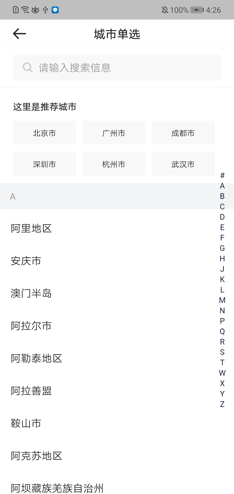

# BrnSingleSelectCityPage

## 一、效果总览


## 二、描述

### 适用场景

`BrnSingleSelectCityPage`是用于城市选择的单选页面，可以自定制导航栏文案，搜索文案信息，定位信息，右侧可快速滑动查看城市。

## 三、构造函数及参数说明

### 构造函数

```dart
BrnSingleSelectCityPage({
    this.appBarTitle = '',
    this.hotCityTitle = '',
    this.hotCityList,
    this.cityList,
    this.showSearchBar = true,
    this.locationText = '',
    this.onValueChanged,
    this.emptyImage,
  });
```


### 参数说明

| **参数名** | **参数类型** | **描述** | **是否必填** | **默认值** |
| --- | --- | --- | --- | --- |
| appBarTitle | String? | 导航栏标题 | 否 | "" |
| hotCityTitle | String? | 热门推荐标题 | 否 | "" |
| showSearchBar | bool | 是否展示searchBar | 否 |  |
| locationText | String | 当前定位城市文案 | 否 | "" |
| cityList | `List<BrnSelectCityModel>?` | 城市列表 | 否 |  |
| onValueChanged | ValueChanged<BrnSelectCityModel>? | 点击时间 | 否 |  |
| hotCityList | `List<BrnSelectCityModel>?` | 热门推荐城市列表 | 否 |  |
| emptyImage | `Image?` | 暂无搜索结果页面占位图 | 否 |  |

### 其它数据


```dart

/// 页面标题，默认空
final String? appBarTitle;

/// 热门推荐标题，默认空
final String? hotCityTitle;

/// 是否展示searchBar，默认 true
final bool showSearchBar;

/// 当前城市定位文案展示
final String locationText;

/// 城市列表
final List<BrnSelectCityModel>? cityList;

/// 热门推荐城市列表
final List<BrnSelectCityModel> hotCityList;

/// 单选项 点击的回调
final ValueChanged<BrnSelectCityModel>? onValueChanged;

/// 空页面中间展位图展示
final Image? emptyImage;
  
  ///城市信息  
BrnSelectCityModel {
  /// 城市名称
  String name = "";

  /// 城市名称前这是的标记符号 
  String tagIndex = "";

  /// 拼音
  String? namePinyin;

  String tag = "";

  /// 城市编码
  String cityCode = ""; 
}
```


## 四、代码展示

### 效果1



```dart
   List<BrnSelectCityModel> hotCityList = [];
    hotCityList.addAll([
      BrnSelectCityModel(name: "北京市"),
      BrnSelectCityModel(name: "广州市"),
      BrnSelectCityModel(name: "成都市"),
      BrnSelectCityModel(name: "深圳市"),
      BrnSelectCityModel(name: "杭州市"),
      BrnSelectCityModel(name: "武汉市"),
    ]);
    return BrnSingleSelectCityPage(
      appBarTitle: '城市单选',
      hotCityTitle: '这里是推荐城市',
      hotCityList: hotCityList,
    );
   			
```