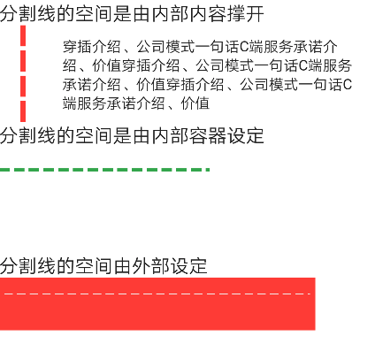

# BrnDashedLine

界面元素中的虚线分割线


## 一、效果总览



## 二、描述

### 适用场景  

1. 界面元素中的分割线

2. 分割线样式的装饰

## 三、构造函数及参数说明

### 构造函数


```dart
BrnMetaDashedLine({  
  Key key,  
  @required this.contentWidget,  
  this.axis,  
  this.dashedLength,  
  this.dashedThickness,  
  this.dashedSpacing,  
  this.color,  
  this.dashedOffset,  
  this.position,  
});
```
### 参数说明

| **参数名** | **参数类型** | **描述** | **是否必填** | **默认值** |
| --- | --- | --- | --- | --- |
| contentWidget | Widget | 虚线的Wiget | 否 | 无 |
| axis | Axis | 虚线方向 | 否 | Axis.horizontal |
| dashedLength | double | 虚线长度 | 否 | 8 |
| dashedThickness | double | 虚线厚度 | 否 | 1 |
| dashedSpacing | double | 虚线间距 | 否 | 4 |
| color | Color | 颜色 | 否 | BrunoColor.instance.L1Color |
| dashedOffset | double | 距离边缘的位置（偏移量） | 否 | 0 |
| position | BrnDashedLinePosition | 分割线所在位置 | 否 | 默认位置，头部BrnDashedLinePosition.DashedLineLeading |

## 四、代码演示

### 效果1


```dart
// 内部有内容  
BrnMetaDashedLine(  
  dashedLength: 20,  
  dashedThickness: 5,  
  axis: Axis.vertical,  
  color: Colors.red,  
  dashedOffset: 20,  
  position: BrnDashedLinePosition.DashedLineLeading,  
  contentWidget: Container(  
    margin: EdgeInsets.only(left: 60, right: 20, top: 10, bottom: 10),  
    child: Text("穿插介绍、公司模式一句话C端服务承诺介绍、价值穿插介绍、公司模式一句话C端服务承诺介绍、价值穿插介绍、公司模式一句话C端服务承诺介绍、价值"),  
  ),  
)
```
#### 效果2


```dart
// 内部没有内容  
BrnMetaDashedLine(  
  dashedLength: 10,  
  dashedThickness: 3,  
  axis: Axis.horizontal,  
  color: Colors.green,  
  dashedOffset: 20,  
  position: BrnDashedLinePosition.DashedLineLeading,  
  contentWidget: Container(  
    width: 200,  
    height: 100,  
  ),  
),
```
### 效果3


```dart
// 分割线的空间由外部设定  
Container(  
  height: 50,  
  width: 300,  
  padding: EdgeInsets.all(5),  
  color: Colors.red,  
  child: BrnMetaDashedLine(  
    axis: Axis.horizontal,  
    dashedOffset: 10,  
  ),  
),
```
