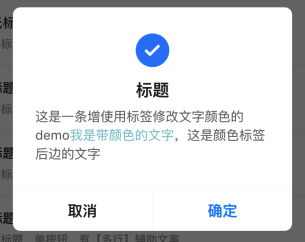

# BrnDialog

## 一、效果总览


## 二、描述

### 适用场景简介

1. 该类是一个Widget，可以通过Flutter的原始的方式showDialog 去show这个widget使用，也可以通过BrnDialogManager快捷使用

2. 通用的对话框，该类定义了一个对话框容器，容器的结构为头部icon、标题、内容文本，警示文案和底部操作区

3. BrnDialogManager类提供了快捷使用的静态方法，支持传入字符串显示对话框

4. 如果有自定义的需求，则直接给相应的区域传入widget

## 三、构造参数及参数说明

### 构造参数

```dart
BrnDialog({
    Key? key,
    this.showIcon = false,
    this.iconImage,
    this.titleText,
    this.messageText,
    this.titleWidget,
    this.contentWidget,
    this.warningText,
    this.warningWidget,
    this.actionsWidget,
    this.divider = cDividerLine,
    this.verticalDivider = cVerticalDivider,
    this.actionsText,
    this.indexedActionCallback,
    this.themeData,
    this.titleMaxLines = cTitleMaxLines,
  }) : super(key: key);
```
### 参数配置

| **参数名** | **参数类型** | **作用** | **是否必填** | **默认值** |
| --- | --- | --- | --- | --- |
| showIcon | bool | 是否显示icon | 否 | false |
| iconImage | Image? | 头部显示的icon 默认为alert | 否 | 主题色alert |
| titleText | String? | 对话框的标题文案 | 否 | 无 |
| messageText | String? | 对话框中间的显示文本 | 否 | 无 |
| warningText | String? | 对话框的警示文案文本 | 否 | 无 |
| actionsText | `List<String>?` | 对话框底部的按钮 | 否 | 无 |
| titleWidget | Widget? | 自定义widget的标题 | 否 | 无 |
| contentWidget | Widget? | 自定义widget的内容 | 否 | 无 |
| warningWidget | Widget? | 自定义widget的警示内容 | 否 | 无 |
| actionsWidget | `List<Widget>?` | 对话框底部的自定义widget按钮 | 否 | 无 |
| indexedActionCallback | DialogIndexedActionClickCallback? | 对话框底部的点击回调 | 否 | 无 |
| divider | Divider | 底部按钮的水平和上面内容的水平分割线 | 否 | 高1像素的L1分割线 |
| verticalDivider | VerticalDivider | 底部按钮之间的分割线 | 否 | 宽1像素的L1分割线 |
| titleMaxLines | int | 标题文本的最大展示行数 | 否 | 2 |
| themeData | BrnDialogConfig? | 主题配置 | 否 | 无 |

### 快捷使用类BrnDialogManager

####  效果1: showSingleButtonDialog（单一按钮）


| **参数名** | **参数类型** | **作用** | **是否必填** | **默认值** |
| --- | --- | --- | --- | --- |
| context | BuildContext | 用于显示弹窗的上下文 | 是 | 五 |
| label | String | 弹窗的按钮文案 | 是 | 无 |
| showIcon | bool | 是否显示icon | 否 | false |
| iconWidget | Image? | 头部显示的icon 默认为alert | 否 | 主题色alert |
| title | String? | 对话框的标题文案 | 否 | 无 |
| titleWidget | Widget? | 自定义widget的标题 | 否 | 无 |
| message | String? | 对话框中间的显示文本 | 否 | 无 |
| messageWidget | Widget? | 自定义widget的内容 | 否 | 无 |
| warning | String? | 对话框的警示文案文本 | 否 | 无 |
| warningWidget | Widget | 自定义widget的警示内容 | 否 | 无 |
| labelWidget | Widget? | 对话框底部的自定义widget按钮 | 否 | 无 |
| onTap | GestureTapCallback? | 对话框按钮的点击回调 | 否 | 无 |
| barrierDismissible | bool | 点击对话框遮罩是否消失对话框 | 否 | true 关闭 |
| titleMaxLines | int | 标题最大行数 | 否 | 3 |
| themeData | BrnDialogConfig? | 主题配置 | 否 | 无 |

#### 效果2: showConfirmDialog（双按钮）


| **参数名** | **参数类型** | **作用** | **是否必填** | **默认值** |
| --- | --- | --- | --- | --- |
| context | BuildContext | 用于显示弹窗的上下文 | 是 | 五 |
| cancel | String | 弹窗的左侧文案 | 是 | 无 |
| confirm | String | 弹窗的右侧文案 | 是 | 无 |
| showIcon | bool | 是否显示icon | 否 | false |
| iconWidget | Image? | 头部显示的icon 默认为alert | 否 | 主题色alert |
| title | String? | 对话框的标题文案 | 否 | 无 |
| titleWidget | Widget? | 自定义widget的标题 | 否 | 无 |
| message | String? | 对话框中间的显示文本 | 否 | 无 |
| messageWidget | Widget? | 自定义widget的内容 | 否 | 无 |
| warning | String? | 对话框的警示文案文本 | 否 | 无 |
| warningWidget | Widget? | 自定义widget的警示内容 | 否 | 无 |
| dismiss | bool | 点击对话框按钮之后，对话框是否消失 | 否 | true 消失 |
| cancelWidget | Widget? | 对话框底部左侧的自定义widget按钮 | 否 | 无 |
| conformWidget | Widget? | 对话框底部右侧的自定义widget按钮 | 否 | 无 |
| onCancel | GestureTapCallback? | 对话框左侧按钮的点击回调 | 否 | 无 |
| onConfirm | GestureTapCallback? | 对话框右侧按钮的点击回调 | 否 | 无 |
| barrierDismissible | bool | 点击对话框遮罩是否消失对话框 | 否 | true 关闭 |
| titleMaxLines | int | 标题最大行数 | 否 | 3 |
| themeData | BrnDialogConfig？ | 主题配置 | 否 | 无 |

#### 效果3: showMoreButtonDialog（多按钮）


| **参数名** | **参数类型** | **作用** | **是否必填** | **默认值** |
| --- | --- | --- | --- | --- |
| context | BuildContext | 用于显示弹窗的上下文 | 是 | 五 |
| actions | `List<String>` | 对话框底部的按钮 | 否 | 无 |
| showIcon | bool | 是否显示icon | 否 | false |
| iconWidget | Image? | 头部显示的icon 默认为alert | 否 | 主题色alert |
| title | String? | 对话框的标题文案 | 否 | 无 |
| titleWidget | Widget? | 自定义widget的标题 | 否 | 无 |
| message | String? | 对话框中间的显示文本 | 否 | 无 |
| messageWidget | Widget? | 自定义widget的内容 | 否 | 无 |
| warning | String? | 对话框的警示文案文本 | 否 | 无 |
| warningWidget | Widget? | 自定义widget的警示内容 | 否 | 无 |
| actionsWidget |` List<Widget>?` | 对话框底部的自定义widget按钮 | 否 | 无 |
| indexedActionClickCallback | DialogIndexedActionClickCallback? | 对话按钮点击的回调 | 否 | 无 |
| titleMaxLines | int | 标题最大行数 | 否 | 3 |
| barrierDismissible | bool | 点击对话框遮罩是否消失对话框 | 否 | true 关闭 |
| themeData | BrnDialogConfig? | 主题配置 | 否 | 无 |

## 四、效果及代码展示

### 效果1: 直接使用BrnDialog（无标题、无按钮）


```dart
showDialog<void>(  
  context: context,  
  barrierDismissible: true,  
  builder: (BuildContext dialogContext) {  
    return BrnDialog(  
      messageText: "辅助内容信息辅助内容信息辅助内容信息辅助内容信息辅助内容信息",  
      actionsText: [],  
    );  
  },  
);
```
###  效果2: 标题+信息+按钮


```dart
BrnDialogManager.showConfirmDialog(context,  
    title: "标题内容",  
    cancel: '取消',  
    confirm: '确定',  
    message: "辅助内容信息辅助内容信息辅助内容信息辅助内容信息辅助内容信息。", confirmTap: () {  
  BrnToast.show("确定", context);  
}, cancelTap: () {  
  BrnToast.show("取消", context);  
});  
```
###  效果3: 标题+信息+警示+按钮


```dart
BrnDialogManager.showSingleButtonDialog(context,  
    label: "确定",  
    title: '标题内容',  
    warning: '错误文案展示/警示文案展示',  
    message: "辅助内容信息辅助内容信息辅助内容信息辅助内容信息辅助内容信息。", onTap: () {  
  BrnToast.show('知道了', context);  
});  
```
###  效果4: 标题+按钮


```dart
BrnDialogManager.showConfirmDialog(context,  
    title: "标题内容标题内容标题内容标题内容",  
    cancel: '取消',  
    confirm: '确定', confirmTap: () {  
  BrnToast.show("确定", context);  
}, cancelTap: () {  
  BrnToast.show("取消", context);  
});  
```
###  效果5: icon+标题+信息+按钮


```dart
BrnDialogManager.showConfirmDialog(context,  
    showIcon: true,  
    iconWidget: BrunoTools.getAssetImage("images/icon_warnning.png"),  
    title: "标题内容",  
    confirm: "确定",  
    cancel: "取消",  
    message: "辅助内容信息辅助内容信息辅助内容信息辅助内容信息辅助内容信息。", confirmTap: () {  
  BrnToast.show("确定", context);  
}, cancelTap: () {  
  BrnToast.show("取消", context);  
});  
```
###  效果6: icon+标题+信息+按钮

 


```dart
BrnDialogManager.showSingleButtonDialog(context,  
        showIcon: true, title: "标题内容标题内容", label: "确定", onTap: () {  
      BrnToast.show("确定", context);  
 });  
```
###  效果7: icon+标题+信息+按钮

 


```dart
BrnDialogManager.showMoreButtonDialog(context,  
    title: "标题内容",  
    actions: [  
      '选项一',  
      '选项二',  
      '选项三',  
    ],  
    message: "辅助内容信息辅助内容信息辅助内容信息辅助内容信息辅助内容信息。",  
    indexedActionClickCallback: (index) {  
  BrnToast.show("$index", context);  
});  
```
###  效果8: 标题+信息+竖排按钮

 


```dart
BrnDialogManager.showMoreButtonDialog(context,  
    actions: [  
      '选项一',  
      '选项二',  
      '选项三',  
    ],  
    title: "标题内容标题内容标题内容标题内容",  
    indexedActionClickCallback: (index) {  
  BrnToast.show("$index", context);  
});  
```
###  效果9: 标题+信息+竖排按钮

 


```dart
BrnDialogManager.showMoreButtonDialog(context,  
    actions: [  
      '选项一',  
      '选项二',  
      '选项三',  
    ],  
    message: "辅助内容信息辅助内容信息辅助内容信息辅助内容信息辅助内容信息。",  
    indexedActionClickCallback: (index) {  
  BrnToast.show("$index", context);  
});  
```
###  效果10: 富文本Widget




```dart
BrnDialogManager.showConfirmDialog(context,  
    cancel: "取消",  
    confirm: "确定",  
    title: "标题",  
    message: "辅助内容信息辅助内容信息辅助内容信息辅助内容信息辅助内容信息",  
    messageWidget: Padding(  
      padding: const EdgeInsets.only(top: 6, left: 24, right: 24),  
      child: BrnCSS2Text.toTextView(  
          "这是一条增使用标签修改文字颜色的demo\<font color = '#8ac6d1'\>我是带颜色的文字</font>，"  
              "这是颜色标签后边的文字",  
          linksCallback: (String text, String linkUrl) {  
        BrnToast.show('$text clicked!  Url is $linkUrl', context);  
      }),  
    ),  
    showIcon: true, confirmTap: () {  
  BrnToast.show("确定", context);  
});
```

