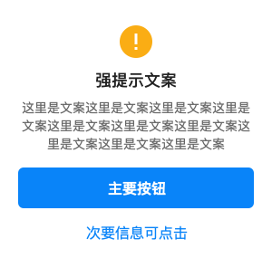
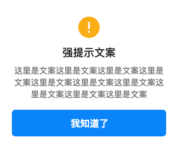
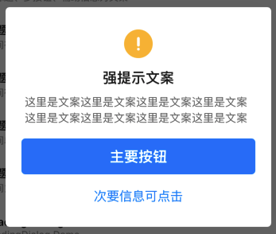

# BrnEnhanceOperationDialog

纵向单/双按钮Dialog

## 一、效果总览




## 二、描述

### 适用场景

1. 屏幕中间dialog弹窗
2. 可选择预设的提示图标（提示，警示，成功）
3. 可自定义标题文案
4. 可自定义辅助信息文案
5. 可自定义主要按钮文案
6. 可自定义次要按钮文案

## 三、构造函数及参数说明

### 构造函数

```dart
BrnEnhanceOperationDialog({
    this.iconType = BrnDialogConstants.iconAlert,
    this.customIconWidget,
    required this.context,
    this.titleText,
    this.descText,
    this.mainButtonText = '确认',
    this.secondaryButtonText,
    this.onMainButtonClick,
    this.onSecondaryButtonClick,
    this.themeData,
  }) {
    this.themeData ??= BrnDialogConfig();
    this.themeData = BrnThemeConfigurator.instance
        .getConfig(configId: this.themeData!.configId)
        .dialogConfig
        .merge(this.themeData);
  }
```


### 参数说明

| **参数名** | **参数类型** | **描述** | **是否必填** | **默认值** |
| --- | --- | --- | --- | --- |
| context | BuildContext | BuidContext | 是 | 空 |
| iconType | int | 在预设的提示图标中选择一个座位图标（提示：BrnDialogConstants**.**ICON\_ALERT警示：BrnDialogConstants**.**ICON\_WARNNING成功：BrnDialogConstants**.**ICON\_SUCCESS自定义图标：BrnDialogConstants.ICON\_CUSTOM） | 否 | 0，ICON\_ALERT |
| customIconWidget | Widget? | 自定义图标 | 否 |  |
| titleText | String? | 弹框标题文案（为空则**不显示**标题） | 否 | 无 |
| descText | String? | 弹框辅助信息文案（为空则**不显示**辅助信息） | 否 | 无 |
| mainButtonText | String | 主要按钮文案 | 否 | 无 |
| secondaryButtonText | String? | 次要按钮文案（为空则**不显示**次要按钮） | 否 | 无 |
| mainButtonCallBack | VoidCallback? | 点击**主要按钮**后回调方法，使用者**根据参数自行配置响应动作**。 | 否 | 空 |
| secondaryButtonCallBack | VoidCallback? | 点击**次要按钮**后回调方法，使用者**根据参数自行配置响应动作**。 | 否 | 空 |
| themeData | BrnDialogConfig? | 弹窗主题配置 | 否 | 默认取全局配置 |

## 四、代码演示

### 效果1: 警示图标+主标题+辅助信息+单按钮


```dart
BrnEnhanceOperationDialog enhanceOperationDialog = new BrnEnhanceOperationDialog(  
   iconType: BrnDialogConstants.ICON_WARNNING,  
   context: context,  
   titleText: "强提示文案",  
   descText: "这里是文案这里是文案这里是文案这里是文案这里是文案这里是文案这里是文案这里是文案",  
   mainButtonText: "我知道了",  
   mainButtonCallBack: () {  
     print("主要按钮");  
   },  
 );  
 enhanceOperationDialog.show();  
}
```
### 效果2: 提示图标+主标题+辅助信息+双按钮




```dart
BrnEnhanceOperationDialog enhanceOperationDialog = new BrnEnhanceOperationDialog(  
 context: context,  
 iconType: BrnDialogConstants.ICON_ALERT,  
 titleText: "强提示文案",  
 descText: "这里是文案这里是文案这里是文案这里是文案这里是文案这里是文案这里是文案这里是文案",  
 mainButtonText: "主要按钮",  
 secondaryButtonText: "次要信息可点击",  
 mainButtonCallBack: () {  
   print("主要按钮");  
 },  
 secondaryButtonCallBack: () {  
   print("次要按钮");  
 },  
);  
brnShareDialog.show();
```
