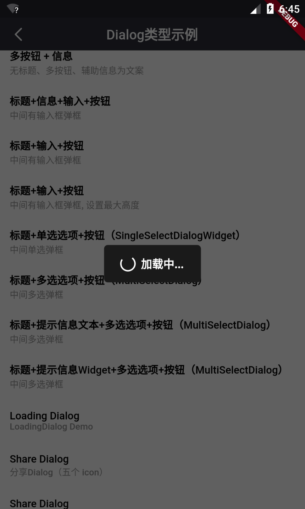

# BrnLoadingDialog

页面级加载框

## 一、效果总览



## 二、描述

### 适用场景简介

页面中间的加载弹窗，覆盖整个页面，可以配置显示的文字

## 三、构造函数及参数说明

### 构造函数

```dart
const BrnLoadingDialog({Key? key, this.content})
      : super(key: key);
```

### 参数说明

| **参数名** | **参数类型** | **描述**   | **是否必填** | **默认值** |
| ---------- | ------------ | ---------- | ------------ | ---------- |
| content    | String?       | 显示的文案 | 否           | 默认值为国际化配置文本 '加载中...'  |

## 四、效果及代码展示

###   效果 1：加载中


```dart
//显示
BrnLoadingDialog.show(context);

//关闭
BrnLoadingDialog.dismiss(context);
```
