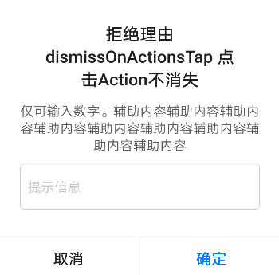
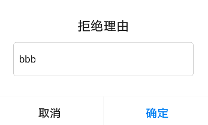

# BrnMiddleInputDialog

带输入的弹窗

## 一、效果总览



## 二、描述

1. 带输入框的Dialog，在BrnDialogManager 基础上封装了输入框功能。
2. 更进一步的细节定制，可使用 [BrnDialog](../widgets/brn-dialog) 实现

## 三、构造方法及参数说明

### 构造方法


```dart
const BrnMiddleInputDialog(
      {this.title,
      this.message,
      this.hintText,
      this.keyboardType,
      this.maxLength = 20,
      this.maxLines,
      this.minLines: 1,
      this.inputFocusNode,
      this.inputEditingController,
      this.inputFormatters,
      this.textInputAction = TextInputAction.newline,
      this.cancelText,
      this.confirmText,
      this.onConfirm,
      this.onCancel,
      this.dismissOnActionsTap = true,
      this.barrierDismissible = true,
      this.autoFocus = false,
      this.themeData,});
```
### 参数说明

| **参数名** | **参数类型** | **描述** | **是否必填** | **默认值** |
| --- | --- | --- | --- | --- |
| title | String? | 标题 | 否 |  |
| message | String? | 辅助内容 | 否 |  |
| hintText | String? | 提示语 | 否 |  |
| keyboardType | TextInputType? | 输入类型 | 否 | |
| maxLength | int | 最大输入长度 | 否 | 20 |
| maxLines | int? | 可输入的最maxLines多行数。超过 [maxLines] 指定的行数后，输入内容会变成可滑动 | 否 | |
| minLines | int | 可输入的最少行数 | 否 | 1 |
| inputFocusNode | FocusNode? | 焦点控制 | 否 |  |
| inputEditingController | TextEditingController? | 输入控制器。如果有初始状态的填充文字，可以通过 [inputEditingController] 设置 | 否 |  |
| cancelText? | String | 取消文案 | 否 | 默认值为国际化配置文本 '取消' |
| confirmText? | String | 确定文案 | 否 | 默认值为国际化配置文本 '确定' |
| inputFormatters | `List<TextInputFormatter>?` | 键盘操作按钮类型，可参见系统的 TextField.textInputAction | 否 | TextInputAction.newline |
| textInputAction | `TextInputAction` | 用于控制输入的内容范围比如只能输入数字可以填写:`FilteringTextInputFormatter.digitsOnly` | 否 | 无 |
| onConfirm | void Function(String value)? | 确定回调，返回输入的值 | 否 |  |
| onCancel | VoidCallback | 取消回调 | 否 |  |
| dismissOnActionsTap | bool | 点击取消/确认按钮之后，是否自动关闭弹窗 | 否 | true |
| barrierDismissible | bool | 点击蒙层背景，弹窗是否可关闭。 | 否 | true |
| autoFocus | bool | 是否自动获取焦点，弹出键盘 | 否 | false |
| themeData | BrnDialogConfig | 主题定制配置 | 否 | defaultDialogConfig |


## 四、效果及代码展示

###  效果1：标题+辅助信息内容


```dart
BrnMiddleInputDialog(
  title: '拒绝理由 dismissOnActionsTap 点击Action不消失',
  message: "仅可输入数字。辅助内容辅助内容辅助内容辅助内容辅助内容辅助内容辅助内容辅助内容辅助内容 ",
  hintText: '提示信息',
  cancelText: '取消',
  confirmText: '确定',
  autoFocus: true,
  maxLength: 1000,
  maxLines: 2,
  inputFormatters: [FilteringTextInputFormatter.digitsOnly],
  dismissOnActionsTap: false,
  barrierDismissible: true,
  onConfirm: (value) {
    BrnToast.show(value, context);
  },
  onCancel: () {
    BrnToast.show("取消", context);
    Navigator.pop(context);
  }).show(context);
```
### 效果2：标题+输入框+按钮，带默认值


```dart
BrnMiddleInputDialog(
  title: '拒绝理由',
  hintText: '提示信息',
  cancelText: '取消',
  confirmText: '确定',
  maxLength: 1000,
  maxLines: 2,
  barrierDismissible: false,
  inputEditingController: TextEditingController()..text = 'bbb',
  textInputAction: TextInputAction.done,
  onConfirm: (value) {
    BrnToast.show(value, context);
  },
  onCancel: () {
    BrnToast.show("取消", context);
    Navigator.pop(context);
  }).show(context);
```
