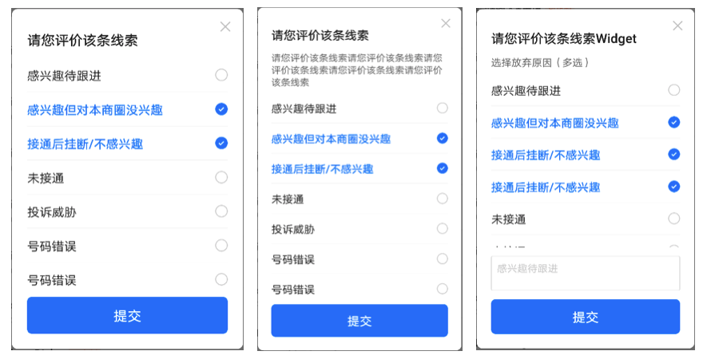
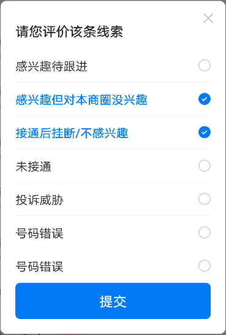
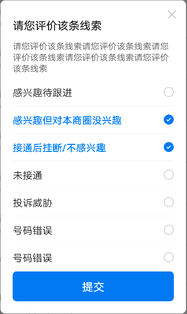
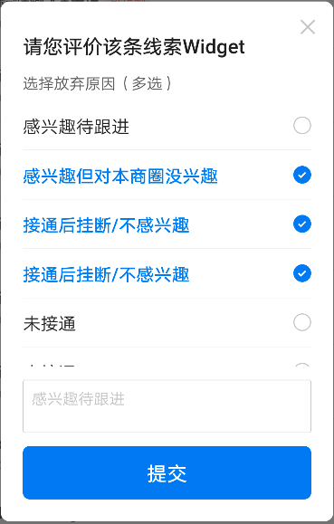

# BrnMultiSelectDialog

多选列表

## 一、效果总览

 

## 二、描述

### 适用场景

多选列表，适用于从页面中部弹出的情况，属于 Dialog。 相似组件有 [BrnMultiSelectListPicker](../widgets/brn-multi-select-list-picker)， 从页面中部弹出。

## 三、构造函数及参数说明

### 构造函数

```dart
BrnMultiSelectDialog({
    this.isClose = true,
    this.title = "",
    required this.conditions,
    this.messageText,
    this.messageWidget,
    this.customWidget,
    this.isCustomFollowScroll = true,
    this.submitText,
    this.submitBgColor,
    this.onSubmitClick,
    this.onItemClick,
    this.isShowOperateWidget = true,
  });
```

### 参数说明

| **参数名**           | **参数类型**                             | **描述**                           | **是否必填** | **默认值** |
| -------------------- | ---------------------------------------- | ---------------------------------- | ------------ | ---------- |
| isClose              | bool                                     | 是否展示右上角【X】按钮            | 否           | true       |
| conditions           | List                                     | 数据源                             | 否           |            |
| title                | String                                   | Dialog title                       | 否           | ""         |
| messageText          | String?                                  | 描述文案                           | 否           |            |
| messageWidget        | Widget?                                  | 自定义描述 widget                  | 否           |            |
| customWidget         | Widget?                                  | 底部自定义 widget                  | 否           |            |
| isCustomFollowScroll | bool                                     | 是否支持滚动                       | 否           | true       |
| onSubmitClick        | BrnMultiSelectDialogClickSubmitCallback? | 点击【完成】时回调给外部选中的数据 | 否           |            |
| onItemClick          | BrnMultiSelectDialogOnItemClickCallback? | Item 被点击的回调                  | 否           |            |
| submitText           | String?                                   | 底部提交按钮的文案                 | 否           | 默认值为国际化配置文本 '提交'      |
| submitBgColor        | Color?                                   | 底部按钮的主题色                   | 否           | 主题色     |
| isShowOperateWidget  | bool                                     | 是否展示底部操作区域               | 否           | true       |

## 四、代码演示

### 效果 1



```dart
List<MultiSelectItem> data =  [];
    data.add(new MultiSelectItem("100", "感兴趣待跟进"));
    data.add(new MultiSelectItem("101", "感兴趣但对本商圈没兴趣", isChecked: true));
    data.add(new MultiSelectItem("102", "接通后挂断/不感兴趣", isChecked: true));
    data.add(new MultiSelectItem("103", "未接通"));
    data.add(new MultiSelectItem("104", "投诉威胁"));
    data.add(new MultiSelectItem("104", "号码错误"));
    data.add(new MultiSelectItem("104", "号码错误"));
    data.add(new MultiSelectItem("104", "号码错误"));
    showDialog(
        context: context,
        builder: (_) => BrnMultiSelectDialog(
            title: "请您评价该条线索",
            isClose: true,
            conditions: data,
            onSubmitClick: (List<MultiSelectItem> data) {
              var str = "";
              data.forEach((item) {
                str = str + item.content + "  ";
              });
              BrnToast.show(str, context);
              return true;
            }));
```

### 效果 2



```dart
 List<MultiSelectItem> data = [];
data.add(new MultiSelectItem("100", "感兴趣待跟进"));
data.add(new MultiSelectItem("101", "感兴趣但对本商圈没兴趣", isChecked: true));
data.add(new MultiSelectItem("102", "接通后挂断/不感兴趣", isChecked: true));
data.add(new MultiSelectItem("103", "未接通"));
data.add(new MultiSelectItem("104", "投诉威胁"));
data.add(new MultiSelectItem("104", "号码错误"));
data.add(new MultiSelectItem("104", "号码错误"));
data.add(new MultiSelectItem("104", "号码错误"));
showDialog(
    context: context,
    builder: (_) => BrnMultiSelectDialog(
        title: "请您评价该条线索",
        messageText: '请您评价该条线索请您评价该条线索请您评价该条线索请您评价该条线索请您评价该条线索',
        isClose: true,
        conditions: data,
        onSubmitClick: (List<MultiSelectItem> data) {
          var str = "";
          data.forEach((item) {
            str = str + item.content + "  ";
          });
          BrnToast.show(str, context);
          return true;
        }));
```

### 效果 3



```dart
 String hintText = "感兴趣待跟进";
List<MultiSelectItem> data = [];
data.add(new MultiSelectItem("100", "感兴趣待跟进"));
data.add(new MultiSelectItem("101", "感兴趣但对本商圈没兴趣", isChecked: true));
data.add(new MultiSelectItem("102", "接通后挂断/不感兴趣", isChecked: true));
data.add(new MultiSelectItem("102", "接通后挂断/不感兴趣", isChecked: true));
data.add(new MultiSelectItem("103", "未接通"));
data.add(new MultiSelectItem("103", "未接通"));
data.add(new MultiSelectItem("104", "其他"));
showDialog(
    context: context,
    builder: (_) => StatefulBuilder(builder: (context, state) {
          return BrnMultiSelectDialog(
              title: "请您评价该条线索Widget",
              messageWidget: Row(
                children: <Widget>[
                  Text(
                    "选择放弃原因（多选）",
                    style: cContentTextStyle,
                  ),
                ],
              ),
              isClose: true,
              conditions: data,
              isCustomFollowScroll: false,
              customWidget: TextField(
                //光标颜色
                maxLines: 2,
                cursorColor: Color(0xFF0984F9),
                //光标圆角弧度
                cursorRadius: Radius.circular(2.0),
                style: TextStyle(fontSize: 14, color: Color(0xFF222222)),
                maxLengthEnforced: true,
                onChanged: (value) {},
                decoration: InputDecoration(
                  contentPadding: EdgeInsets.all(8.0),
                  hintText: hintText,
                  hintStyle: TextStyle(fontSize: 14, color: Color(0xFFCCCCCC)),
                  enabledBorder: OutlineInputBorder(
                      borderRadius: BorderRadius.circular(2.0),
                      borderSide: BorderSide(
                        width: 0.5,
                        color: Color(0xFFCCCCCC),
                      )),
                  focusedBorder: OutlineInputBorder(
                      borderRadius: BorderRadius.circular(2.0),
                      borderSide: BorderSide(
                        width: 0.5,
                        color: Color(0xFFCCCCCC),
                      )),
                ),
              ),
              onItemClick: (BuildContext contex, int index) {
                hintText = data[index].content;
                state(() {});
              },
              onSubmitClick: (List<MultiSelectItem> data) {
                var str = "";
                data.forEach((item) {
                  str = str + item.content + "  ";
                });
                BrnToast.show(str, context);
                return true;
              });
        }));
```
