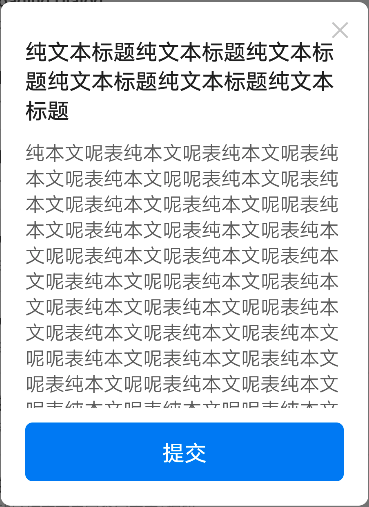
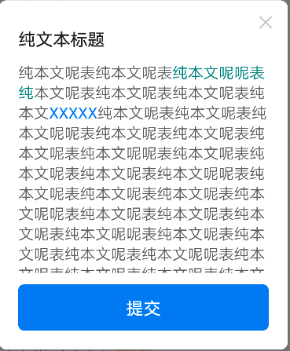
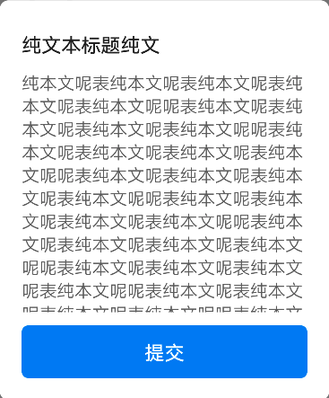
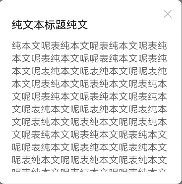

# BrnScrollableTextDialog

纯文本 Dialog 超过定高可滚动

## 一、效果总览



<br />



## 二、描述

### 适用场景

纯文本展示场景

### 使用规范

1. 关闭按钮可显示隐藏

2. 操作区域可有无

3. 内容支持富文本

## 三、构造函数及参数说明

### 构造函数

```dart
const BrnScrollableTextDialog(
      {this.title,
      this.isClose = true,
      required this.contentText,
      this.textColor = const Color(0xFF666666),
      this.textFontSize = 16,
      this.submitText,
      this.onSubmitClick,
      this.submitBgColor,
      this.linksCallback,
      this.isShowOperateWidget = true});
```

### 参数说明

| **参数名**          | **参数类型**          | **描述**             | **是否必填** | **默认值**        |
| ------------------- | --------------------- | -------------------- | ------------ | ----------------- |
| title               | String?               | 弹框标题             | 否           | ""                |
| isClose             | bool                  | 是否可关闭           | 否           | true              |
| contentText         | String                | 内容                 | 否           | 无                |
| textColor           | Color                 | 文字颜色             | 否           | Color(0xFF666666) |
| textFontSize        | double                | 文字大小             | 否           | 16                |
| submitText          | String?               | 操作按钮文字         | 否           | 无                |
| submitBgColor       | Color?                | 操作按钮背景色       | 否           | 默认主题色        |
| onSubmitClick       | VoidCallback?         | 提交操作             | 否           | 无                |
| linksCallback       | BrnHyperLinkCallback? | 富文本链接点击回调   | 否           | 无                |
| isShowOperateWidget | bool                  | 是否展示底部操作区域 | 否           | true              |

### 其他数据

#### 内部使用可扩展的 widget

```dart
BrnContentExportWidget(this.contentWidget,
      {this.title,
      required this.isClose,
      this.submitText,
      this.onSubmit,
      this.submitBgColor,
      required this.isShowOperateWidget,
      this.themeData}) {
    this.themeData ??= BrnDialogConfig();
    this.themeData = BrnThemeConfigurator.instance
        .getConfig(configId: themeData!.configId)
        .dialogConfig
        .merge(themeData);
  }
```

## 四、代码演示

### 效果 1


```dart
showDialog(
  context: context,
  builder: (_) => BrnScrollableTextDialog(
      title: "纯文本标题纯文本标题纯文本标题纯文本标题纯文本标题纯文本标题",
      contentText: "纯本文呢表纯本文呢表纯本文呢表纯本文呢表纯本文呢呢表纯本文呢表纯本文呢"
          "表纯本文呢表纯本文呢呢表纯本文呢表纯本文呢表纯本文呢表纯本文呢呢表"
          "纯本文呢表纯本文呢表纯本文呢表纯本文呢呢表纯本文呢表纯本文呢表纯本"
          "文呢表纯本文呢呢表纯本文呢表纯本文呢表纯本文呢表纯本文呢呢表纯本文呢"
          "表纯本文呢表纯本文呢表纯本文呢呢表纯本文呢表纯本文呢表纯本文呢表纯本"
          "文呢呢表纯本文呢表纯本文呢表纯本文呢表纯本文呢呢表纯本文呢表纯本文呢"
          "表纯本文呢表纯本文呢呢表纯本文呢表纯本文呢表纯本文呢表纯本文呢呢表纯"
          "本文呢表纯本文呢表纯本文呢表纯本文呢呢表纯本文呢表纯本文呢表纯本文呢",
      submitText: "提交",
      onSubmitClick: () {
        BrnToast.show("点击了纯文本弹框", context);
      }));
```

### 效果 2


```dart
showDialog(
  context: context,
  builder: (_) => BrnScrollableTextDialog(
      title: "纯文本标题",
      contentText:
          "纯本文呢表纯本文呢表\<font color = '#008886'\>纯本文呢呢表纯\</font\>本文呢表纯本文呢表纯本文呢表纯本文\<a href='www.baidu.com'\>XXXXX\</a\>纯本文呢表纯本文呢表纯本文呢呢表纯本文呢表纯本文"
          "呢表纯本文呢表纯本文呢呢表纯本文呢表纯本文呢表纯本文呢表纯本文呢呢表纯本文呢表纯本文呢表纯本文呢表纯本文呢呢表纯"
          "本文呢表纯本文呢表纯本文呢表纯本文呢呢表纯本文呢表纯本文呢表纯本文呢表纯本文呢呢表纯本文呢表纯本文呢"
          "表纯本文呢表纯本文呢呢表纯本文呢表纯本文呢表纯本文呢表纯本文呢呢表纯本文呢表纯本文呢表纯本文呢表纯本文呢呢表"
          "纯本文呢表纯本文呢表纯本文呢表纯本文呢呢表纯本文呢表纯本文呢表纯本文呢表纯本文呢呢表纯本文呢表纯本文呢表纯本文呢"
          "表纯本文呢呢表纯本文呢表纯本文呢表纯本文呢表纯本文呢呢表纯本文呢表纯本文呢表纯本文呢表纯本文呢呢表纯本文呢表纯本文"
          "呢表纯本文呢表纯本文呢呢表纯本文呢表纯本文呢表纯本文呢表纯本文呢呢表纯本文呢表纯本文呢表纯本文呢表纯本文呢呢表纯本"
          "文呢表纯本文呢表纯本文呢表纯本文呢呢表纯本文呢表纯本文呢表纯本文呢表纯本文呢呢表纯本文呢表纯本文呢表纯本文呢表纯本文呢"
          "呢表纯本文呢表纯本文呢表纯本文呢表纯本文呢呢表纯本文呢表纯本文呢表纯本文呢表纯本文呢表纯本文呢表纯本文呢表纯本文呢表纯本"
          "文呢表纯本文呢表纯本文呢表纯本文呢表纯本文呢表纯本文呢表纯本文呢表纯本文呢表纯本文呢表纯本文呢表纯本文呢表纯本文呢表纯本文"
          "呢表纯本文呢表纯本文呢表纯本文呢表纯本文呢表纯本文呢表纯本文呢表纯本文呢表纯本文呢表纯本文呢表",
      submitText: "提交",
      linksCallback: (String? text, String? url) {
              BrnToast.show(text!, context);
      },
      onSubmitClick: () {
        BrnToast.show("点击了纯文本弹框", context);
      }));
```

### 效果 3


```
showDialog(
  context: context,
  builder: (_) => BrnScrollableTextDialog(
      title: "纯文本标题纯文",
      isClose: false,
      contentText: "纯本文呢表纯本文呢表纯本文呢表纯本文呢表纯本文呢呢表纯本文呢表纯本文呢"
          "表纯本文呢表纯本文呢呢表纯本文呢表纯本文呢表纯本文呢表纯本文呢呢表"
          "纯本文呢表纯本文呢表纯本文呢表纯本文呢呢表纯本文呢表纯本文呢表纯本"
          "文呢表纯本文呢呢表纯本文呢表纯本文呢表纯本文呢表纯本文呢呢表纯本文呢"
          "表纯本文呢表纯本文呢表纯本文呢呢表纯本文呢表纯本文呢表纯本文呢表纯本"
          "文呢呢表纯本文呢表纯本文呢表纯本文呢表纯本文呢呢表纯本文呢表纯本文呢"
          "表纯本文呢表纯本文呢呢表纯本文呢表纯本文呢表纯本文呢表纯本文呢呢表纯"
          "本文呢表纯本文呢表纯本文呢表纯本文呢呢表纯本文呢表纯本文呢表纯本文呢",
      submitText: "提交",
      onSubmitClick: () {
        BrnToast.show("点击了纯文本弹框", context);
      }));
```

### 效果 4


```dart
showDialog(
  context: context,
  builder: (_) => BrnScrollableTextDialog(
    title: "纯文本标题纯文",
    contentText: "纯本文呢表纯本文呢表纯本文呢表纯本文呢表纯本文呢呢表纯本文呢表纯本文呢"
        "表纯本文呢表纯本文呢呢表纯本文呢表纯本文呢表纯本文呢表纯本文呢呢表"
        "纯本文呢表纯本文呢表纯本文呢表纯本文呢呢表纯本文呢表纯本文呢表纯本"
        "文呢表纯本文呢呢表纯本文呢表纯本文呢表纯本文呢表纯本文呢呢表纯本文呢"
        "表纯本文呢表纯本文呢表纯本文呢呢表纯本文呢表纯本文呢表纯本文呢表纯本"
        "文呢呢表纯本文呢表纯本文呢表纯本文呢表纯本文呢呢表纯本文呢表纯本文呢"
        "表纯本文呢表纯本文呢呢表纯本文呢表纯本文呢表纯本文呢表纯本文呢呢表纯"
        "本文呢表纯本文呢表纯本文呢表纯本文呢呢表纯本文呢表纯本文呢表纯本文呢",
    isShowOperateWidget: false,
  ));
```
