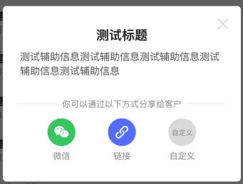
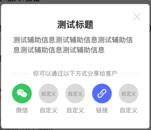

# BrnShareDialog

分享专用 Dialog

## 一、效果总览





## 二、描述

### 适用场景

1. 屏幕中间dialog弹窗

2. 可指定最多五个需要展示的分享渠道图标（目前内设有：微信，朋友圈，qq，qq空间，微博，链接，短信）

3. 如需展示内设渠道之外的分享渠道，支持自定义展示渠道图标

4. 可自定义分享弹框标题文案

5. 可自定义分享弹框辅助信息

6. 可自定义文案和分享渠道中间的分割线内文案

## 三、构造函数及参数说明

### 构造函数

```dart
BrnShareDialog({
    required this.context,
    required this.titleText,
    this.descText,
    this.separatorText,
    required this.shareChannels,
    this.clickCallBack,
    this.getCustomChannelTitle,
    this.getCustomChannelWidget,
    this.titleColor = const Color(0xff222222),
    this.descColor = const Color(0xff666666),
    this.shareTextColor = const Color(0xff999999),
    this.separatorLineColor = const Color(0xfff0f0f0),
    this.themeData,
  }) {
    this.themeData ??= BrnDialogConfig();
    this.themeData = BrnThemeConfigurator.instance
        .getConfig(configId: themeData!.configId)
        .dialogConfig
        .merge(themeData);
  }
```


### 参数配置

| **参数名** | **参数类型** | **作用** | **是否必填** | **默认值** |
| --- | --- | --- | --- | --- |
| titleText | String | 弹框标题文案 | 是 | 无 |
| descText | String? | 弹框辅助信息文案（为空则**不显示**辅助信息） | 否 | 无 |
| separatorText | String? | 文案与分享渠道图标间的分割线内嵌文案 | 否 | 你可以通过以下方式分享给客户 |
| shareChannels | `List<int>` | 用于表示所展示的分享渠道图标的索引（列表内容可直接填写渠道对应的**int**值，或使用**BrnShareItemConstants**的静态变量，例如**BrnShareItemConstants.SHARE\_WEIXIN**）。自定义为100或**BrnShareItemConstants.SHARE\_CUSTOM**。 | 是 | 空 |
| clickCallBack | BrnShareDialogItemClickCallBack? | 点击分享渠道图标后回调方法（方法传参为被点击的分享渠道图标在**BrnShareItemConstants**中的索引值shareChannel， 及改列表在使用者自定义的*shareChannels*中的索引值customIndex），使用者**根据参数自行配置响应动作**。 | 否 | 空 |
| getCustomChannelTitle | BrnShareDialogGetCustomShareItemTitle? | 获取自定义分享渠道对应的显示**文案**（方法传参为该自定义分享渠道在*shareChannels*中的索引值index）。回调返回值为**String**，如果返回值为空，则**不显示**该自定义分享渠道。 | 否 | 空 |
| getCustomChannelWidget | BrnShareDialogGetCustomShareItemIcon? | 获取自定义分享渠道对应的显示**图标**（方法传参为该自定义分享渠道在*shareChannels*中的索引值index）。回调返回值为**Widget**，如果返回值为空，则**不显示**该自定义分享渠道。 | 否 | 空 |
| context | BuildContext | BuildContext | 是 | 空 |
| titleColor | Color | 标题颜色 | 否 | **Color(0xff222222)** 黑色 |
| descColor | Color | 分享渠道文案颜色 | 否 | **Color(0xff666666)**灰色 |
| separatorLineColor | Color | 分割线颜色 | 否 | **Color(0xfff0f0f0)**浅灰 |
| shareTextColor | Color | 分享渠道文案颜色 | 否 | **Color(0xff999999)**灰色 |
| themeData | BrnDialogConfig | 弹窗配置，配置详情见BrnDialogConfig | 否 |  |

### 其他数据

| 常量名                            | 渠道名                                                       |
| --------------------------------- | ------------------------------------------------------------ |
| BrnShareItemConstants.shareWeiXin | 微信                                                         |
| BrnShareItemConstants.shareFriend | 朋友圈                                                       |
| BrnShareItemConstants.shareQQ     | qq                                                           |
| BrnShareItemConstants.shareQZone  | qq空间                                                       |
| BrnShareItemConstants.shareWeiBo  | 微博                                                         |
| BrnShareItemConstants.shareLink   | 链接                                                         |
| BrnShareItemConstants.shareSms    | 短信                                                         |
| BrnShareItemConstants.shareCustom | 自定义自定义图标需在**getCustomChannelTitle**方法中设置文案，在**getCustomChannelWidget**方法中设定图标。如其中一个为空，则不显示自定义图标。 |

## 四、代码演示

### 效果1：主标题+辅助信息+三个分享渠道，2预设+1自定义


```dart
BrnShareDialog brnShareDialog = BrnShareDialog(  
 context: context,  
 shareChannels: [  
   BrnShareItemConstants.shareWeiXin,
   BrnShareItemConstants.shareLink,
   BrnShareItemConstants.shareCustom
 ],  
 titleText: "测试标题",  
 descText: "测试辅助信息测试辅助信息测试辅助信息测试辅助信息测试辅助信息",  
 clickCallBack: (int channel, int index) {  
   BrnToast.show("channel: $channel, index: $index", context);  
 },  
 getCustomChannelWidget: (int index) {  
   if (index == 2)  
     return BrunoTools.getAssetImage("images/icon_custom_share.png");  
   else  
     return null;  
 },  
 // 自定义图标  
 getCustomChannelTitle: (int index) {  
   if (index == 2)  
     return "自定义";  
   else  
     return null;  
 }, // 自定义名字  
);  
brnShareDialog.show();
```
### 效果2：主标题+辅助信息+五个分享渠道，5预设+2自定义


```dart
BrnShareDialog brnShareDialog = new BrnShareDialog(  
   context: context,  
   shareChannels: [  
     BrnShareItemConstants.shareWeiXin,
     BrnShareItemConstants.shareCustom,
     BrnShareItemConstants.shareCustom,
     BrnShareItemConstants.shareLink,
     BrnShareItemConstants.shareCustom 
   ],  
   titleText: "测试标题",  
   descText: "测试辅助信息测试辅助信息测试辅助信息测试辅助信息测试辅助信息",  
   clickCallBack: (int channel, int index) {  
     BrnToast.show("channel: $channel, index: $index", context);  
   },  
   getCustomChannelWidget: (int index) {  
     if (index == 1)  
       return BrunoTools.getAssetImage("images/icon_custom_share.png");  
     else if (index == 2)  
       return BrunoTools.getAssetImage("images/icon_custom_share.png");  
     else if (index == 4)  
       return BrunoTools.getAssetImage("images/icon_custom_share.png");  
     else  
       return null;  
   },  
   // 自定义图标  
   getCustomChannelTitle: (int index) {  
     if (index == 1)  
       return "自定义";  
     else if (index == 2)  
       return "自定义";  
     else if (index == 4)  
       return "自定义";  
     else  
       return null;  
   }, // 自定义名字  
 );  
 brnShareDialog.show();  
```
