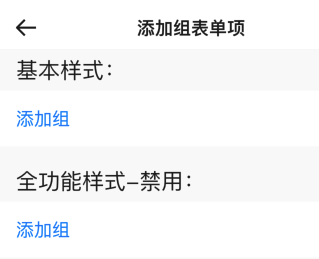

# BrnAddLabel

## 一、效果总览



## 二、描述

### 适用场景

添加组类型录入项所使用的Widget

### 交互规则

右侧“操作”区文案可点击

## 三、构造函数及参数说明

### 构造函数

```dart
BrnAddLabel({
  Key? key,
  this.label,
  this.title = "",
  this.isEdit = true,
  this.onTap,
}) : super(key: key);
```
### 参数说明：

| **参数名** | **参数类型** | **描述** | **是否必填** | **默认值** | **备注** |
| --- | --- | --- | --- | --- | --- |
| label | String? | 录入项的唯一标识，主要用于录入类型页面框架中 | 否 | 无 |  |
| type | Stirng | 录入项类型，主要用于录入类型页面框架中 | 否 | BrnInputItemType.labelAdd | 外部可根据此字段判断表单项类型 |
| title | String | 录入项标题 | 否 | '' |  |
| isEdit | bool | 录入项 是否可编辑 | 否 | true | true：可编辑false：禁用 |
| onTap | VoidCallback? | 可操作区点击回调 | 否 | 无 |  |

## 四、代码演示

### 效果1：基本样式


```dart
BrnAddLabelWidget(  
  title: "添加组",  
  onTap: () {  
    BrnToast.show("点击触发onTap回调", context);  
  },
),
```
