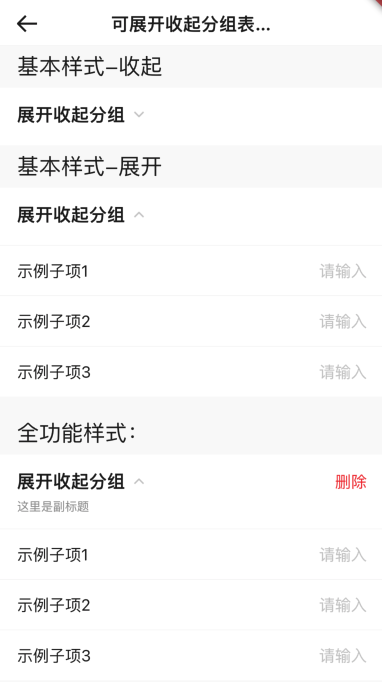

# BrnExpandFormGroup
可展开收起组类型录入项，内部可包含其他类型Widget。

## 一、效果总览



##  二、描述

### 适用场景

1. 普通组类型录入项、可以展开收起。
2. 根据UI规范不可在组类型录入项中嵌套其他组类型录入项。

### 交互规则

1. 设置此录入项是否可编辑（禁用）
2. 包括"标题"、"副标题"、"错误信息提示"、"必填项提示"、"添加/删除按钮"、"消息提示"

### 使用规范

根据UI规范不可在组类型录入项中嵌套其他组类型录入项。

## 三、构造函数及参数说明

### 构造函数


```dart
BrnExpandFormGroup({
    Key? key,
    this.label,
    this.title = "",
    this.subTitle,
    this.error = "",
    this.isEdit = true,
    this.isRequire = false,
    this.onRemoveTap,
    this.onTip,
    this.isExpand = true,
    this.deleteLabel,
    this.backgroundColor,
    required this.children,
  }) : super(key: key);
```
### 参数说明

| **参数名** | **参数类型** | **描述** | **是否必填** | **默认值** | **备注** |
| --- | --- | --- | --- | --- | --- |
| backgroundColor | Color? | 表单项背景色 | 否 | 走主题配置默认色值 Colors.white |  |
| label | String? | 录入项的唯一标识，主要用于录入类型页面框架中 | 否 | 无 |  |
| type | Stirng | 录入项类型，主要用于录入类型页面框架中 | 否 | BrnInputItemType.normalGroupType | 外部可根据此字段判断表单项类型 |
| title | String | 录入项标题 | 否 | '' |  |
| subTitle | String? | 录入项子标题 | 否 | 无 |  |
| error | String | 录入项错误提示 | 否 | '' |  |
| isRequire | bool | 录入项是否为必填项（展示`*`图标） 默认为 false 不必填 | 否 | false |  |
| isEdit | bool | 录入项 是否可编辑 | 否 | true | true：可编辑，false：禁用 |
| onTip | VoidCallback? | 点击"+"图标回调 | 否 | 点击"？"图标回调 | 见**tipLabel**字段 |
| onRemoveTap | VoidCallback? | 点击删除按钮回调 | 否 | 无 |  |
| isExpand | bool | 设置初始“展开/收起”状态true: 展开false：收起 | 否 | true |  |
| deleteLabel | String? | 删除按钮文案 | 否 | 无 |  |
| children | `List<Widget>` | 子组件list | 否 | 无 |  |

## 四、代码演示

### 效果1：基本样式-收起


```dart
 BrnExpandFormGroup(
  title: "展开收起分组",
  isExpand: false,
  children: [
    BrnTextInputFormItem(
      title: "示例子项1",
      hint: "请输入",
      onChanged: (newValue) {
        BrnToast.show("点击触发回调_${newValue}_onChanged", context);
      },
    ),
    BrnTextInputFormItem(
      title: "示例子项2",
      hint: "请输入",
      onChanged: (newValue) {
        BrnToast.show("点击触发回调_${newValue}_onChanged", context);
      },
    ),
    BrnTextInputFormItem(
      title: "示例子项3",
      hint: "请输入",
      onChanged: (newValue) {
        BrnToast.show("点击触发回调_${newValue}_onChanged", context);
      },
    ),
  ],
),
```
### 效果2：基本样式-展开


```dart
BrnExpandFormGroup(
  title: "展开收起分组",
  isExpand: true,
  children: [
    BrnTextInputFormItem(
      title: "示例子项1",
      hint: "请输入",
      onChanged: (newValue) {
        BrnToast.show("点击触发回调_${newValue}_onChanged", context);
      },
    ),
    BrnTextInputFormItem(
      title: "示例子项2",
      hint: "请输入",
      onChanged: (newValue) {
        BrnToast.show("点击触发回调_${newValue}_onChanged", context);
      },
    ),
    BrnTextInputFormItem(
      title: "示例子项3",
      hint: "请输入",
      onChanged: (newValue) {
        BrnToast.show("点击触发回调_${newValue}_onChanged", context);
      },
    ),
  ],
)
```
### 效果3：全功能样式


```dart
BrnExpandFormGroup(
  title: "展开收起分组",
  subTitle: "这里是副标题",
  deleteLabel: "删除",
  tipLabel: "标签",
  error: "必填项不能为空",
  isRequire: true,
  isEdit: true,
  onRemoveTap: () {
    BrnToast.show("点击触发回调_onRemoveTap", context);
  },
  children: [
    BrnTextInputFormItem(
      title: "示例子项1",
      hint: "请输入",
      onChanged: (newValue) {
        BrnToast.show("点击触发回调_${newValue}_onChanged", context);
      },
    ),
    BrnTextInputFormItem(
      title: "示例子项2",
      hint: "请输入",
      onChanged: (newValue) {
        BrnToast.show("点击触发回调_${newValue}_onChanged", context);
      },
    ),
    BrnTextInputFormItem(
      title: "示例子项3",
      hint: "请输入",
      onChanged: (newValue) {
        BrnToast.show("点击触发回调_${newValue}_onChanged", context);
      },
    ),
  ],
)
```
