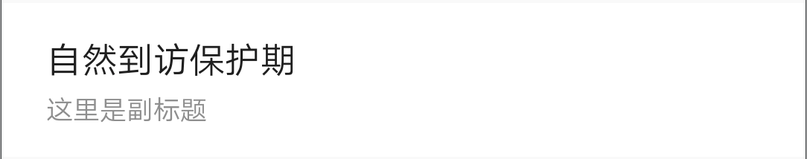
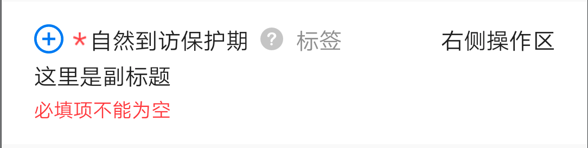

# BrnGeneralFormItem

## 一、效果总览



## 二、描述

### 适用场景

1. 基础表单项框架适用于自定义基础表单项
2. 可自定义标题、副标题、右侧操作区域

包括"标题"、"副标题"、"错误信息提示"、"必填项提示"、"添加/删除按钮"、"消息提示"、"多选项"等元素。

### 交互规则

1. 设置是否为"必填项"（"\*"）

2. 设置“添加/删除”图标（"+"、"-"）：用于接收回调函数处理新增/删除录入项操作

3. 设置“提示”图标&文案（"?"）：用于接收回调函数为用户展示提示信息

4. 设置此录入项是否可编辑（禁用）

5. 设置展示错误信息（error）

### 使用规范

一般用于扩展基础表单项

## 三、构造函数及参数说明

### 构造函数

```dart
BrnGeneralFormItem({
    Key? key,
    this.label,
    this.title: "",
    this.titleWidget,
    this.subTitle,
    this.subTitleWidget,
    this.tipLabel,
    this.prefixIconType = BrnPrefixIconType.normal,
    this.error: "",
    this.isEdit: true,
    this.isRequire: false,
    this.operateWidget,
    this.onAddTap,
    this.onRemoveTap,
    this.onTip,
    this.backgroundColor,
    this.themeData,
  }): super(key: key){
    this.themeData ??= BrnFormItemConfig();
    this.themeData = BrnThemeConfigurator.instance
        .getConfig(configId: this.themeData!.configId)
        .formItemConfig
        .merge(this.themeData);
    this.themeData = this.themeData!.merge(
        BrnFormItemConfig(backgroundColor: backgroundColor));
  }
```

### 参数说明：

| **参数名**     | 参数类型                 | **描述**                                                     | **是否必填** | **默认值**                                        | **备注**                                                     |
| --- | --- | --- | --- | --- | --- |
| backgroundColor | Color? | 表单项背景色 | 否 | 走主题配置默认色值 Colors.white |  |
| label          | String?                          | 录入项的唯一标识，主要用于录入类型页面框架中                 | 否           | 无                                                |                                                              |
| title          | String                           | 录入项标题                                                   | 否           | ''                                                |                                                              |
| titleWidget | Widget? | 录入项标题Widget | 否 | 无 | |
| subTitle       | String?                          | 录入项子标题                                                 | 否           | 无                                                |                                                              |
| subTitleWidget | Widget? | 录入项子标题Widget | 否 | 无 | |
| tipLabel       | String?                          | 录入项提示（问号图标&文案） 用户点击时触发 onTip 回调。      | 否           | 备注中类型 3                                      | 1. 设置"空字符串"时展示问号图标 2. 设置"非空字符串"时展示问号图标&文案 3. 若不赋值或赋值为 null 时，不显示提示项 |
| prefixIconType | String                           | 录入项前缀图标样式 "添加项" "删除项" 详见 BrnPrefixIconType 类 | 否           | BrnPrefixIconType.normal                     | 1. 不展示图标：BrnPrefixIconType.normal 2. 展示加号图标：BrnPrefixIconType.add 3. 展示减号图标：BrnPrefixIconType.remove |
| error          | String                           | 录入项错误提示                                               | 否           | ''                                                |                                                              |
| isRequire      | bool                             | 录入项是否为必填项（展示\*图标） 默认为 false 不必填         | 否           | false                                             |                                                              |
| isEdit         | bool                             | 录入项 是否可编辑                                            | 否           | true                                              | true：可编辑 false：禁用                                     |
| onAddTap       | VoidCallback?                    | 点击"+"图标回调                                              | 否           | 无                                                | 见**prefixIconType**字段                                     |
| onRemoveTap    | VoidCallback?                    | 点击"-"图标回调                                              | 否           | 无                                                | 见**prefixIconType**字段                                     |
| onTip          | VoidCallback?                    | 点击"？"图标回调                                             | 否           | 无                                                | 见**tipLabel**字段                                           |
| themeData      | BrnFormItemConfig?               | form 配置                                                    | 否           | 无                                                |                                                              |

### 其他数据说明:

#### BrnPrefixIconType:

```dart
class BrnPrefixIconType {
  static const String normal = "type_normal";
  static const String add = "type_add";
  static const String remove = "type_remove";
}
```

## 四、代码演示

### 效果 1：基本样式


```dart
BrnGeneralFormItem(
  title: "自然到访保护期",
  subTitle: "这里是副标题",
  onTip: () {
    BrnToast.show("点击触发onTip回调", context);
  },
  onAddTap: () {
    BrnToast.show("点击触发onAddTap回调", context);
  },
  onRemoveTap: () {
    BrnToast.show("点击触发onRemoveTap回调", context);
  },
)
```

### 效果 2：全功能样式



```dart
BrnGeneralFormItem(
  prefixIconType: BrnPrefixIconType.add,
  isRequire: true,
  isEdit: true,
  error: "必填项不能为空",
  titleWidget: Text("自然到访保护期"),
  subTitleWidget: Text("这里是副标题"),
  tipLabel: "标签",
  operateWidget: Text("右侧操作区"),
  onTip: () {
    BrnToast.show("点击触发onTip回调", context);
  },
  onAddTap: () {
    BrnToast.show("点击触发onAddTap回调", context);
  },
  onRemoveTap: () {
    BrnToast.show("点击触发onRemoveTap回调", context);
  },
)
```

