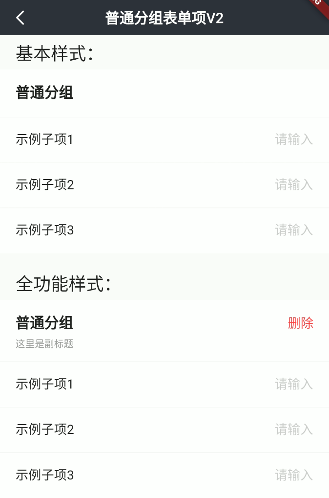
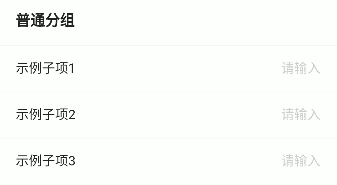
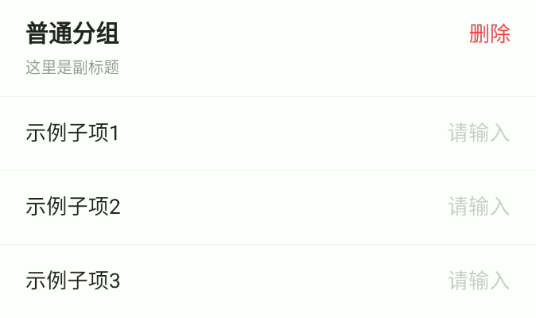

# BrnNormalFormGroup

## 一、效果总览



## 二、描述

### 适用场景

1. 普通组类型录入项、不可展开收起

2. 根据UI规范不可在组类型录入项中嵌套其他组类型录入项

### 交互规则

可设置此录入项是否可编辑（禁用）。

### 使用规范

根据UI规范不可在组类型录入项中嵌套其他组类型录入项。

## 三、构造函数及参数说明

### 构造函数


```dart
BrnNormalFormGroup({
  Key? key,
  this.label,
  this.title = "",
  this.subTitle,
  this.tipLabel,
  this.error = "",
  this.isEdit = true,
  this.isRequire = false,
  this.onRemoveTap,
  this.onTip,
  this.deleteLabel,
  required this.children,
}) : super(key: key) {
  this.themeData ??= BrnFormItemConfig();
  this.themeData = BrnThemeConfigurator.instance
      .getConfig(configId: this.themeData!.configId)
      .formItemConfig
      .merge(this.themeData);
}
```
### 参数说明

| **参数名** | **参数类型** | **描述** | **是否必填** | **默认值** | **备注** |
| --- | --- | --- | --- | --- | --- |
| label | String? | 录入项的唯一标识，主要用于录入类型页面框架中 | 否 | 无 |  |
| type | String | 录入项类型，主要用于录入类型页面框架中 | 否 | BrnInputItemType.normalGroupType | 外部可用此字段判断表单类型 |
| title | String | 录入项标题 | 否 | 无 |  |
| subTitle | String? | 录入项子标题 | 否 | 无 |  |
| tipLabel | String? | 录入项提示（问号图标&文案） 用户点击时触发onTip回调。 | 否 | 无 | 1. 若赋值为 空字符串（""）时仅展示"问号"图标，2. 若赋值为非空字符串时 展示"问号图标&文案"，3. 若不赋值或赋值为null时 不显示提示项 |
| error | String | 录入项错误提示 | 否 | 无 |  |
| isRequire | bool | 录入项是否为必填项（展示*图标） 默认为 false 不必填 | 否 | false |  |
| isEdit | bool | 录入项 是否可编辑 | 否 | true | true：可编辑false：禁用 |
| onRemoveTap | VoidCallback? | 点击"-"图标回调 | 否 | 无 | 见**prefixIconType**字段 |
| onTip | VoidCallback? | 点击"？"图标回调 | 否 | 无 | 见**tipLabel**字段 |
| deleteLabel | String? | 右侧文案 | 否 | 无 |  |
| children | `List<Widget>` | 子组件list | 是 | 无 |  |
| themeData | BrnFormItemConfig? | form配置 | 否 | 无 | |

## 四、代码演示

### 效果1：基本样式



```dart
BrnNormalFormGroup(
  title: "普通分组",
  children: [
    BrnTextInputFormItem(
      title: "示例子项1",
      hint: "请输入",
      onChanged: (newValue) {
        BrnToast.show("点击触发回调_${newValue}_onChanged", context);
      },
    ),
    BrnTextInputFormItem(
      title: "示例子项2",
      hint: "请输入",
      onChanged: (newValue) {
        BrnToast.show("点击触发回调_${newValue}_onChanged", context);
      },
    ),
    BrnTextInputFormItem(
      title: "示例子项3",
      hint: "请输入",
      onChanged: (newValue) {
        BrnToast.show("点击触发回调_${newValue}_onChanged", context);
      },
    ),
  ],
),
```
### 效果2：全功能样式



```dart
BrnNormalFormGroup(
  title: "普通分组",
  subTitle: "这里是副标题",
  deleteLabel: "删除",
  tipLabel: "标签",
  error: "必填项不能为空",
  isRequire: true,
  isEdit: true,
  onRemoveTap: () {
    BrnToast.show("点击触发回调_onRemoveTap", context);
  },
  children: [
    BrnTextInputFormItem(
      title: "示例子项1",
      hint: "请输入",
      onChanged: (newValue) {
        BrnToast.show("点击触发回调_${newValue}_onChanged", context);
      },
    ),
    BrnTextInputFormItem(
      title: "示例子项2",
      hint: "请输入",
      onChanged: (newValue) {
        BrnToast.show("点击触发回调_${newValue}_onChanged", context);
      },
    ),
    BrnTextInputFormItem(
      title: "示例子项3",
      hint: "请输入",
      onChanged: (newValue) {
        BrnToast.show("点击触发回调_${newValue}_onChanged", context);
      },
    ),
  ],
),
```

