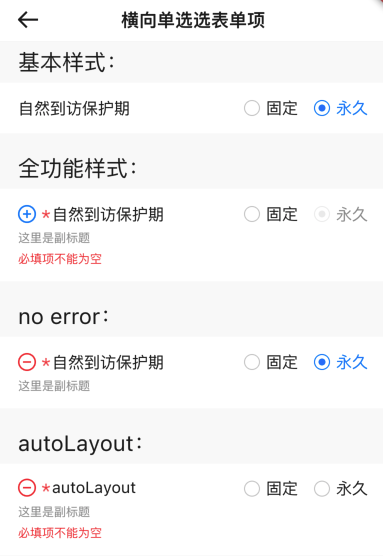
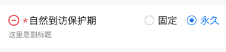
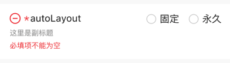

# BrnRadioInputFormItem

横向单选录入项。


## 一、效果总览



## 二、描述

### 适用场景

1. 用于横向单选录入
2. 支持全局/部分选项禁用

包括"标题"、"副标题"、"错误信息提示"、"必填项提示"、"添加/删除按钮"、"消息提示"、 "单选项"等元素。

### 交互规则

1. 设置是否为"必填项"（"*"）

2. 设置“添加/删除”图标（"+"、"-"）：用于接收回调函数处理新增/删除录入项操作

3. 设置“提示”图标&文案（"?"）：用于接收回调函数为用户展示提示信息

4. 设置此录入项是否可编辑（禁用）

5. 设置展示错误信息（error）

### 使用规范

一般用于横向单选录入页面。

## 三、构造函数及参数说明

### 构造函数


```dart
BrnRadioInputFormItem({
    Key? key,
    this.label,
    this.title: "",
    this.subTitle,
    this.tipLabel,
    this.prefixIconType: BrnPrefixIconType.normal,
    this.error: "",
    this.isEdit: true,
    this.isRequire: false,
    this.onAddTap,
    this.onRemoveTap,
    this.onTip,
    this.value,
    this.options,
    this.enableList,
    this.onChanged,
    this.themeData,
    this.backgroundColor,
    this.titleMaxLines,
  }) : super(key: key) {
    this.themeData ??= BrnFormItemConfig();
    this.themeData = BrnThemeConfigurator.instance
        .getConfig(configId: this.themeData!.configId)
        .formItemConfig
        .merge(this.themeData);
    this.themeData = this.themeData!.merge(
        BrnFormItemConfig(backgroundColor: backgroundColor));
    this._isAutoLayout = false;
  }
```
### 参数说明

| **参数名** | **参数类型** | **描述** | **是否必填** | **默认值** | **备注** |
| --- | --- | --- | --- | --- | --- |
| backgroundColor | Color? | 表单项背景色 | 否 | 走主题配置默认色值 Colors.white |  |
| label | String? | 录入项的唯一标识，主要用于录入类型页面框架中 | 否 | 无 |  |
| type | Stirng | 录入项类型，主要用于录入类型页面框架中 | 否 | BrnInputItemType.radioInputType | 外部可根据此字段判断表单项类型 |
| title | String | 录入项标题 | 否 | '' |  |
| subTitle | String? | 录入项子标题 | 否 | 无 |  |
| tipLabel | String? | 录入项提示（问号图标&文案） 用户点击时触发onTip回调。 | 否 | 备注中类型3 | 1. 设置"空字符串"时展示问号图标 2. 设置"非空字符串"时展示问号图标&文案 3. 若不赋值或赋值为null时，不显示提示项 |
| prefixIconType | String | 录入项前缀图标样式 "添加项" "删除项" 详见 **BrnPrefixIconType** 类 | 否 | BrnPrefixIconType.normal | 1. 不展示图标：BrnPrefixIconType.normal 2. 展示加号图标：BrnPrefixIconType.add 3. 展示减号图标：BrnPrefixIconType.remove |
| error | String | 录入项错误提示 | 否 | '' |  |
| isRequire | bool | 录入项是否为必填项（展示*图标） 默认为 false 不必填 | 否 | false |  |
| isEdit | bool | 录入项 是否可编辑 | 否 | true | true：可编辑false：禁用 |
| onAddTap | VoidCallback? | 点击"+"图标回调 | 否 | 无 | 见**prefixIconType**字段 |
| onRemoveTap | VoidCallback? | 点击"-"图标回调 | 否 | 无 | 见**prefixIconType**字段 |
| onTip | VoidCallback? | 点击"？"图标回调 | 否 | 无 | 见**tipLabel**字段 |
| value | String? | 选中的选项文案 | 否 | 无 |  |
| options | `List<String>?` | 所有选项文案 | 否 | 无 |  |
| enableList | `List<bool>?` | 标识每个选项是否禁用false：禁用 | 否 | 无 |  |
| onChanged | OnBrnFormRadioValueChanged? | 用户在选项间切换时调用 | 否 | 无 | void Function(String oldStr, String newStr) |
| titleMaxLines | int? | 标题显示的最大行数 | 否 | 1 |  |
| layoutRatio | double? | 左边标题部分/右边选项部分的宽度比例。例如 1/2 显示就传 0.5 | 否 | 当左右内容超出默认比例且「有」提示语，则按比例  6:4 布局，当左右内容超出默认比例且「无」提示语，则按比例  4:6 布局 | 右边选项部分的显示宽度 = min(选项部分的实际宽度, 选项部分的比例计算宽度) |
| themeData | BrnFormItemConfig? | 表单主题配置 | 否 | 无 | |

### 其他数据说明

#### BrnPrefixIconType


```dart
class BrnPrefixIconType {
  static const String normal = "type_normal";
  static const String add = "type_add";
  static const String remove = "type_remove";
}
```
## 四、代码演示

### 效果1：基本样式


```dart
BrnRadioInputFormItem(
  title: "自然到访保护期",
  options: [
    "固定",
    "永久",
  ],
  value: "永久",
  onTip: () {
    BrnToast.show("点击触发onTip回调", context);
  },
  onAddTap: () {
    BrnToast.show("点击触发onAddTap回调", context);
  },
  onRemoveTap: () {
    BrnToast.show("点击触发onRemoveTap回调", context);
  },
  onChanged: (oldValue, newValue) {
    BrnToast.show("点击触发回调${oldValue}_${newValue}_onChanged", context);
  },
),
```

### 效果2：全功能样式


```dart
BrnRadioInputFormItem(
  prefixIconType: BrnPrefixIconType.add,
  isRequire: true,
  error: "必填项不能为空",
  title: "自然到访保护期",
  subTitle: "这里是副标题",
  options: [
    "固定",
    "永久",
  ],
  value: "永久",
  enableList: [true, false],
  onTip: () {
    BrnToast.show("点击触发onTip回调", context);
  },
  onAddTap: () {
    BrnToast.show("点击触发onAddTap回调", context);
  },
  onRemoveTap: () {
    BrnToast.show("点击触发onRemoveTap回调", context);
  },
  onChanged: (oldValue, newValue) {
    BrnToast.show("点击触发回调${oldValue}_${newValue}_onChanged", context);
  },
)
```

### 效果3：无错误提示样式


```dart
BrnRadioInputFormItem(
  prefixIconType: BrnPrefixIconType.remove,
  isRequire: true,
  title: "自然到访保护期",
  subTitle: "这里是副标题",
  options: [
    "固定",
    "永久",
  ],
  value: "永久",
  enableList: [true, true],
  onTip: () {
    BrnToast.show("点击触发onTip回调", context);
  },
  onAddTap: () {
    BrnToast.show("点击触发onAddTap回调", context);
  },
  onRemoveTap: () {
    BrnToast.show("点击触发onRemoveTap回调", context);
  },
  onChanged: (oldValue, newValue) {
    BrnToast.show("点击触发回调${oldValue}_${newValue}_onChanged", context);
  },
)
```

### 效果4：autoLayout 布局


```dart
BrnRadioInputFormItem.autoLayout(
  prefixIconType: BrnPrefixIconType.remove,
  isRequire: true,
  error: "必填项不能为空",
  title: "autoLayout",
  layoutRatio: 0.25,
  titleMaxLines: 3,
  subTitle: "这里是副标题",
  options: [
    "固定",
    "永久",
  ],
)
```
