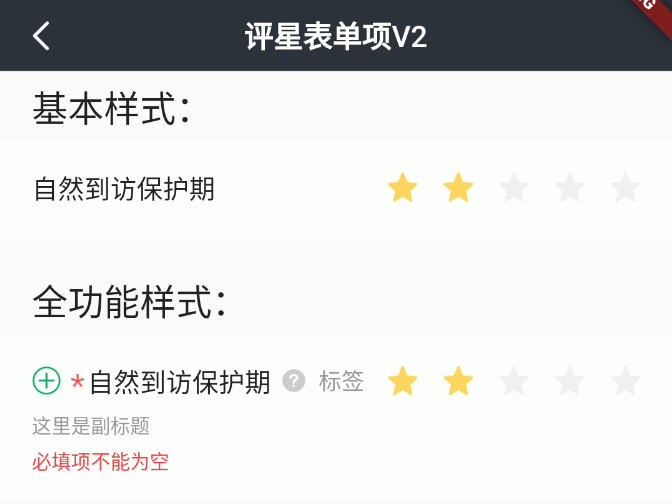

# BrnStarsFormItem

## 一、效果总览



## 二、描述

### 适用场景

用于评星类型输入，包括"标题"、"副标题"、"错误信息提示"、"必填项提示"、"添加/删除按钮"、"消息提示"、"星级选择"等元素。

### 交互规则

1. 设置是否为"必填项"（"*"）

2. 设置“添加/删除”图标（"+"、"-"）：用于接收回调函数处理新增/删除录入项操作

3. 设置“提示”图标&文案（"?"）：用于接收回调函数为用户展示提示信息

4. 设置此录入项是否可编辑（禁用）

5. 设置展示错误信息（error）

## 三、构造函数及参数说明

### 构造函数


```dart
BrnStarsFormItem(
      {Key? key,
      this.label,
      this.title: "",
      this.subTitle,
      this.tipLabel,
      this.prefixIconType: BrnPrefixIconType.normal,
      this.error: "",
      this.isEdit: true,
      this.isRequire: false,
      this.onAddTap,
      this.onRemoveTap,
      this.onTip,
      this.sumStar: 5,
      this.value: 0,
      this.onChanged,
      this.backgroundColor,
      this.themeData})
      : super(key: key) {
    this.themeData ??= BrnFormItemConfig();
    this.themeData = BrnThemeConfigurator.instance
        .getConfig(configId: this.themeData!.configId)
        .formItemConfig
        .merge(this.themeData);
    this.themeData = this.themeData!.merge(
        BrnFormItemConfig(backgroundColor: backgroundColor));
  }
```

### 参数说明

| **参数名** | **参数类型** | **描述** | **是否必填** | **默认值** | **备注** |
| --- | --- | --- | --- | --- | --- |
| backgroundColor | Color? | 表单项背景色 | 否 | 走主题配置默认色值 Colors.white |  |
| label | String? | 录入项的唯一标识，主要用于录入类型页面框架中 | 否 | 无 |  |
| type | Stirng | 录入项类型，主要用于录入类型页面框架中 | 否 | BrnInputItemType.starInputType | 外部可根据此字段判断表单项类型 |
| title | String | 录入项标题 | 否 | '' |  |
| subTitle | String? | 录入项子标题 | 否 | 无 |  |
| tipLabel | String? | 录入项提示（问号图标&文案） 用户点击时触发onTip回调。 | 否 | 备注中类型3 | 1. 设置"空字符串"时展示问号图标 2. 设置"非空字符串"时展示问号图标&文案 3. 若不赋值或赋值为null时，不显示提示项 |
| prefixIconType | String | 录入项前缀图标样式 "添加项" "删除项" 详见 **BrnPrefixIconType** 类 | 否 | BrnPrefixIconType.normal | 1. 不展示图标：BrnPrefixIconType.normal 2. 展示加号图标：BrnPrefixIconType.add 3. 展示减号图标：BrnPrefixIconType.remove |
| error | String | 录入项错误提示 | 否 | '' |  |
| isRequire | bool | 录入项是否为必填项（展示`*`图标） 默认为 false 不必填 | 否 | false |  |
| isEdit | bool | 录入项 是否可编辑 | 否 | true | true：可编辑false：禁用 |
| onAddTap | VoidCallback? | 点击"+"图标回调 | 否 | 无 | 见**prefixIconType**字段 |
| onRemoveTap | VoidCallback? | 点击"-"图标回调 | 否 | 无 | 见**prefixIconType**字段 |
| onTip | VoidCallback? | 点击"？"图标回调 | 否 | 无 | 见**tipLabel**字段 |
| value | int | 外部设置点亮星标数量 | 否 | 0 |  |
| sumStar | int | 总星标数量 | 否 | 5 |  |
| onChanged | OnBrnFormValueChanged? | 点亮星标数量变化回调 | 否 | 无 |  |
| themeData | BrnFormItemConfig? | form配置 | 否 | 无 | |

### 其他数据说明:

#### BrnPrefixIconType:

```dart
class BrnPrefixIconType {
  static const String normal = "type_normal";
  static const String add = "type_add";
  static const String remove = "type_remove";
}
```

## 四、代码演示

### 效果1：基本样式


```dart
BrnStarsFormItem(
  title: "自然到访保护期",
  sumStar: 5,
  value: 2,
  onTip: () {
    BrnToast.show("点击触发onTip回调", context);
  },
  onAddTap: () {
    BrnToast.show("点击触发onAddTap回调", context);
  },
  onRemoveTap: () {
    BrnToast.show("点击触发onRemoveTap回调", context);
  },
  onChanged: (oldValue, newValue) {
    BrnToast.show("点击触发回调${oldValue}_${newValue}_onChanged", context);
  },
)
```
### 效果2：全功能样式


```dart
BrnStarsFormItem(
  prefixIconType: BrnPrefixIconType.TYPE_ADD,
  isRequire: true,
  isEdit: true,
  error: "必填项不能为空",
  title: "自然到访保护期",
  subTitle: "这里是副标题",
  tipLabel: "标签",
  sumStar: 5,
  value: 2,
  onTip: () {
    BrnToast.show("点击触发onTip回调", context);
  },
  onAddTap: () {
    BrnToast.show("点击触发onAddTap回调", context);
  },
  onRemoveTap: () {
    BrnToast.show("点击触发onRemoveTap回调", context);
  },
  onChanged: (oldValue, newValue) {
    BrnToast.show("点击触发回调${oldValue}_${newValue}_onChanged", context);
  },
)
```

