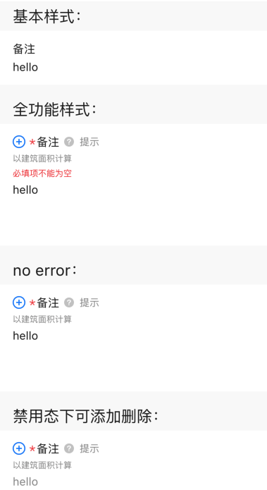
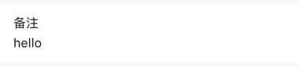
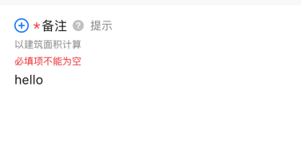
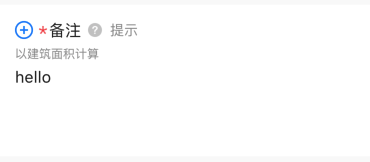
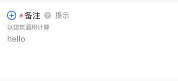

# BrnTextBlockInputFormItem
文本块输入型录入项。

## 一、效果总览



## 二、描述

### 适用场景

用于单行文本输入，包括"标题"、"副标题"、"错误信息提示"、"必填项提示"、"添加/删除按钮"、"消息提示"、"文本输入框"等元素。

### 交互规则

1. 设置是否为"必填项"（"*"）

2. 设置“添加/删除”图标（"+"、"-"）：用于接收回调函数处理新增/删除录入项操作

3. 设置“提示”图标&文案（"?"）：用于接收回调函数为用户展示提示信息

4. 设置此录入项是否可编辑（禁用）

5. 设置展示错误信息（error）

### 使用规范

一般用于数据录入页面。

## 三、构造函数及参数说明

### 构造函数


```dart
BrnTextBlockInputFormItem(
    {Key? key,
    this.label,
    this.type: BrnInputItemType.textBlockInputType,
    this.title = "",
    this.subTitle,
    this.tipLabel,
    this.prefixIconType = BrnPrefixIconType.normal,
    this.error = "",
    this.isEdit = true,
    this.isRequire = false,
    this.isPrefixIconEnabled = false,
    this.onAddTap,
    this.onRemoveTap,
    this.onTip,
    this.onChanged,
    this.hint = "请输入",
    this.maxCharCount,
    this.inputType,
    this.inputFormatters,
    this.controller,
    this.minLines = 4,
    this.maxLines = 20,
    this.themeData})
    : super(key: key) {
  this.themeData ??= BrnFormItemConfig();
  this.themeData = BrnThemeConfigurator.instance
      .getConfig(configId: this.themeData!.configId)
      .formItemConfig
      .merge(this.themeData);
}
```
### 参数说明

| **参数名** | **参数类型** | **描述** | **是否必填** | **默认值** | **备注** |
| --- | --- | --- | --- | --- | --- |
| label | String? | 录入项的唯一标识，主要用于录入类型页面框架中 | 否 | 无 |  |
| type | Stirng | 录入项类型，主要用于录入类型页面框架中 | 否 | BrnInputItemType.textBlockInputType | 外部可根据此字段判断表单项类型 |
| title | String | 录入项标题 | 否 | '' |  |
| subTitle | String? | 录入项子标题 | 否 | 无 |  |
| tipLabel | String? | 录入项提示（问号图标&文案） 用户点击时触发onTip回调。 | 否 | 备注中类型3 | 1. 设置"空字符串"时展示问号图标 2. 设置"非空字符串"时展示问号图标&文案 3. 若不赋值或赋值为null时，不显示提示项 |
| prefixIconType | String | 录入项前缀图标样式 "添加项" "删除项" 详见 **BrnPrefixIconType** 类 | 否 | BrnPrefixIconType.normal | 1. 不展示图标：BrnPrefixIconType.normal 2. 展示加号图标：BrnPrefixIconType.add 3. 展示减号图标：BrnPrefixIconType.remove |
| error | String | 录入项错误提示 | 否 | '' |  |
| isRequire | bool | 录入项是否为必填项（展示`*`图标） 默认为 false 不必填 | 否 | false |  |
| isEdit | bool | 录入项 是否可编辑 | 否 | true | true：可编辑false：禁用 |
| isPrefixIconEnabled | bool | 录入项不可编辑时(isEdit: false) "+"、"-"号是否可点击，true: 可点击回调 false: 不可点击回调 | 否 | false |  |
| onAddTap | VoidCallback? | 点击"+"图标回调 | 否 | 无 | 见**prefixIconType**字段 |
| onRemoveTap | VoidCallback? | 点击"-"图标回调 | 否 | 无 | 见**prefixIconType**字段 |
| onTip | VoidCallback? | 点击"？"图标回调 | 否 | 无 | 见**tipLabel**字段 |
| hint | String | 录入项 hint 提示 | 否 | "请输入" |  |
| maxCharCount | int? | 最大输入字符数 | 否 | 无 |  |
| inputType | String? | 输入内容类型，指定键盘类型，参见 `BrnInputType` | 否 | 无 | 详见**BrnInputType**类，注意：无法通过指定键盘类型确保输入。比如不能通过指定数字键盘确保用户只输入数字。如果有要求用户只输入特定字符的需求请使用**inputFormatters**参数 |
| inputFormatters | `List<TextInputFormatter>?` | 指定对输入数据的格式化要求 | 否 | 无 |  |
| onChanged | `ValueChanged<String>?` | 输入文案回调 | 否 | 无 |  |
| controller | TextEditingController? | 文本输入controller | 否 | 无 |  |
| minLines | int | 最小行数 | 否 | 4 |  |
| maxLines | int | 最大行数 | 否 | 20 |  |
| themeData | BrnFormItemConfig? | 表单主题配置 | 否 | 无 | |

### 其他数据说明

#### BrnPrefixIconType


```dart
class BrnPrefixIconType {
  static const String normal = "type_normal";
  static const String add = "type_add";
  static const String remove = "type_remove";
}
```
#### BrnInputType


```dart
class BrnInputType {
  static const String text = "text";
  static const String multiLine = "multiline";
  static const String number = "number";
  static const String decimal = "decimal";
  static const String phone = "phone";
  static const String date = "datetime";
  static const String email = "emailAddress";
  static const String url = "url";
  static const String pwd = "visiblePassword";
}
```
## 四、代码演示

### 效果1：基本样式


```dart
BrnTextBlockInputFormItem(
  controller: TextEditingController()..text = "hello",
  title: "备注",
  hint: "请输入",
  minLines: 1,
  maxLines: 5,
  onTip: () {
    BrnToast.show("点击触发onTip回调", context);
  },
  onAddTap: () {
    BrnToast.show("点击触发onAddTap回调", context);
  },
  onRemoveTap: () {
    BrnToast.show("点击触发onRemoveTap回调", context);
  },
  onChanged: (newValue) {
    BrnToast.show("点击触发回调_${newValue}_onChanged", context);
  },
)
```
### 效果2：全功能样式


```dart
BrnTextBlockInputFormItem(
  controller: TextEditingController()..text = "hello",
  prefixIconType: BrnPrefixIconType.add,
  isRequire: true,
  isEdit: true,
  error: "必填项不能为空",
  title: "备注",
  subTitle: "以建筑面积计算",
  tipLabel: "提示",
  hint: "请输入",
  onTip: () {
    BrnToast.show("点击触发onTip回调", context);
  },
  onAddTap: () {
    BrnToast.show("点击触发onAddTap回调", context);
  },
  onRemoveTap: () {
    BrnToast.show("点击触发onRemoveTap回调", context);
  },
  onChanged: (newValue) {
    BrnToast.show("点击触发回调_${newValue}_onChanged", context);
  },
)
```

### 效果3：无错误提示样式


```dart
BrnTextBlockInputFormItem(
  controller: TextEditingController()..text = "hello",
  prefixIconType: BrnPrefixIconType.add,
  isRequire: true,
  isEdit: true,
  title: "备注",
  subTitle: "以建筑面积计算",
  tipLabel: "提示",
  hint: "请输入",
  onTip: () {
    BrnToast.show("点击触发onTip回调", context);
  },
  onAddTap: () {
    BrnToast.show("点击触发onAddTap回调", context);
  },
  onRemoveTap: () {
    BrnToast.show("点击触发onRemoveTap回调", context);
  },
  onChanged: (newValue) {
    BrnToast.show("点击触发回调_${newValue}_onChanged", context);
  },
)
```

### 效果4：禁用状态样式


```dart
BrnTextBlockInputFormItem(
  controller: TextEditingController()..text = "hello",
  prefixIconType: BrnPrefixIconType.add,
  isRequire: true,
  isEdit: false,
  isPrefixIconEnabled: true,
  title: "备注",
  subTitle: "以建筑面积计算",
  tipLabel: "提示",
  hint: "请输入",
  onTip: () {
    BrnToast.show("点击触发onTip回调", context);
  },
  onAddTap: () {
    BrnToast.show("点击触发onAddTap回调", context);
  },
  onRemoveTap: () {
    BrnToast.show("点击触发onRemoveTap回调", context);
  },
  onChanged: (newValue) {
    BrnToast.show("点击触发回调_${newValue}_onChanged", context);
  },
)
```
