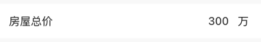

# BrnTextInputFormItem
文本输入型录入项

## 一、效果总览


## 二、描述

### 适用场景

用于单行文本输入

### 交互规则

1. 设置是否为"必填项"（"*"）

2. 设置“添加/删除”图标（"+"、"-"）：用于接收回调函数处理新增/删除录入项操作

3. 设置“提示”图标&文案（"?"）：用于接收回调函数为用户展示提示信息

4. 设置此录入项是否可编辑（禁用）

5. 设置展示错误信息（error）

### 使用规范

一般用于数据录入页面。

## 三、构造函数及参数说明

### 构造函数


```dart
BrnTextInputFormItem({
    Key? key,
    this.label,
    this.title = "",
    this.subTitle,
    this.tipLabel,
    this.focusNode,
    this.prefixIconType = BrnPrefixIconType.normal,
    this.error = "",
    this.isEdit = true,
    this.obscureText = false,
    this.isRequire = false,
    this.isPrefixIconEnabled = false,
    this.onAddTap,
    this.onRemoveTap,
    this.onTip,
    this.prefixText,
    this.hint,
    this.unit,
    this.maxCharCount,
    this.autofocus: false,
    this.inputType,
    this.inputFormatters,
    this.onChanged,
    this.controller,
    this.backgroundColor,
    this.themeData,
  }) : super(key: key) {
    this.themeData ??= BrnFormItemConfig();
    this.themeData = BrnThemeConfigurator.instance
        .getConfig(configId: this.themeData!.configId)
        .formItemConfig
        .merge(this.themeData);
    this.themeData = this.themeData!.merge(
        BrnFormItemConfig(backgroundColor: backgroundColor));
  }
```
### 参数说明

| **参数名** | **参数类型** | **描述** | **是否必填** | **默认值** | **备注** |
| --- | --- | --- | --- | --- | --- |
| backgroundColor | Color? | 表单项背景色 | 否 | 走主题配置默认色值 Colors.white |  |
| label | String? | 录入项的唯一标识，主要用于录入类型页面框架中 | 否 | 无 |  |
| type | Stirng | 录入项类型，主要用于录入类型页面框架中 | 否 | BrnInputItemType.textInputType | 外部可根据此字段判断表单项类型 |
| title | String | 录入项标题 | 否 | '' |  |
| subTitle | String? | 录入项子标题 | 否 | 无 |  |
| tipLabel | String? | 录入项提示（问号图标&文案） 用户点击时触发onTip回调。 | 否 | 备注中类型3 | 1. 设置"空字符串"时展示问号图标 2. 设置"非空字符串"时展示问号图标&文案 3. 若不赋值或赋值为null时，不显示提示项 |
| focusNode | FocusNode? | 录入项的焦点控制对象，主要用于控制焦点 | 否 |  |  |
| prefixIconType | String | 录入项前缀图标样式 "添加项" "删除项" 详见 **BrnPrefixIconType** 类 | 否 | BrnPrefixIconType.normal | 1. 不展示图标：BrnPrefixIconType.normal 2. 展示加号图标：BrnPrefixIconType.add 3. 展示减号图标：BrnPrefixIconType.remove |
| error | String | 录入项错误提示 | 否 | '' |  |
| isRequire | bool | 录入项是否为必填项（展示`*`图标） 默认为 false 不必填 | 否 | false |  |
| isEdit | bool | 录入项 是否可编辑 | 否 | true | true：可编辑false：禁用 |
| obscureText | bool | 录入项 是否模糊文本（输入后*代替文本，常用于密码框） 默认值 |  | false |  |
| isPrefixIconEnabled | bool | 录入项不可编辑时(isEdit: false) "+"、"-"号是否可点击，true: 可点击回调 false: 不可点击回调 | 否 | false |  |
| onAddTap | VoidCallback? | 点击"+"图标回调 | 否 | 无 | 见**prefixIconType**字段 |
| onRemoveTap | VoidCallback? | 点击"-"图标回调 | 否 | 无 | 见**prefixIconType**字段 |
| onTip | VoidCallback? | 点击"？"图标回调 | 否 | 无 |  |
| prefixText | String? | 固定前缀文案 | 否 | 无 |  |
| hint | String? | 录入项 hint 提示 | 否 | 默认值为国际化配置文本 "请输入" |  |
| unit | String? | 单位 | 否 | 无 |  |
| maxCharCount | int? | 最大输入字符数 | 否 | 无 |  |
| autofocus | bool | 是否自动获取焦点 | 否 | false |  |
| inputType | String? | 输入内容类型，指定键盘类型，参见 `BrnInputType` | 否 | 无 | 详见**BrnInputType**类，注意：无法通过指定键盘类型确保输入。比如不能通过指定数字键盘确保用户只输入数字。如果有要求用户只输入特定字符的需求请使用**inputFormatters**参数 |
| inputFormatters | `List<TextInputFormatter>?` | 指定对输入数据的格式化要求 | 否 | 无 |  |
| onChanged | `ValueChanged<String>?` | 输入文案回调 | 否 | 无 |  |
| controller | TextEditingController? | 文本输入controller | 否 | 无 |  |
| themeData | BrnFormItemConfig? | 表单主题配置 | 否 | 无 | |

### 其他数据说明

#### BrnPrefixIconType


```dart
class BrnPrefixIconType {
  static const String normal = "type_normal";
  static const String add = "type_add";
  static const String remove = "type_remove";
}
```
#### BrnInputType


```dart
class BrnInputType {
  static const String TEXT = "text";
  static const String MULTI_LINE = "multiline";
  static const String NUMBER = "number";
  static const String DECIMAL = "decimal";
  static const String PHONE = "phone";
  static const String DATE = "datetime";
  static const String EMAIL = "emailAddress";
  static const String URL = "url";
  static const String PWD = "visiblePassword";
}
```
## 四、代码演示

### 效果1：基本样式


```dart
BrnTextInputFormItem(
  controller: TextEditingController()..text = "300",
  title: "房屋总价",
  unit: "万",
  hint: "请输入",
  onTip: () {
    BrnToast.show("点击触发onTip回调", context);
  },
  onAddTap: () {
    BrnToast.show("点击触发onAddTap回调", context);
  },
  onRemoveTap: () {
    BrnToast.show("点击触发onRemoveTap回调", context);
  },
  onChanged: (newValue) {
    BrnToast.show("点击触发回调_${newValue}_onChanged", context);
  },
),
```
### 效果2：全功能样式


```dart
BrnTextInputFormItem(
  controller: TextEditingController()..text = "300",
  prefixIconType: BrnPrefixIconType.add,
  isRequire: true,
  isEdit: true,
  error: "必填项不能为空",
  title: "房屋总价",
  subTitle: "以建筑面积计算",
  tipLabel: "贷款计算",
  unit: "万",
  hint: "请输入",
  onTip: () {
    BrnToast.show("点击触发onTip回调", context);
  },
  onAddTap: () {
    BrnToast.show("点击触发onAddTap回调", context);
  },
  onRemoveTap: () {
    BrnToast.show("点击触发onRemoveTap回调", context);
  },
  onChanged: (newValue) {
    BrnToast.show("点击触发回调_${newValue}_onChanged", context);
  },
),
```

### 效果3：无错误提示样式


```dart
BrnTextInputFormItem(
  controller: TextEditingController()..text = "300",
  prefixIconType: BrnPrefixIconType.add,
  isRequire: true,
  isEdit: true,
  title: "房屋总价",
  subTitle: "以建筑面积计算",
  tipLabel: "贷款计算",
  unit: "万",
  hint: "请输入",
  onTip: () {
    BrnToast.show("点击触发onTip回调", context);
  },
  onAddTap: () {
    BrnToast.show("点击触发onAddTap回调", context);
  },
  onRemoveTap: () {
    BrnToast.show("点击触发onRemoveTap回调", context);
  },
  onChanged: (newValue) {
    BrnToast.show("点击触发回调_${newValue}_onChanged", context);
  },
),
```

### 效果4：禁用状态样式


```dart
BrnTextInputFormItem(
  controller: TextEditingController()..text = "300",
  prefixIconType: BrnPrefixIconType.add,
  isRequire: true,
  isEdit: false,
  isPrefixIconEnabled: true,
  title: "房屋总价",
  subTitle: "以建筑面积计算",
  tipLabel: "贷款计算",
  unit: "万",
  hint: "请输入",
  onTip: () {
    BrnToast.show("点击触发onTip回调", context);
  },
  onAddTap: () {
    BrnToast.show("点击触发onAddTap回调", context);
  },
  onRemoveTap: () {
    BrnToast.show("点击触发onRemoveTap回调", context);
  },
  onChanged: (newValue) {
    BrnToast.show("点击触发回调_${newValue}_onChanged", context);
  },
),
```
