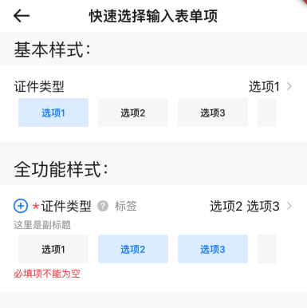
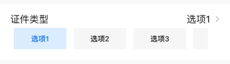
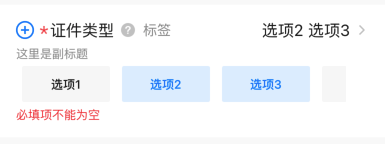

# BrnTextQuickSelectFormItem

快速选择类型录入型表单项。

## 一、效果总览



##  二、描述

### 适用场景

1. 文本选择

2. 快速选择按钮

### 交互规则

1. 设置此录入项是否可编辑（禁用），包括"标题"、"副标题"、"错误信息提示"、"必填项提示"、"添加/删除按钮"、"消息提示"、"点击选择区"、"快捷选择按钮"等元素。
2. 按钮的选中状态可以由外部维护，`selectBtnList`，也可以不传，组件内部自动生成并维护。
3. 目前暂时不支持移除选项的操作，如果需要选中某一项之后移除该选项，请谨慎操作。

## 三、构造函数及参数说明

### 构造函数


```dart
BrnTextQuickSelectFormItem(
      {Key? key,
      this.label,
      this.title: "",
      this.subTitle,
      this.tipLabel,
      this.prefixIconType: BrnPrefixIconType.normal,
      this.error: "",
      this.isEdit: true,
      this.isRequire: false,
      this.onAddTap,
      this.onRemoveTap,
      this.onTip,
      this.hint,
      this.value,
      this.btnsTxt,
      this.selectBtnList,
      this.enableBtnList,
      this.btns,
      this.isBtnsScroll: false,
      this.onTap,
      this.onBtnSelectChanged,
      this.backgroundColor,
      this.themeData})
      : super(key: key) {
    themeData ??= BrnFormItemConfig();
    themeData = BrnThemeConfigurator.instance
        .getConfig(configId: themeData!.configId)
        .formItemConfig
        .merge(themeData);
    this.themeData = this.themeData!.merge(
        BrnFormItemConfig(backgroundColor: backgroundColor));
  }
```
### 参数说明

| **参数名** | **参数类型** | **描述** | **是否必填** | **默认值** | **备注** |
| --- | --- | --- | --- | --- | --- |
| backgroundColor | Color? | 表单项背景色 | 否 | 走主题配置默认色值 Colors.white |  |
| label | String? | 录入项的唯一标识，主要用于录入类型页面框架中 | 否 | 无 |  |
| type | Stirng | 录入项类型，主要用于录入类型页面框架中 | 否 | BrnInputItemType.textQuickSelectInputType | 外部可根据此字段判断表单项类型 |
| title | String | 录入项标题 | 否 | '' |  |
| subTitle | String? | 录入项子标题 | 否 | 无 |  |
| tipLabel | String? | 录入项提示（问号图标&文案） 用户点击时触发onTip回调。 | 否 | 备注中类型3 | 1. 设置"空字符串"时展示问号图标 2. 设置"非空字符串"时展示问号图标&文案 3. 若不赋值或赋值为null时，不显示提示项 |
| error | String | 录入项错误提示 | 否 | '' |  |
| isRequire | bool | 录入项是否为必填项（展示`*`图标） 默认为 false 不必填 | 否 | false |  |
| isEdit | bool | 录入项 是否可编辑 | 否 | true | true：可编辑false：禁用 |
| prefixIconType | String | 录入项前缀图标样式 "添加项" "删除项" 详见 BrnPrefixIconType 类 | 否 | BrnPrefixIconType.normal | 1. 不展示图标：BrnPrefixIconType.normal 2. 展示加号图标：BrnPrefixIconType.add 3. 展示减号图标：BrnPrefixIconType.remove |
| isBtnsScroll | bool | 快捷按钮是否可滑动 | 否 | false | true：可滚动false：不可滚动 |
| value | String? | 选择框文案 | 否 | 无 |  |
| onTip | VoidCallback? | 点击"？"图标回调 | 否 | 无 | 见**tipLabel**字段 |
| onAddTap | VoidCallback? | 点击"+"图标回调 | 否 | 无 | 见prefixIconType字段 |
| onRemoveTap | VoidCallback? | 点击"-"图标回调 | 否 | 无 | 见prefixIconType字段 |
| onBtnSelectChanged | `ValueChanged<int>?` | 按钮选中文案，会把选中的序号回调出去。 | 否 | 无 |  |
| hint | String? | 录入项 hint 提示 | 否 | 默认值为国际化配置文本 '请选择' |  |
| btnsTxt | `List<String>?` | 快捷操作按钮选项文案列表 | 否 | 无 |  |
| selectBtnList | `List<bool>?` | 快捷按钮区的初始选中状态 | 否 | 无 |  |
| enableBtnList | `List<bool>?` | 快捷按钮区的是否可用状态 | 否 | 无 |  |
| btns | Widget? | 快捷按钮用户自定义视图 | 否 | 无 |  |
| themeData | BrnFormItemConfig? | 表单主题配置 | 否 | 无 | |

## 四、代码演示

### 效果1：基本样式



```dart
String selectedStr = '';
List<String> options = ['选项1', '选项2', '选项3', '选项4'];
List<bool> status = [false, false, false, false];
  
BrnTextQuickSelectFormItem(
  title: "证件类型",
  btnsTxt: options,
  value: selectedStr,
  // selectBtnList: status,
  isBtnsScroll: true,
  onBtnSelectChanged: (int index) {
    status[index] = !status[index];
    if (status[index]) {
      selectedStr += '${options[index]} ';
    } else if (selectedStr.contains(options[index])) {
      selectedStr = selectedStr.replaceFirst('${options[index]} ', '');
    }
    BrnToast.show(
        "点击触发onBtnSelectChanged回调。\n index:$index",
        context);
    /// 在 statefulwidget 中使用
    setState(() {});
  },
  onTip: () {
    BrnToast.show("点击触发onTip回调", context);
  },
  onAddTap: () {
    BrnToast.show("点击触发onAddTap回调", context);
  },
  onRemoveTap: () {
    BrnToast.show("点击触发onRemoveTap回调", context);
  },
  onTap: () {
    BrnToast.show("点击触发回调_onTap", context);
  },
),
```

### 效果2：全功能样式



```dart
String selectedStrAllFunctionDemo = '';
List<String> options = ['选项1', '选项2', '选项3', '选项4'];
List<bool> statusAllFunctionDemo = [false, false, false, false];

BrnTextQuickSelectFormItem(
  prefixIconType: BrnPrefixIconType.add,
  isRequire: true,
  btnsTxt: options,
  selectBtnList: statusAllFunctionDemo,
  value: selectedStrAllFunctionDemo,
  isBtnsScroll: true,
  error: "必填项不能为空",
  title: "证件类型",
  subTitle: "这里是副标题",
  tipLabel: "标签",
  onBtnSelectChanged: (index) {
    statusAllFunctionDemo[index] = !statusAllFunctionDemo[index];
    if (statusAllFunctionDemo[index]) {
      selectedStrAllFunctionDemo += '${options[index]} ';
    } else if (selectedStrAllFunctionDemo.contains(options[index])) {
      selectedStrAllFunctionDemo = selectedStrAllFunctionDemo.replaceFirst('${options[index]} ', '');
    }
    BrnToast.show(
        "点击触发onBtnSelectChanged回调。\n index:$index",
        context);
    /// 需要配合 statefulwidget 使用
    setState(() {});
  },
  onTip: () {
    BrnToast.show("点击触发onTip回调", context);
  },
  onAddTap: () {
    BrnToast.show("点击触发onAddTap回调", context);
  },
  onRemoveTap: () {
    BrnToast.show("点击触发onRemoveTap回调", context);
  },
  onTap: () {
    BrnToast.show("点击触发回调_onTap", context);
  },
)
```

