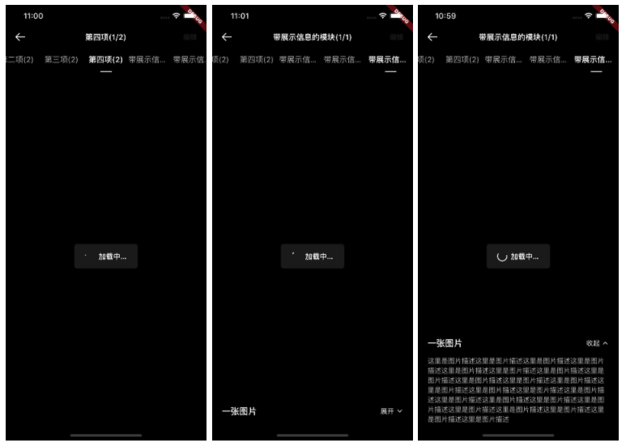
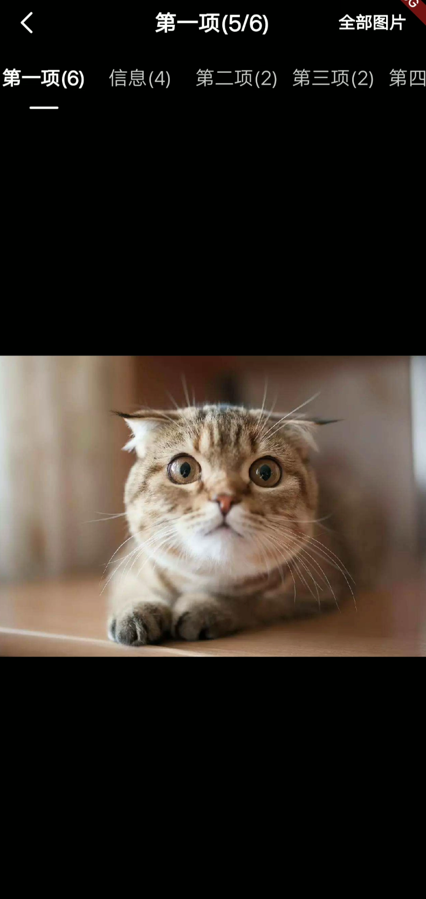

# BrnGalleryDetailPage

查看大图交互模式-详情页。

关联组件： [BrnGallerySummaryPage](../widgets/brn-gallery-summary-page)

## 一、效果总览

 


## 二、描述

### 适用场景

1. 适用于查看图片，视频PDF等场景。默认只实现了图片的查看，如果想要扩展视频或者pdf自行扩展配置接口可实现
2. 一般用于相册等图片分类和图片总数量较多的场景

### 注意事项

1. 如何选择优先进入大图模式（BrnGalleryDetailPage）还是缩略图模式（BrnGallerySummaryPage）：根据实际需求，若用户点开图片的动机是查看图片细节，则进入大图模式。若用户希望在众多图片中快速定位某张图片，则进入缩略图模式。
2. 大图模式下，图片信息展示区的展示内容可根据实际需求配置。
3. 在图片数量较多时，可能引起OOM，可以自行继承**BrnPhotoItemConfig**，将其中的图片展示组件替换为自定义图片组件。
4. 当所有图片放在 allConfig 中的一个 Item 中时，不显示 TabBar，如：查看图片，查看视频，pdf(自行扩展配置接口**BrnBasicItemConfig**)
5. BrnPhotoItemConfig 中**bottomCardModel** 用于控制图片描述是否可以展开

## 三、构造函数及参数配置

### 构造函数


```dart
BrnGalleryDetailPage(
  {Key key,
  @required this.allConfig,
  this.initGroupId = 0,
  this.initIndexId = 0,
  this.fromSummary = false,
  this.detailRightAction,
  this.controller,
  this.themeData})
```


### 参数说明：

| **参数名** | **参数类型** | **描述** | **是否必填** | **默认值** |
| --- | --- | --- | --- | --- |
| allConfig | `List<BrnBasicGroupConfig>` | 该交互下所有item的配置集合 | 是 |  |
| initGroupId | int | 默认位于哪一组 | 否 | 0 |
| initIndexId | int | 默认位于组内的哪一个对象 | 否 |  |
| fromSummary | bool | 是否来自于列表页，如果为 true 点击全部图片之后会立马返回 | 否 | false |
| detailRightAction | Widget Function(int groupId, int indexId) | 右上角自定义设置按钮，若为空，则展示 "全部图片" | 否 |  |
| controller | BrnGalleryController | 控制图片查看刷新，一般在图片数据变化后调用 | 否 | |


### 图片组配置：


```dart
class BrnPhotoGroupConfig extends BrnBasicGroupConfig {  
  final List<String> urls;  
  final String title;  
  List<BrnBasicItemConfig> configList;  
  
  //通过url列表生成配置  
  BrnPhotoGroupConfig.url({this.title, @required this.urls}) {  
    configList = List();  
    urls.forEach((item) => configList.add(BrnPhotoItemConfig(url: item)));  
  }  
  //自定义每一项配置  
  BrnPhotoGroupConfig({this.urls, this.title, this.configList});  
}
```


### 图片每一条item配置：


```dart
BrnPhotoItemConfig({  
  //图片url  
  @required this.url,  
  //图片的展示模式  
  this.fit = BoxFit.cover,  
  //占位图  
  this.placeHolder =  
      "packages/${BrunoStrings.flutterPackageName}/assets/icons/grey_place_holder.png",  
  //单击事件回调  
  this.onTap,  
  //双击事件回调  
  this.onDoubleTap,  
  //长按事件回调  
  this.onLongPress,  
  //图片名称 用于详情页展示  
  this.name,  
  //片描述用于详情页展示  
  this.des,  
  //详情页是否展示底部卡片，需要提供name和des信息  
  this.showBottom = false,  
  // 底部展示卡片的模式
  // 0 表示 展开不可收起  1 收起可展开  2、 展开可收起  
  this.bottomCardModel,  
  //指定展开不可收起下 content的高度  
  this.bottomContentHeight,  
});
```


### 自定义配置接口：


```dart
//一组配置  
abstract class BrnBasicGroupConfig {  
  //每一个组的标题  
  String title;  
  //该组内具体每一个item的配置  
  List<BrnBasicItemConfig> configList;  
  
  BrnBasicGroupConfig({this.title, @required this.configList});  
}  
  
//每一个item的配置接口，定制化的需求可以自己实现相关接口  
abstract class BrnBasicItemConfig {  
  //该配置的groupIndex  
  int groupIndex;  
  
  //改配置的type信息  
  String type;  
  
  //构建查看详情页的widget  
  Widget buildDetailWidget(BuildContext context,  
      List<BrnBasicGroupConfig> allConfig, int groupId, int index);  
  
  //构建简略页的widget  
  Widget buildSummaryWidget(BuildContext context,  
      List<BrnBasicGroupConfig> allConfig, int groupId, int index);  
}  
```


## 四、代码演示

### 效果1：通过url快速生成配置
优点：使用简单，但无法定制化一些内容，例如详情页下额外的信息

  


```dart
Navigator.push(context, MaterialPageRoute(  
  builder: (BuildContext context) {  
    return BrnGalleryDetailPage(   allConfig: allConfig,   initGroupId:0,   initIndexId:4,);  
  },  
));  

 //通过url快速生成配置  
List<BrnPhotoGroupConfig> allConfig = [  
  BrnPhotoGroupConfig.url(title: '第一项', urls: <String>[  
    "https://timgsa.baidu.com/timg?image&quality=80&size=b9999_10000&sec=1604923055967&di=723208be280feb602ac9fb74b39a99b9&imgtype=0&src=http%3A%2F%2Fa0.att.hudong.com%2F30%2F29%2F01300000201438121627296084016.jpg",  
    "https://timgsa.baidu.com/timg?image&quality=80&size=b9999_10000&sec=1604923055966&di=7d5ea9848f0b40b5317ad08d2fd6a2b3&imgtype=0&src=http%3A%2F%2Fa1.att.hudong.com%2F05%2F00%2F01300000194285122188000535877.jpg",  
    "https://timgsa.baidu.com/timg?image&quality=80&size=b9999_10000&sec=1604923102417&di=d1df6889499f642ffbac1af687fe5b2c&imgtype=0&src=http%3A%2F%2Fb-ssl.duitang.com%2Fuploads%2Fitem%2F201605%2F19%2F20160519224441_VfMWR.jpeg",  
    "https://timgsa.baidu.com/timg?image&quality=80&size=b9999_10000&sec=1604923102415&di=fb7dbb6ede64dbb6e16904aaf691eb71&imgtype=0&src=http%3A%2F%2Fb-ssl.duitang.com%2Fuploads%2Fitem%2F201610%2F10%2F20161010022252_iAnZU.thumb.700_0.jpeg",  
    "https://timgsa.baidu.com/timg?image&quality=80&size=b9999_10000&sec=1604923102415&di=b9ba95bf37124325ebf05451a8c75e98&imgtype=0&src=http%3A%2F%2Fimg.mp.itc.cn%2Fupload%2F20170804%2F89fd4882b00d4757a4ce56559b8a07b7_th.jpg",  
    "https://timgsa.baidu.com/timg?image&quality=80&size=b9999_10000&sec=1604923102414&di=c302d0cae4b1412a7b40921bdcc69a18&imgtype=0&src=http%3A%2F%2Fwww.qipaishuo.com%2Fdongwuimage%2F1-12022h31030.jpg"  
  ])  
];
```


### 效果2：定制每一个Item的配置 

优点：可以对图片的每一个item进行配置，支持传入更多信息，但配置稍微麻烦

```dart
Navigator.push(context, MaterialPageRoute(  
  builder: (BuildContext context) {  
    return BrnGalleryDetailPage(   allConfig: allConfig,   initGroupId:0,   initIndexId:4,);  
  },  
));  
//定制每一项item  
List<BrnPhotoGroupConfig> allConfig = [  
  BrnPhotoGroupConfig(title: "信息", configList: [  
    BrnPhotoItemConfig(  
        url:  
            "https://timgsa.baidu.com/timg?image&quality=80&size=b9999_10000&sec=1604923102415&di=b9ba95bf37124325ebf05451a8c75e98&imgtype=0&src=http%3A%2F%2Fimg.mp.itc.cn%2Fupload%2F20170804%2F89fd4882b00d4757a4ce56559b8a07b7_th.jpg",  
        showBottom: true,  
        bottomCardModel: 0,  
        name: "一只猫",  
        des:  
            "这里是图片描述这里是图片描述这里是图片描述这里是图片描述这里是图片描述这里是图片描述这里是图片描述这里是图片描述这里是图片描述这里是图片描述这里是图片描述这里是图片描述这里是图片描述这里是图片描述"),  
    BrnPhotoItemConfig(  
        url:  
            "https://timgsa.baidu.com/timg?image&quality=80&size=b9999_10000&sec=1604923102415&di=fb7dbb6ede64dbb6e16904aaf691eb71&imgtype=0&src=http%3A%2F%2Fb-ssl.duitang.com%2Fuploads%2Fitem%2F201610%2F10%2F20161010022252_iAnZU.thumb.700_0.jpeg",  
        showBottom: true,  
        bottomCardModel: 1,  
        name: "两只猫",  
        des:  
            "这里是图片描述这里是图片描述这里是图片描述这里是图片描述这里是图片描述这里是图片描述这里是图片描述这里是图片描述；"),  
    BrnPhotoItemConfig(  
        url:  
            "https://timgsa.baidu.com/timg?image&quality=80&size=b9999_10000&sec=1604923055966&di=7d5ea9848f0b40b5317ad08d2fd6a2b3&imgtype=0&src=http%3A%2F%2Fa1.att.hudong.com%2F05%2F00%2F01300000194285122188000535877.jpg",  
        showBottom: true,  
        bottomCardModel: 2,  
        name: "三只猫",  
        des:  
            "这里是图片描述这里是图片描述这里是图片描述这里是图片描述这里是图片描述这里是图片描述这里是图片描述这里是图片描述这里是图片描述这里是图片描述这里是图片描述这里是图片描述这里是图片描述这里是图片描述这里是图片描述这里是图片描述这里是图片描述这里是图片描述这里是图片描述这里是图片描述这里是图片描述这里是图片描述这里是图片描述这里是图片描述这里是图片描述这里是图片描述这里是图片描述这里是图片描述这里是图片描述这里是图片描述这里是图片描述这里是图片描述这里是图片描述这里是图片描述这里是图片描述这里是图片描述这里是图片描述这里是图片描述这里是图片描述这里是图片描述这里是图片描述这里是图片描述这里是图片描述这里是图片描述这里是图片描述这里是图片描述这里是图片描述这里是图片描述这里是图片描述这里是图片描述这里是图片描述这里是图片描述这里是图片描述这里是图片描述这里是图片描述这里是图片描述这里是图片描述这里是图片描述这里是图片描述这里是图片描述"),  
    BrnPhotoItemConfig(  
        url: "http://img.ljcdn.com/test/0eca7a86-1090-4b10-9977-9ebf2d6174b0.jpg",  
        showBottom: false,  
        name: "一张图片",  
        des: "这里是图片描述这里是图片描述这里是图片描述这里是图片描述这里是图片描述这里是图片描述这里是图片描述这里是图片描述这里是图片描述这里是图片描述这里是图片描述")  
  ])  
];  

```


### 效果3: 使用 controller 动态删除、增加图片数据

  

```dart
BrnGalleryDetailPage(
  themeData: PhotoGalleryTheme.dark == widget.photoGalleryTheme
      ? BrnGalleryDetailConfig.dark()
      : BrnGalleryDetailConfig.light(),
  allConfig: allConfig,
  initGroupId: 0,
  initIndexId: 4,
  controller: controller,
  detailRightAction: (i, j) => BrnTextAction(
    '编辑',
    iconPressed: () {
      BrnToast.show("点击了$i $j", context);
      // 移除第二组的最后一个配置，跳转到 第二组的第一张图
      if (allConfig.length > 1) {
        if (allConfig[1].configList.length > 0) {
          allConfig[1].configList.removeLast();
          controller.refresh(1, 0);
        } else {
          allConfig.removeAt(1);
        }
      }
    },
  ),
)


  List<BrnPhotoGroupConfig> allConfig = [
  BrnPhotoGroupConfig.url(
      themeData: PhotoGalleryTheme.dark == widget.photoGalleryTheme
          ? BrnGalleryDetailConfig.dark()
          : BrnGalleryDetailConfig.light(),
      title: '第一项',
      urls: <String>[
        "https://img1.baidu.com/it/u=2496571732,442429806&fm=26&fmt=auto&gp=0.jpg",
        "http://img.pconline.com.cn/images/upload/upc/tx/wallpaper/1508/20/c0/11483087_1440080502911_800x600.jpg",
        "https://img1.baidu.com/it/u=2496571732,442429806&fm=26&fmt=auto&gp=0.jpg",
        "http://img.pconline.com.cn/images/upload/upc/tx/wallpaper/1508/20/c0/11483087_1440080502911_800x600.jpg",
        "https://img1.baidu.com/it/u=2496571732,442429806&fm=26&fmt=auto&gp=0.jpg",
        "http://img.pconline.com.cn/images/upload/upc/tx/wallpaper/1508/20/c0/11483087_1440080502911_800x600.jpg",
      ]),
  BrnPhotoGroupConfig(title: "信息", configList: [
    BrnPhotoItemConfig(
        themeData: PhotoGalleryTheme.dark == widget.photoGalleryTheme
            ? BrnGalleryDetailConfig.dark()
            : BrnGalleryDetailConfig.light(),
        url: "https://img1.baidu.com/it/u=2496571732,442429806&fm=26&fmt=auto&gp=0.jpg",
        showBottom: true,
        bottomCardModel: PhotoBottomCardState.cantFold,
        name: "一只猫",
        des:
            "这里是图片描述这里是图片描述这里是图片描述这里是图片描述这里是图片描述这里是图片描述这里是图片描述这里是图片描述这里是图片描述这里是图片描述这里是图片描述这里是图片描述这里是图片描述这里是图片描述这里是图片描述这里是图片描述这里是图片描述这里是图片描述这里是图片描述这里是图片描述这里是图片描述这里是图片描述这里是图片描述这里是图片描述"),
    BrnPhotoItemConfig(
        themeData: PhotoGalleryTheme.dark == widget.photoGalleryTheme
            ? BrnGalleryDetailConfig.dark()
            : BrnGalleryDetailConfig.light(),
        url:
            "http://m.360buyimg.com/mobilecms/s1600x1120_jfs/t19540/272/1542853502/335716/5ef8759b/5acc6c5bN988cd3d9.jpg",
        showBottom: true,
        bottomCardModel: PhotoBottomCardState.fold,
        name: "两只猫",
        des:
            "这里是图片描述这里是图片描述这里是图片描述这里是图片描述这里是图片描述这里是图片描述这里是图片描述这里是图片描述这里是图片描述这里是图片描述这里是图片描述这里是图片描述这里是图片描述这里是图片描述这里是图片描述这里是图片描述这里是图片描述这里是图片描述这里是图片描述这里是图片描述这里是图片描述这里是图片描述这里是图片描述这里是图片描述"),
    BrnPhotoItemConfig(
        themeData: PhotoGalleryTheme.dark == widget.photoGalleryTheme
            ? BrnGalleryDetailConfig.dark()
            : BrnGalleryDetailConfig.light(),
        url:
            "https://timgsa.baidu.com/timg?image&quality=80&size=b9999_10000&sec=1604923055966&di=7d5ea9848f0b40b5317ad08d2fd6a2b3&imgtype=0&src=http%3A%2F%2Fa1.att.hudong.com%2F05%2F00%2F01300000194285122188000535877.jpg",
        showBottom: true,
        bottomCardModel: PhotoBottomCardState.unFold,
        name: "三只猫",
        des:
            "这里是图片描述这里是图片描述这里是图片描述这里是图片描述这里是图片描述这里是图片描述这里是图片描述这里是图片描述这里是图片描述这里是图片描述这里是图片描述这里是图片描述这里是图片描述这里是图片描述这里是图片描述这里是图片描述这里是图片描述这里是图片描述这里是图片描述这里是图片描述这里是图片描述这里是图片描述这里是图片描述这里是图片描述"),
    BrnPhotoItemConfig(
        themeData: PhotoGalleryTheme.dark == widget.photoGalleryTheme
            ? BrnGalleryDetailConfig.dark()
            : BrnGalleryDetailConfig.light(),
        url:
            "http://m.360buyimg.com/mobilecms/s1600x1120_jfs/t19540/272/1542853502/335716/5ef8759b/5acc6c5bN988cd3d9.jpg",
        showBottom: false,
        name: "一张图片",
        des:
            "这里是图片描述这里是图片描述这里是图片描述这里是图片描述这里是图片描述这里是图片描述这里是图片描述这里是图片描述这里是图片描述这里是图片描述这里是图片描述这里是图片描述这里是图片描述这里是图片描述这里是图片描述这里是图片描述这里是图片描述这里是图片描述这里是图片描述这里是图片描述这里是图片描述这里是图片描述这里是图片描述这里是图片描述")
  ]),
  BrnPhotoGroupConfig.url(
      title: '第二项',
      themeData: PhotoGalleryTheme.dark == widget.photoGalleryTheme
          ? BrnGalleryDetailConfig.dark()
          : BrnGalleryDetailConfig.light(),
      urls: <String>[
        "https://img1.baidu.com/it/u=2496571732,442429806&fm=26&fmt=auto&gp=0.jpg",
        "http://m.360buyimg.com/mobilecms/s1600x1120_jfs/t19540/272/1542853502/335716/5ef8759b/5acc6c5bN988cd3d9.jpg",
      ]),
  BrnPhotoGroupConfig.url(
      themeData: PhotoGalleryTheme.dark == widget.photoGalleryTheme
          ? BrnGalleryDetailConfig.dark()
          : BrnGalleryDetailConfig.light(),
      title: '第三项',
      urls: <String>[
        "https://img1.baidu.com/it/u=2496571732,442429806&fm=26&fmt=auto&gp=0.jpg",
        "http://m.360buyimg.com/mobilecms/s1600x1120_jfs/t19540/272/1542853502/335716/5ef8759b/5acc6c5bN988cd3d9.jpg",
      ]),
  BrnPhotoGroupConfig.url(
      themeData: PhotoGalleryTheme.dark == widget.photoGalleryTheme
          ? BrnGalleryDetailConfig.dark()
          : BrnGalleryDetailConfig.light(),
      title: '第四项',
      urls: <String>[
        "https://img1.baidu.com/it/u=2496571732,442429806&fm=26&fmt=auto&gp=0.jpg",
        "http://m.360buyimg.com/mobilecms/s1600x1120_jfs/t19540/272/1542853502/335716/5ef8759b/5acc6c5bN988cd3d9.jpg",
      ]),
  BrnPhotoGroupConfig(
      themeData: PhotoGalleryTheme.dark == widget.photoGalleryTheme
          ? BrnGalleryDetailConfig.dark()
          : BrnGalleryDetailConfig.light(),
      title: "带展示信息的模块",
      configList: [
        BrnPhotoItemConfig(
            themeData: PhotoGalleryTheme.dark == widget.photoGalleryTheme
                ? BrnGalleryDetailConfig.dark()
                : BrnGalleryDetailConfig.light(),
            url:
                "http://tao.goulew.com/users/upfile/20180927/11eb065d-24d3-4a55-b9f8-e58085bdad2e.jpg",
            showBottom: true,
            bottomCardModel: PhotoBottomCardState.fold,
            name: "一张图片",
            des:
                "这里是图片描述这里是图片描述这里是图片描述这里是图片描述这里是图片描述这里是图片描述这里是图片描述这里是图片描述这里是图片描述这里是图片描述这里是图片描述这里是图片描述这里是图片描述这里是图片描述这里是图片描述这里是图片描述这里是图片描述这里是图片描述这里是图片描述这里是图片描述这里是图片描述这里是图片描述这里是图片描述这里是图片描述")
      ]),
  BrnPhotoGroupConfig(title: "带展示信息的模块", configList: [
    BrnPhotoItemConfig(
        themeData: PhotoGalleryTheme.dark == widget.photoGalleryTheme
            ? BrnGalleryDetailConfig.dark()
            : BrnGalleryDetailConfig.light(),
        url:
            "https://c-ssl.duitang.com/uploads/item/201912/31/20191231121259_dckjf.thumb.1000_0.jpg",
        showBottom: true,
        bottomCardModel: PhotoBottomCardState.fold,
        name: "一张图片",
        des:
            "这里是图片描述这里是图片描述这里是图片描述这里是图片描述这里是图片描述这里是图片描述这里是图片描述这里是图片描述这里是图片描述这里是图片描述这里是图片描述这里是图片描述这里是图片描述这里是图片描述这里是图片描述这里是图片描述这里是图片描述这里是图片描述这里是图片描述这里是图片描述这里是图片描述这里是图片描述这里是图片描述这里是图片描述")
  ]),
  BrnPhotoGroupConfig(title: "带展示信息的模块", configList: [
    BrnPhotoItemConfig(
        themeData: PhotoGalleryTheme.dark == widget.photoGalleryTheme
            ? BrnGalleryDetailConfig.dark()
            : BrnGalleryDetailConfig.light(),
        url:
            "https://c-ssl.duitang.com/uploads/item/201912/31/20191231121259_dckjf.thumb.1000_0.jpg",
        showBottom: true,
        bottomCardModel: PhotoBottomCardState.fold,
        name: "一张图片",
        des:
            "这里是图片描述这里是图片描述这里是图片描述这里是图片描述这里是图片描述这里是图片描述这里是图片描述这里是图片描述这里是图片描述这里是图片描述这里是图片描述这里是图片描述这里是图片描述这里是图片描述这里是图片描述这里是图片描述这里是图片描述这里是图片描述这里是图片描述这里是图片描述这里是图片描述这里是图片描述这里是图片描述这里是图片描述；")
  ])
];
```

