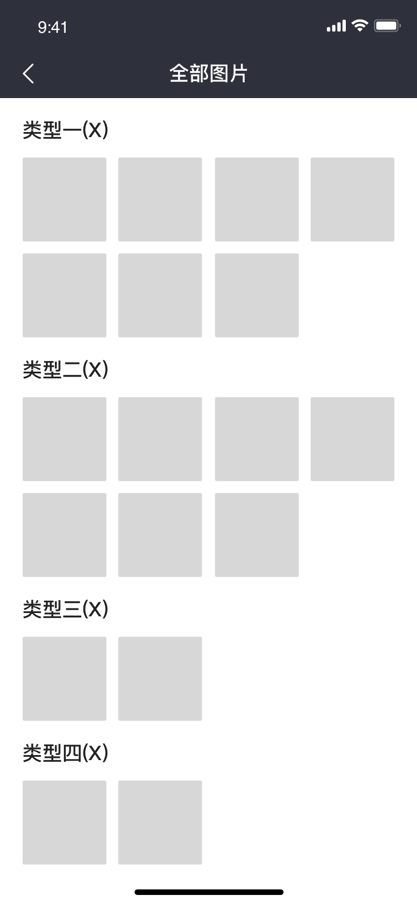
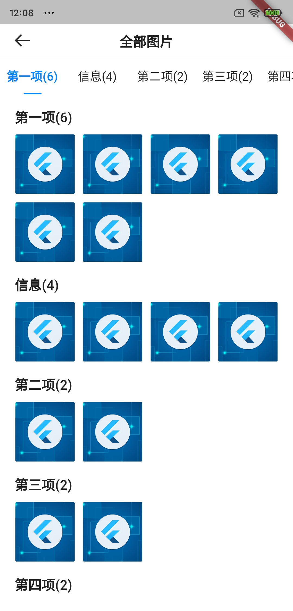

# BrnGallerySummaryPage

查看大图交互模式-列表页

相关组件 [BrnGalleryDetailPage](../widgets/brn-gallery-detail-page)

## 一、效果总览

 

## 二、组件描述

### 适用场景

1. 组件提供了（列表页<-->详情页）这种交互模式的骨架，适用于查看图片，视频PDF等场景。默认只实现了图片的查看，如果想要扩展视频或者pdf自行扩展配置接口可实现。
2. 查看图片，查看视频，pdf(自行扩展配置接口**BrnBasicItemConfig**)

### **注意事项**

在图片数量较多时，可能引起OOM，可以自行继承**BrnPhotoItemConfig，**将其中的图片组件替换为架构组提供的图片组件。

## 三、构造函数及参数说明

### 构造函数


```dart
BrnGallerySummaryPage(
  {@required this.allConfig,
  this.rowCount = 4,
  this.fromDetail = false,
  this.detailRightAction,
  this.controller});
```

### 参数说明

| **参数名** | **参数类型** | **描述** | **是否必填** | 默认值 |
| --- | --- | --- | --- | --- |
| detailRightAction | Widget Function(int groupId, int indexId) | 图片详情页右上角自定义设置按钮，若为空，则展示 "全部图片" | 否 | "全部图片" |
| allConfig | `List<BrnBasicGroupConfig>` | 该交互下所有item的配置集合 | 是 |  |
| fromDetail | bool | 是否从详情页跳转，一般情况不使用，如果为 true 点击之后会立即返回 | 否 | false |
| rowCount | int | 一行展示多少个item | 否 | 4 |
| controller | BrnGalleryController | 控制图片查看刷新 | 否 | 无 |


### 图片组配置：


```dart
class BrnPhotoGroupConfig extends BrnBasicGroupConfig {  
  final List<String> urls;  
  final String title;  
  List<BrnBasicItemConfig> configList;  
  final BrnGalleryDetailConfig themeData;
  
  //通过url列表生成配置
  BrnPhotoGroupConfig.url({this.title, @required this.urls, this.themeData}) {
    configList = List();
    urls.forEach((item) => configList.add(BrnPhotoItemConfig(url: item, themeData: themeData)));
  }

  //自定义配置列表
  BrnPhotoGroupConfig({this.urls, this.title, this.configList, this.themeData});
}
```


### 图片每一条item配置：


```dart
BrnPhotoItemConfig({
  @required this.url,
  this.fit = BoxFit.cover,
  this.placeHolder =
      "packages/${BrnStrings.flutterPackageName}/assets/icons/grey_place_holder.png",
  this.onTap,
  this.onDoubleTap,
  this.onLongPress,
  this.name,
  this.des,
  this.showBottom = false,
  this.bottomCardModel,
  this.bottomContentHeight,
  this.themeData,
})
```


| **参数名**          | **参数类型**           | **描述**                                                     | **是否必填** | 默认值                        |
| ------------------- | ---------------------- | ------------------------------------------------------------ | ------------ | ----------------------------- |
| url                 | String                 | 图片url                                                      | 否           | 无                            |
| fit                 | BoxFit                 | 图片的展示模式                                               | 否           | BoxFit.cover                  |
| placeHolder         | String                 | 占位图                                                       | 否           | 内置占位图                    |
| onTap               | VoidCallbackt          | 详情页图片点击回调                                           | 否           | 4                             |
| onDoubleTap         | VoidCallback           | 详情页双击回调                                               | 否           | 无                            |
| onLongPress         | VoidCallback           | 详情页长按回调                                               | 否           |                               |
| name                | String                 | 图片名称 用于详情页展示                                      | 否           |                               |
| des                 | String                 | 图片描述公 用于详情页展示                                    | 否           |                               |
| showBottom          | bool                   | /详情页是否展示底部卡片，需要提供name和des信息               | 否           | false                         |
| bottomCardModel     | PhotoBottomCardState   | 底部展示卡片的模式// 0 表示 展开不可收起  1 收起可展开  2、 展开可收起 | 否           | PhotoBottomCardState.cantFold |
| bottomContentHeight | double                 | 指定展开不可收起下 content的高度                             | 否           | 150                           |
| themeData           | BrnGalleryDetailConfig | 主题配置                                                     | 否           | 全局主题配置                  |

### 自定义配置接口


```dart
//一组配置  
abstract class BrnBasicGroupConfig {  
  //每一个组的标题  
  String title;  
  //该组内具体每一个item的配置  
  List<BrnBasicItemConfig> configList;  
  
  BrnBasicGroupConfig({this.title, @required this.configList});  
}  
  
//每一个item的配置接口，定制化的需求可以自己实现相关接口  
abstract class BrnBasicItemConfig {  
  //该配置的groupIndex  
  int groupIndex;  
  
  //改配置的type信息  
  String type;  
  
  //构建查看详情页的widget  
  Widget buildDetailWidget(BuildContext context,  
      List<BrnBasicGroupConfig> allConfig, int groupId, int index);  
  
  //构建简略页的widget  
  Widget buildSummaryWidget(BuildContext context,  
      List<BrnBasicGroupConfig> allConfig, int groupId, int index);  
}
```


## 四、代码演示

### 效果1:

通过url快速生成配置，优点：使用简单，但无法定制化一些内容，例如详情页下额外的信息

通过BrnPhotoItemConfig定制每一个Item的配置 ，优点：可以对图片的每一个item进行配置，支持传入更多信息，但配置稍微麻烦

 

```dart
Navigator.push(context, MaterialPageRoute(  
  builder: (BuildContext context) {  
    return BrnGallerySummaryPage(allConfig: allConfig));  
  },  
));  
  List<BrnPhotoGroupConfig> allConfig = [
      BrnPhotoGroupConfig.url(title: '第一项', urls: <String>[
        'http://img1.mukewang.com/5c18cf540001ac8206000338.jpg',
        'http://img1.mukewang.com/5c18cf540001ac8206000338.jpg',
        'http://img1.mukewang.com/5c18cf540001ac8206000338.jpg',
        'http://img1.mukewang.com/5c18cf540001ac8206000338.jpg',
        'http://img1.mukewang.com/5c18cf540001ac8206000338.jpg',
        'http://img1.mukewang.com/5c18cf540001ac8206000338.jpg',
      ]),
      BrnPhotoGroupConfig(title: "信息", configList: [
        BrnPhotoItemConfig(
            url: 'http://img1.mukewang.com/5c18cf540001ac8206000338.jpg',
            showBottom: true,
            bottomCardModel: PhotoBottomCardState.cantFold,
            name: "一只猫",
            des:
                "图片描述图片描述图片描述图片描述图片描述图片描述图片描述图片描述图片描述图片描述图片描述图片描述图片描述图片描述图片描述图片描述图片描述图片描述图片描述图片描述图片描述图片描述图片描述图片描述图片描述图片描述图片描述图片描述图片描述图片描述图片描述图片描述图片描述图片描述图片描述图片描述图片描述图片描述图片描述图片描述图片描述图片描述图片描述图片描述图片描述图片描述图片描述图片描述图片描述图片描述图片描述图片描述"),
        BrnPhotoItemConfig(
            url: 'http://img1.mukewang.com/5c18cf540001ac8206000338.jpg',
            showBottom: true,
            bottomCardModel: PhotoBottomCardState.fold,
            name: "两只猫",
            des: "图片描述图片描述图片描述图片描述图片描述图片描述图片描述图片描述图片描述图片描述图片描述图片描述图片描述"),
        BrnPhotoItemConfig(
            url: 'http://img1.mukewang.com/5c18cf540001ac8206000338.jpg',
            showBottom: true,
            bottomCardModel: PhotoBottomCardState.unFold,
            name: "三只猫",
            des:
                "图片描述图片描述图片描述图片描述图片描述图片描述图片描述图片描述图片描述图片描述图片描述图片描述图片描述图片描述图片描述图片描述图片描述图片描述图片描述图片描述图片描述图片描述图片描述图片描述图片描述图片描述图片描述图片描述图片描述图片描述图片描述图片描述图片描述图片描述图片描述图片描述图片描述图片描述图片描述"),
        BrnPhotoItemConfig(
            url: 'http://img1.mukewang.com/5c18cf540001ac8206000338.jpg',
            showBottom: false,
            name: "一张图片",
            des:
                "图片描述图片描述图片描述图片描述图片描述图片描述图片描述图片描述图片描述图片描述图片描述图片描述图片描述图片描述图片描述图片描述图片描述图片描述图片描述图片描述图片描述图片描述图片描述图片描述图片描述图片描述")
      ]),
      BrnPhotoGroupConfig.url(title: '第二项', urls: <String>[
        'http://img1.mukewang.com/5c18cf540001ac8206000338.jpg',
        'http://img1.mukewang.com/5c18cf540001ac8206000338.jpg',
      ]),
      BrnPhotoGroupConfig.url(title: '第三项', urls: <String>[
        'http://img1.mukewang.com/5c18cf540001ac8206000338.jpg',
        'http://img1.mukewang.com/5c18cf540001ac8206000338.jpg',
      ]),
      BrnPhotoGroupConfig.url(title: '第四项', urls: <String>[
        'http://img1.mukewang.com/5c18cf540001ac8206000338.jpg',
        'http://img1.mukewang.com/5c18cf540001ac8206000338.jpg',
      ]),
      BrnPhotoGroupConfig(title: "带展示信息的模块", configList: [
        BrnPhotoItemConfig(
            url: 'http://img1.mukewang.com/5c18cf540001ac8206000338.jpg',
            showBottom: true,
            bottomCardModel: PhotoBottomCardState.fold,
            name: "一张图片",
            des: "图片描述图片描述图片描述图片描述图片描述图片描述图片描述图片描述图片描述图片描述图片描述图片描述图片描述")
      ]),
      BrnPhotoGroupConfig(title: "带展示信息的模块", configList: [
        BrnPhotoItemConfig(
            url: 'http://img1.mukewang.com/5c18cf540001ac8206000338.jpg',
            showBottom: true,
            bottomCardModel: PhotoBottomCardState.fold,
            name: "一张图片",
            des:
                "图片描述图片描述图片描述图片描述图片描述图片描述图片描述图片描述图片描述图片描述图片描述图片描述图片描述图片描述图片描述图片描述图片描述图片描述图片描述图片描述图片描述图片描述图片描述图片描述图片描述图片描述图片描述图片描述图片描述图片描述图片描述图片描述图片描述图片描述图片描述图片描述图片描述图片描述图片描述")
      ]),
      BrnPhotoGroupConfig(title: "带展示信息的模块", configList: [
        BrnPhotoItemConfig(
            url: 'http://img1.mukewang.com/5c18cf540001ac8206000338.jpg',
            showBottom: true,
            bottomCardModel: PhotoBottomCardState.fold,
            name: "一张图片",
            des:
                "图片描述图片描述图片描述图片描述图片描述图片描述图片描述图片描述图片描述图片描述图片描述图片描述图片描述图片描述图片描述图片描述图片描述图片描述图片描述图片描述图片描述图片描述图片描述图片描述图片描述图片描述图片描述图片描述图片描述图片描述图片描述图片描述图片描述图片描述图片描述图片描述图片描述图片描述图片描述图片描述图片描述图片描述图片描述图片描述图片描述图片描述图片描述图片描述图片描述图片描述图片描述图片描述图片描述图片描述图片描述图片描述图片描述图片描述图片描述图片描述图片描述图片描述图片描述图片描述图片描述图片描述图片描述图片描述图片描述图片描述图片描述图片描述图片描述图片描述图片描述图片描述图片描述图片描述图片描述图片描述图片描述图片描述图片描述图片描述图片描述图片描述图片描述图片描述图片描述图片描述图片描述")
      ])
    ];
```
