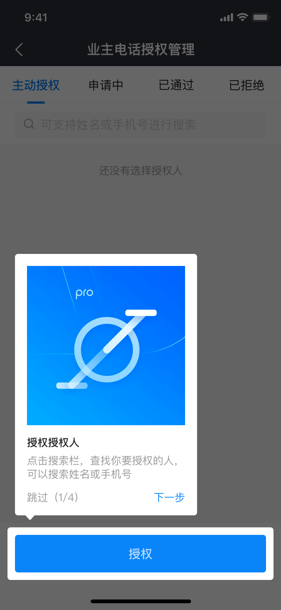
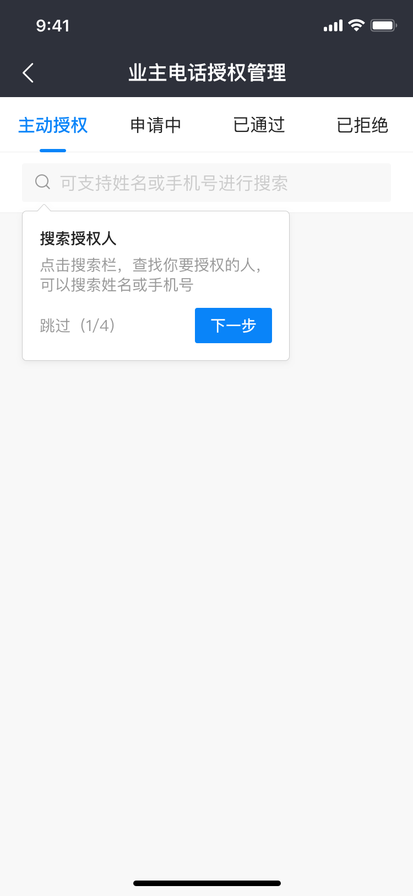
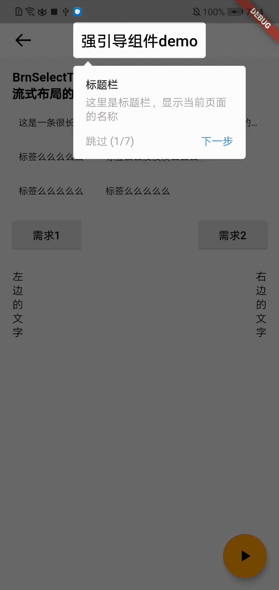

# BrnGuide

通过阻断式的交互弹框，实现新手交互

## 一、效果总览

有强和弱两种交互模式

#### 强引导



#### 弱引导



## 二、描述

### 适用场景

产品提出需要实现引导类的需求时。

### 交互规则

1. 强引导：蒙层覆盖+引导内容

2. 弱引导：引导内容

3. 初始化完 引导视图之后需要通过 key 和要展示引导视图的组件关联起来；然后调用引导视图的 start() 方法展示即可。

## 三、构造函数及参数说明

### 构造函数

```dart
BrnGuide(
    {@required this.introMode,
    @required this.widgetBuilder,
    @required this.stepCount,
    this.borderRadius = const BorderRadius.all(Radius.circular(4)),
    this.padding = const EdgeInsets.all(10),
    this.onNextClick})
    : assert(stepCount > 0) {
    for (int i = 0; i < stepCount; i++) {
    _globalKeys.add(GlobalKey());
    _configMap.add({});
  }
}
```

### 参数说明

| **参数名**    | **参数类型**                             | **描述**                                 | **是否必填** | **默认值**                           |
| ------------- | ---------------------------------------- | ---------------------------------------- | ------------ | ------------------------------------ |
| introMode     | GuideMode                                | 引导强弱模式， GuideMode { force, soft } | 是           | 无                                   |
| widgetBuilder | Widget Function(StepWidgetParams params) | 引导 Widget                              | 是           | 无                                   |
| stepCount     | int                                      | 步骤数量                                 | 是           | 无                                   |
| borderRadius  | BorderRadiusGeometry                     | 强提示下的高亮圆角                       | 否           | BorderRadius.all(Radius.circular(4)) |
| padding       | EdgeInsets                               | 高亮组件与目标组件的间距，默认是 10      | 否           | EdgeInsets.all(10)                   |
| onNextClick   | void Function(int nextIndex)             | 每次点击的下一步的时候的回调             | 否           | 无                                   |

### 其他参数说明：StepWidgetBuilder 使用默认配置

```dart
static Widget Function(StepWidgetParams params) useDefaultTheme(
  {@required List<BrnTipInfoBean> tipInfo,
  String Function(int currentStepIndex, int stepCount) buttonTextBuilder,
  bool showStepLabel = true,
  bool showSkipLabel = true,
  bool showClose = true})
```

| **参数名**        | **参数类型**                                         | **描述**         | **是否必填** | 默认值                 |
| ----------------- | ---------------------------------------------------- | ---------------- | ------------ | ---------------------- |
| tipInfo           | `List<BrnTipInfoBean>`                               | 提示内容         | 是           | 无                     |
| buttonTextBuilder | String Function(int currentStepIndex, int stepCount) | 下一步的文案     | 否           | '下一步' 和 '我知道了' |
| showStepLabel     | bool                                                 | 是否展示步骤标志 | 否           | true                   |
| showSkipLabel     | bool                                                 | 是否展示跳过功能 | 否           | true                   |
| showClose         | bool                                                 | 是否展示关闭功能 | 否           | true                   |

## 四、代码演示

### 效果1：强引导模式



```dart
class ForceGuideDemo extends StatefulWidget {
  ForceGuideDemo({Key key}) : super(key: key);

  @override
  _ForceGuideDemoState createState() => _ForceGuideDemoState();
}

class _ForceGuideDemoState extends State<ForceGuideDemo> {
  BrnGuide intro;

  _ForceGuideDemoState() {
    /// init Guide
    intro = BrnGuide(
      stepCount: 7,
      introMode: GuideMode.force,

      /// use defaultTheme, or you can implement widgetBuilder function yourself
      widgetBuilder: StepWidgetBuilder.useDefaultTheme(
        showClose: false,
        tipInfo: [
          BrnTipInfoBean("标题栏", "这里是标题栏，显示当前页面的名称", ""),
          BrnTipInfoBean("标签组件", "这里是标签组件，你可以动态添加或者删除组件，当你点击后会将结果给你回传", ""),
          BrnTipInfoBean("左边的按钮", "这里是按钮，点击他试试", ''),
          BrnTipInfoBean("右边的按钮", "这里是按钮，点击他试试", ''),
          BrnTipInfoBean("左边的文本 ", "这是一个朴实无华的文本", ''),
          BrnTipInfoBean("右边文本 ", "这是一个枯燥文本", ""),
          BrnTipInfoBean("开始按钮 ", "点击开启引导动画", ''),
        ],
      ),
    );
  }

  List<String> nameList = [
    '这是一条很长很长很长很长很长很长很长很长很长很长的标签',
    '标签么么么么么',
    '标签么么没没没么么么',
    '标签么么么么么',
    '标签么么么么么'
  ];

  @override
  void initState() {
    super.initState();
    Timer(Duration(microseconds: 0), () {
      /// start the intro
      intro.start(context);
    });
  }

  Widget build(BuildContext context) {
    return WillPopScope(
      child: Scaffold(
        appBar: BrnAppBar(
          brightness: Brightness.light,
          title: Text(
            '强引导组件demo',
            key: intro.keys[0],
            style: TextStyle(color: Colors.black),
          ),
        ),
        body: SingleChildScrollView(
          child: Container(
            padding: EdgeInsets.all(16),
            child: Column(
              crossAxisAlignment: CrossAxisAlignment.start,
              children: [
                Text(
                  'BrnSelectTagWidget',
                  style: TextStyle(fontSize: 16, fontWeight: FontWeight.bold),
                ),
                Text(
                  '流式布局的自适应标签(最小宽度75)',
                  style: TextStyle(fontSize: 16, fontWeight: FontWeight.bold),
                ),
                SizedBox(
                  height: 10,
                ),
                BrnSelectTag(
                    key: intro.keys[1],
                    tagNameList: nameList,
                    tagWidth: (MediaQuery.of(context).size.width - 40 - 24) / 3,
                    fixWidthMode: false,
                    onSelect: (index) {
                      BrnToast.show("$index is selected", context);
                    }),
                SizedBox(
                  height: 16,
                ),
                Row(
                  mainAxisAlignment: MainAxisAlignment.spaceBetween,
                  children: <Widget>[
                    RaisedButton(
                      key: intro.keys[2],
                      onPressed: () {},
                      child: Text("需求1"),
                    ),
                    RaisedButton(
                      key: intro.keys[3],
                      onPressed: () {},
                      child: Text("需求2"),
                    ),
                  ],
                ),
                Row(
                  mainAxisAlignment: MainAxisAlignment.spaceBetween,
                  children: <Widget>[
                    Container(
                      width: 14,
                      padding: EdgeInsets.only(top: 20),
                      alignment: Alignment.center,
                      child: Text(
                        '左边的文字',
                        key: intro.keys[4],
                      ),
                    ),
                    Container(
                      width: 14,
                      padding: EdgeInsets.only(top: 20),
                      alignment: Alignment.center,
                      child: Text(
                        '右边的文字',
                        key: intro.keys[5],
                      ),
                    )
                  ],
                ),
                SizedBox(
                  height: 16,
                ),
              ],
            ),
          ),
        ),
        floatingActionButton: FloatingActionButton(
          key: intro.keys[6],

          /// 1st guide
          child: Icon(
            Icons.play_arrow,
          ),
          onPressed: () {
            intro.start(context);
          },
        ),
      ),
      onWillPop: () async {
        // destroy guide page when tap back key
        intro.dispose();
        return true;
      },
    );
  }
}
```

### 效果2：弱引导模式


```dart
class SoftGuideDemo extends StatefulWidget {
  SoftGuideDemo({Key key}) : super(key: key);

  @override
  _SoftGuideDemoState createState() => _SoftGuideDemoState();
}

class _SoftGuideDemoState extends State<SoftGuideDemo> {
  BrnGuide intro;

  _SoftGuideDemoState() {
    /// init Guide
    intro = BrnGuide(
      stepCount: 7,
      introMode: GuideMode.soft,

      /// use defaultTheme, or you can implement widgetBuilder function yourself
      widgetBuilder: StepWidgetBuilder.useDefaultTheme(
        tipInfo: [
          BrnTipInfoBean("标题栏", "这里是标题栏，显示当前页面的名称", ""),
          BrnTipInfoBean("标签组件", "这里是标签组件，你可以动态添加或者删除组件，当你点击后会将结果给你回传", ""),
          BrnTipInfoBean("左边的按钮", "这里是按钮，点击他试试", ""),
          BrnTipInfoBean("右边的按钮", "这里是按钮，点击他试试", ""),
          BrnTipInfoBean("左边的文本 ", "这是一个朴实无华的文本", ""),
          BrnTipInfoBean("右边文本 ", "这是一个枯燥文本", ""),
          BrnTipInfoBean("开始按钮 ", "点击开启引导动画", ""),
        ],
      ),
    );
  }

  List<String> nameList = [
    '这是一条很长很长很长很长很长很长很长很长很长很长的标签',
    '标签么么么么么',
    '标签么么没没没么么么',
    '标签么么么么么',
    '标签么么么么么'
  ];

  @override
  void initState() {
    super.initState();
    Timer(Duration(microseconds: 0), () {
      /// start the intro
      intro.start(context);
    });
  }

  Widget build(BuildContext context) {
    return WillPopScope(
      child: Scaffold(
        appBar: BrnAppBar(
          brightness: Brightness.light,
          title: Text(
            '弱引导组件demo',
            key: intro.keys[0],
            style: TextStyle(color: Colors.black),
          ),
        ),
        body: SingleChildScrollView(
          child: Container(
            padding: EdgeInsets.all(16),
            child: Column(
              crossAxisAlignment: CrossAxisAlignment.start,
              children: [
                Text(
                  'BrnSelectTagWidget',
                  style: TextStyle(fontSize: 16, fontWeight: FontWeight.bold),
                ),
                Text(
                  '流式布局的自适应标签(最小宽度75)',
                  style: TextStyle(fontSize: 16, fontWeight: FontWeight.bold),
                ),
                SizedBox(
                  height: 10,
                ),
                BrnSelectTag(
                    key: intro.keys[1],
                    tagNameList: nameList,
                    tagWidth: (MediaQuery.of(context).size.width - 40 - 24) / 3,
                    fixWidthMode: false,
                    onSelect: (index) {
                      BrnToast.show("$index is selected", context);
                    }),
                SizedBox(
                  height: 16,
                ),
                Row(
                  mainAxisAlignment: MainAxisAlignment.spaceBetween,
                  children: <Widget>[
                    RaisedButton(
                      key: intro.keys[2],
                      onPressed: () {},
                      child: Text("需求1"),
                    ),
                    RaisedButton(
                      key: intro.keys[3],
                      onPressed: () {},
                      child: Text("需求2"),
                    ),
                  ],
                ),
                Row(
                  mainAxisAlignment: MainAxisAlignment.spaceBetween,
                  children: <Widget>[
                    Container(
                      width: 14,
                      padding: EdgeInsets.only(top: 20),
                      alignment: Alignment.center,
                      child: Text(
                        '左边的文字',
                        key: intro.keys[4],
                      ),
                    ),
                    Container(
                      width: 14,
                      padding: EdgeInsets.only(top: 20),
                      alignment: Alignment.center,
                      child: Text(
                        '右边的文字',
                        key: intro.keys[5],
                      ),
                    )
                  ],
                ),
                SizedBox(
                  height: 16,
                ),
              ],
            ),
          ),
        ),
        floatingActionButton: FloatingActionButton(
          key: intro.keys[6],

          /// 1st guide
          child: Icon(
            Icons.play_arrow,
          ),
          onPressed: () {
            intro.start(context);
          },
        ),
      ),
      onWillPop: () async {
        // destroy guide page when tap back key
        intro.dispose();
        return true;
      },
    );
  }
}
```
