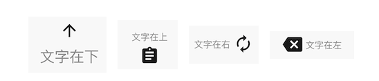

# BrnIconButton

## 一、效果总览



## 二、描述

### 适用场景

1、支持图片和文字任意组合

2、支持文字和图片之间间距调整

3、支持点击和置灰状态

## 三、构造函数及参数说明

### 构造函数

``` dart
const BrnIconButton({
    Key? key,
    required this.name,
    this.iconWidget,
    this.onTap,
    this.iconWidth = 24,
    this.iconHeight = 24,
    @Deprecated('该字段废弃，请使用 style ,未来版本会删除该字段')
    this.fontSize = 11,
    this.widgetWidth = 80,
    this.widgetHeight = 80,
    this.direction = Direction.top,
    this.padding = 4,
    this.style,
    this.mainAxisAlignment = MainAxisAlignment.center,
  }): super(key: key);
```

### 参数说明

| 参数名                       | 参数类型                                     | 描述                                                         | 是否必填 | 默认值                                                       |
| ---------------------------- | -------------------------------------------- | ------------------------------------------------------------ | -------- | ------------------------------------------------------------ |
| name                         | String                                       | 图文组合文字的名称                                           | 否       | 空                                                           |
| iconWidget                   | Widget?                                      | 图文组合需要展示的图片/可以是置灰的图片                      | 否       | 空                                                           |
| onTap                        | VoidCallback?                                | 点击的回调                                                   | 否       | 空                                                           |
| direction                    | enum Direction { left, right, top, bottom, } | 文字相对于图片的位置。 bottom：文字在下 icon 在上， top：文字在上 icon 在下 ，left：文字在左 icon 在右，right：文字在右 icon 在左 | 否       | top                                                          |
| iconWidth                    | double                                       | 图片的宽度                                                   | 否       | 24                                                           |
| iconHeight                   | Color                                        | 图片的高度                                                   | 否       | 24                                                           |
| widgetWidth                  | double                                       | 图文组合的宽度                                               | 否       | 80                                                           |
| widgetHeight                 | double                                       | 图文组合的高度                                               | 否       | 80                                                           |
| padding                      | double                                       | 文字和图片的间距                                             | 否       | 4                                                            |
| style                        | TextStyle?                                   | 文字样式                                                     | 否       | TextStyle( fontSize: 11, color: BrunoColor.instance.F2Color, ), |
| **@Deprecated**<br/>fontSize | double                                       | 文字字体大小<br>**Deprecated 该字段废弃，请使用 style ,未来版本会删除该字段** | 否       | 11                                                           |
| mainAxisAlignment            | MainAxisAlignment                            | 图文对齐方式                                                 | 否       | MainAxisAlignment.center                                     |

## 四、代码演示

### 效果1


``` dart
Widget iconButton(){
 return Column(
   children: <Widget>[
     Padding(
       padding: EdgeInsets.only(top: 50, bottom: 50),
       child: Center(
         child: BrnIconButton(
           name: '文字在下',
           style: TextStyle(
             fontSize: 18,
             color: BrunoColor.instance.F2Color,
           ),
           direction: Direction.bottom,
           padding: 4,
           iconHeight: 30,
           iconWidth: 30,
           iconWidget: Icon(Icons.arrow_upward),
           onTap: () {
             BrnToast.show('按钮被点击', context);
           }),
       ),
     ),
     Padding(
       padding: EdgeInsets.only(top: 10, bottom: 50),
       child: Center(
         child: BrnIconButton(
           name: '文字在上',
           direction: Direction.top,
           padding: 4,
           iconWidget: Icon(Icons.assignment),
           onTap: () {
             BrnToast.show('按钮被点击', context);
           }),
       ),
     ),
     Padding(
       padding: EdgeInsets.only(top: 10, bottom: 50),
       child: Center(
         child: BrnIconButton(
           name: '文字在右',
           direction: Direction.right,
           padding: 4,
           iconWidget: Icon(Icons.autorenew),
           onTap: () {
             BrnToast.show('按钮被点击', context);
           }),
       ),
     ),
     Padding(
       padding: EdgeInsets.only(top: 10, bottom: 50),
       child: Center(
         child: BrnIconButton(
           name: '文字在左',
           direction: Direction.left,
           padding: 4,
           iconWidget: Icon(Icons.backspace),
           onTap: () {
             BrnToast.show('按钮被点击', context);
           }),
       ),
     )
   ],
 );
}
```
