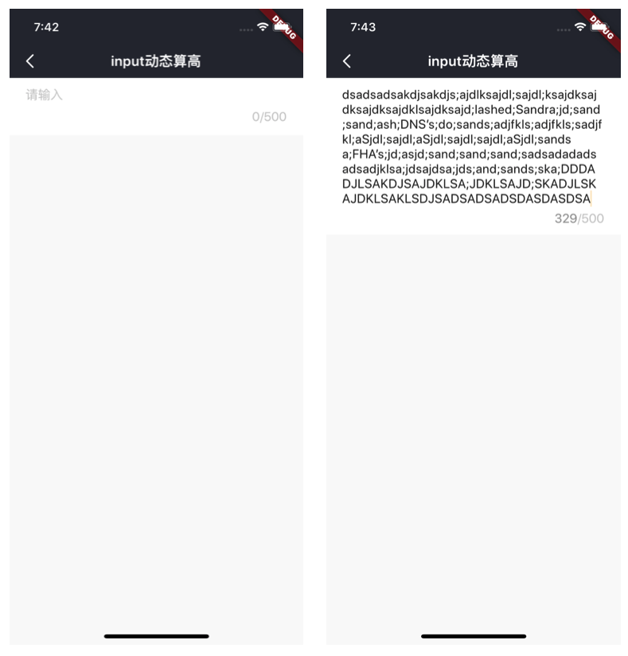
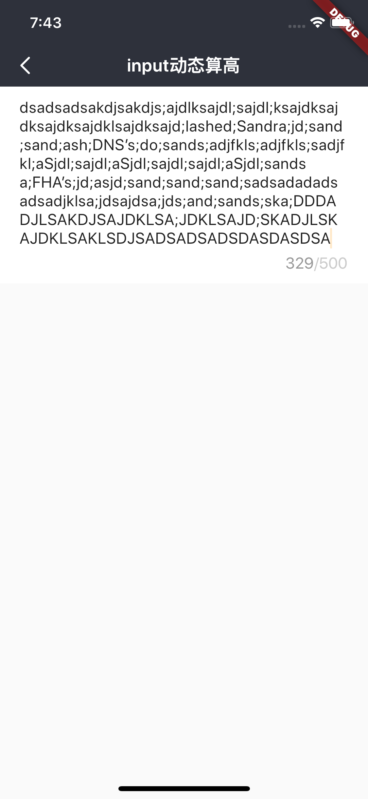
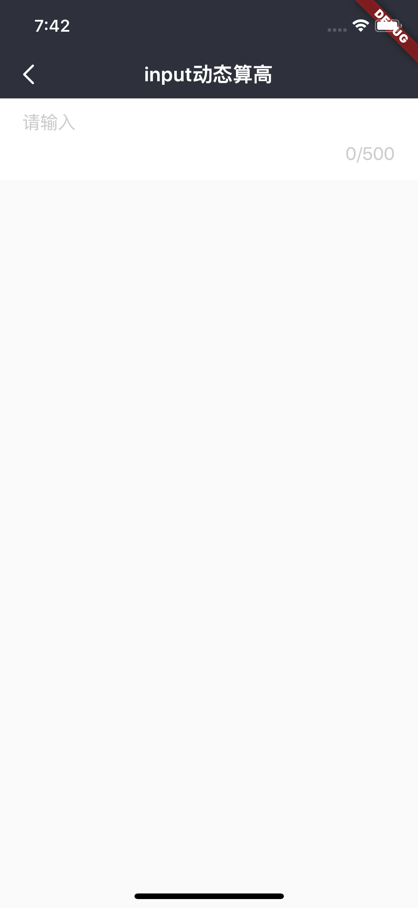

# BrnInputText

动态通用输入框

## 一、效果总览



## 二、描述

### 适用场景

1. 输入基础能力字数多少可配，数字提示字符串的位置会根据输入自动往下移动

2. 输入框初始高度可配

3. 根据输入内容动态算高

## 三、构造函数及参数说明

### 构造函数

```dart
 BrnInputText({
    this.onTextChange,
    this.onSubmit,
    this.maxHeight = 200,
    this.minHeight = 50,
    this.bgColor = Colors.white,
    this.maxLength = 200,
    this.minLines = 1,
    this.hint,
    this.maxHintLines,
    this.padding = EdgeInsets.zero,
    this.textString = "",
    this.autoFocus,
    this.textEditingController,
    this.focusNode,
    this.textInputAction,
    this.textInputAction = TextInputAction.done,
    this.borderRadius,
    this.borderColor,
  });
```

### 参数说明

| **参数名**            | **参数类型**                                         | **描述**                                                     | **是否必填** | **默认值**           |
| --------------------- | ---------------------------------------------------- | ------------------------------------------------------------ | ------------ | -------------------- |
| hint                  | String?                                               | 输入提示语,默认为"请输入"                                 | 否           | 默认值为国际化配置文本 "请输入"          |
| textString            | String                                               | 输入框初始值                                                 | 否           | ""                   |
| maxHintLines          | int?                                                 | 最大 hint 行数                                               |              |                      |
| textEditingController | TextEditingController?                               | 用于对 TextField 更精细的控制，若传入该字段，[textString] 参数将失效，可使用 TextEditingController.text 进行赋值 | 否           |                      |
| onTextChange          | BrnInputTextChangeCallback = Function(String input)? | 搜索框输入内容改变时候的回调函数,str 为输入内容              | 否           | 无                   |
| onSubmit              | BrnInputTextSubmitCallback = Function(String input)? | 输入内容点击确定后的回调,str 为输入内容                      | 否           | 空                   |
| maxHeight             | double                                               | 容器的最大高度、输入框最大可以伸缩的高度                     | 否           | 空                   |
| minHeight             | double                                               | 容器的最小高度、输入框最小可以伸缩的高度                     | 否           | 空                   |
| bgColor               | Color                                                | 整个容器的背景颜色                                           | 否           | Colors.white         |
| maxLength             | int                                                  | 最大字数                                                     | 否           | 200                  |
| minLines              | int                                                  | 最少几行、文字可以输入几行                                   | 否           | 1                    |
| padding               | EdgeInsetsGeometry                                   | 文字离容器的上下左右的距离                                   | 否           | EdgeInsets.zero      |
| borderColor           | Color?                                               | 边框颜色                                                     | 否           |                      |
| borderRadius          | double?                                              | 背景圆角                                                     | 否           |                      |
| autoFocus             | bool?                                                | 光标展示                                                     | 否           |                      |
| focusNode             | FocusNode                                            | 搜索框的焦点控制器                                           | 否           |                      |
| textInputAction       | TextInputAction?                                     | 选择键盘的完成按钮                                           | 否           |                      |
| padding               | EdgeInsetsGeometry                                   | 文字距离边框的边距                                           | 否           | EdgeInsets.zero      |
| textEditingController | TextInputAction                                      | 键盘输入行为                                                 | 否           | TextInputAction.done |

## 三、效果及代码展示

### 效果1





```dart
BrnInputText(
      maxHeight: 200,
      minHeight: 30,
      minLines: 1,
      maxLength: 10,
      bgColor: Colors.grey[200]!,
      textString: model.text ?? '',
      textInputAction: TextInputAction.newline,
      maxHintLines: 20,
      hint: 'input动态算高input动态算高input动态算高input动态算高input动态算高',
      padding: EdgeInsets.fromLTRB(20, 10, 20, 14),
      onTextChange: (text) {
        print(text);
        model.text = text;
        setState(() {});
      },
      onSubmit: (text) {
        print(text);
      },
    );
```
