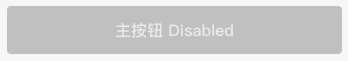

# BrnBigMainButton

## 一、效果总览




## 二、描述

### 适用场景

常用于页面底部、宽度为屏幕宽度的主题色按钮。


## 三、构造函数及参数说明

### 构造函数

```dart
const BrnBigMainButton({
    Key? key,
    this.title = '确认',
    this.width,
    this.isEnable = true,
    this.onTap,
    this.themeData,
    this.bgColor,
  }) : super(key: key);
```
### 参数说明

| **参数名** | **参数类型** | 描述 | **是否必填** | **默认值** |
| --- | --- | --- | --- | --- |
| title | String | 按钮显示文案 | 否 | `'确认'` |
| onTap | VoidCallback? | 点击的回调 | 否 | 无 |
| isEnable | bool | 按钮是否可用 | 否 | false |
| bgColor | Color? | 按钮的背景色 | 否 | 主题色 |
| width | double? | 按钮的宽度 | 否 | double.infinity |
| themeData | BrnButtonConfig? | 按钮主题配置 | 否 | 无 |


## 四、代码演示

### 效果1


```dart
BrnBigMainButton(
  title: '主按钮',
  onTap: () {
    BrnToast.show('点击', context);
  },
)
```


### 效果2


```dart
//置灰效果 无法点击
BrnMetaBigMainButtonWidget(  
  title: '提交',  
  isEnable: false,
  onTap: () {  
    BrnToast.show('点击了主按钮', context);
  },  
)
```
