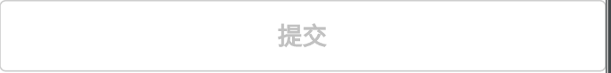

# BrnBigOutlineButton

## 一、效果总览




## 二、描述

### 适用场景

常用于页面底部、宽度为屏幕宽度的边框按钮。

## 三、构造函数及参数说明

### 构造函数

```dart
const BrnBigOutlineButton({
    Key? key,
    this.title,
    this.lineColor,
    this.textColor,
    this.isEnable = true,
    this.width,
    this.onTap,
    this.themeData,
  }) : super(key: key);
```
### 参数说明

| **参数名** | **参数类型** | 描述 | **是否必填** | **默认值** |
| --- | --- | --- | --- | --- |
| title | String? | 按钮显示文案 | 否 | 默认值为国际化配置文本 '确认' |
| onTap | VoidCallback? | 点击的回调 | 否 | 无 |
| isEnable | bool | 按钮是否可用 | 否 | True |
| lineColor | Color? | 边框颜色 | 否 | 主题色 |
| textColor | Color? | 按钮文本颜色 | 否 | 黑色 |
| width | double? | 按钮的宽度 | 否 | double.infinity |
| themeData | BrnButtonConfig? | 按钮主题配置 | 否 | 无 |

## 四、效果及代码演示

###  效果1: 正常效果


```dart
BrnBigOutlineButton(
  title: '次按钮',
  onTap: () {
    BrnToast.show('边框按钮', context);
  },
)
```
###  效果2: 置灰效果


```dart
BrnBigOutlineButton(
  title: '提交',
  isEnable: false,
  onTap: () {
    //置灰点击无响应
    BrnToast.show('点击了按钮', context);
  },
)
```

