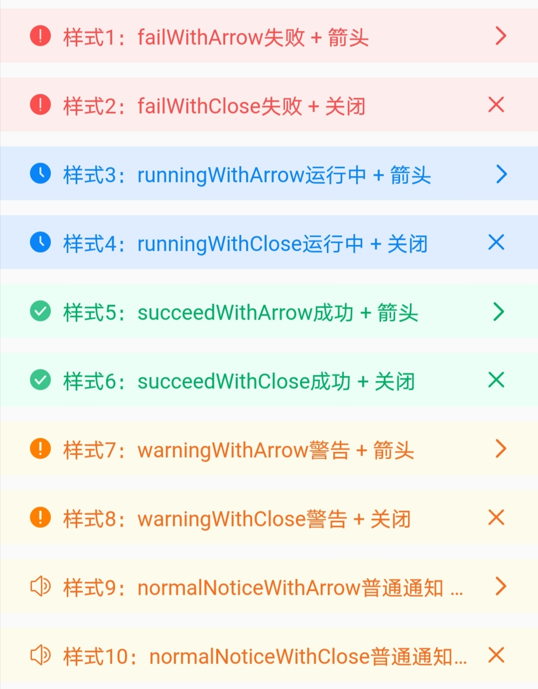
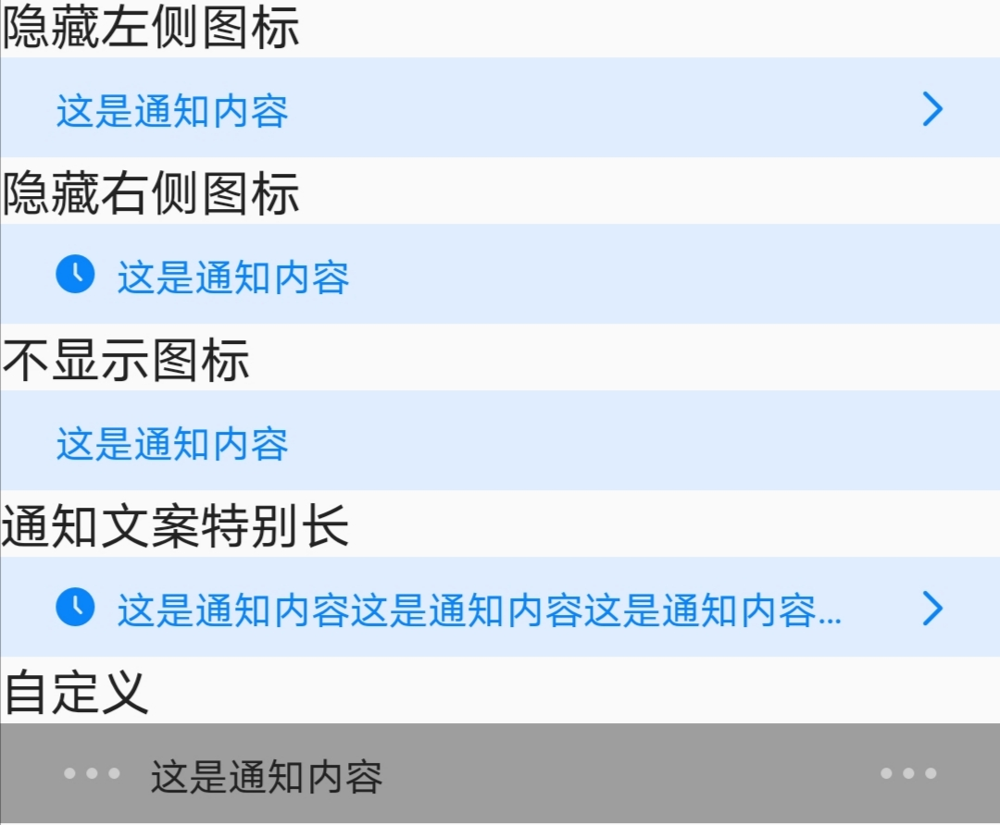
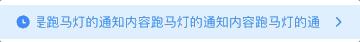

# BrnNoticeBar

通知视图，默认最小高度 36。

## 一、效果总览


<br/>


## 二、描述

### 适用场景

展示通知或者提示信息。

### 交互规则

1. 支持十种默认样式。
2. 支持自定义或隐藏左右图标。
3. 文字颜色和背景颜色支持自定义。
4. 文字较长时只显示一行，以...结尾，也可以支持跑马灯效果展示。
5. 支持点击回调。

## 三、构造函数及参数说明

### 构造函数

```dart
const BrnNoticeBar(
    {Key? key,
    this.leftWidget,
    this.showLeftIcon = true,
    required this.content,
    this.textColor,
    this.backgroundColor,
    this.rightWidget,
    this.showRightIcon = true,
    this.noticeStyle,
    this.onNoticeTap,
    this.onRightIconTap,
    this.marquee = false,
    this.padding,
    this.minHeight = 36})
    : super(key: key);
```

### 参数说明

| 参数名          | 参数类型      | 描述                                                         | 是否必填 | 默认值                        |
| --------------- | ------------- | ------------------------------------------------------------ | -------- | ----------------------------- |
| noticeStyle     | NoticeStyle?  | 样式，取 NoticeStyles 里面的值                               | 否       | NoticeStyles.runningWithArrow |
| content         | String        | 通知具体内容                                                 | 是       | 无                            |
| textColor       | Color?        | 文案的颜色                                                   | 否       | 随 defaultStyle 改变          |
| backgroundColor | Color?        | 通知栏的背景颜色                                             | 否       | 随 defaultStyle 改变          |
| leftWidget      | Widget?       | 左侧图标区域自定义视图                                       | 否       | 无                            |
| showLeftIcon    | bool          | 是否显示左侧图标                                             | 否       | true                          |
| rightWidget     | Widget?       | 右侧图标区域自定义视图                                       | 否       | 无                            |
| showRightIcon   | bool          | 是否显示右侧图标                                             | 否       | true                          |
| onNoticeTap     | VoidCallback? | 点击通知回调                                                 | 否       | 无                            |
| onRightIconTap  | VoidCallback? | 点击右侧图标回掉                                             | 否       | 无                            |
| marquee         | bool          | 跑马灯                                                       | 否       | false                         |
| minHeight       | double        | 最小高度。leftWidget、rightWidget 都为空时，限制的最小高度。可以通过该属性控制组件高度，内容会自动垂直居中。 | 否       | 36                            |
| padding         | EdgeInsets?   | 内容的内边距                                                 | 否       | 无                            |

### 其他参数说明

#### NoticeStyles

```dart
/// NoticeStyle 举例
class NoticeStyles {
  /// 红色+失败+箭头
  static NoticeStyle failWithArrow = NoticeStyle(
      BrunoTools.getAssetImage(BrnAsset.ICON_NOTICE_FAIL),
      Color(0xFFFA3F3F),
      Color(0xFFFEEDED),
      BrunoTools.getAssetImage(BrnAsset.ICON_NOTICE_ARROW_RED));
  /// 红色+失败+关闭
  static NoticeStyle failWithClose = NoticeStyle(
      BrunoTools.getAssetImage(BrnAsset.ICON_NOTICE_FAIL),
      Color(0xFFFA3F3F),
      Color(0xFFFEEDED),
      BrunoTools.getAssetImage(BrnAsset.ICON_NOTICE_CLOSE_RED));
}
```

## 四、代码演示

### 效果 1：正常显示


```dart
BrnNoticeBar(
  content: '这是通知内容',
  noticeStyle: NoticeStyles.runningWithArrow,
  onNoticeTap: () {
    BrnToast.show('点击通知', context);
  },
  onRightIconTap: () {
    BrnToast.show('点击右侧图标', context);
  },
)
```

### 效果 2：隐藏左右图标


```dart
BrnNoticeBar(
  content: '这是通知内容',
  showLeftIcon: false ,
  showRightIcon: false,
  noticeStyle: NoticeStyles.runningWithArrow,
  onNoticeTap: () {
    BrnToast.show('点击通知', context);
  },
  onRightIconTap: () {
    BrnToast.show('点击右侧图标', context);
  },
)
```

### 效果 3：自定义图标和文字、背景颜色


```dart
BrnNoticeBar(
  content: '这是通知内容',
  textColor: BrunoColor.instance.F0Color, ///通知颜色
  backgroundColor: Colors.grey,  ///背景色
  leftWidget: BrunoTools.getAssetImage(BrnAsset.ICON_MORE),  ///左侧图标
  rightWidget: BrunoTools.getAssetImage(BrnAsset.ICON_MORE), ///右侧图标
  onNoticeTap: () {
    BrnToast.show('点击通知', context);
  },
  onRightIconTap: () {
    BrnToast.show('点击右侧图标', context);
  },
)
```

### 效果 4：跑马灯



```dart
BrnNoticeBar(
  content: '这是跑马灯的通知内容跑马灯的通知内容跑马灯的通知内容跑马灯的通知内容',
  marquee: true,
  noticeStyle: NoticeStyles.runningWithArrow,
  onNoticeTap: () {
    BrnToast.show('点击通知', context);
  },
  onRightIconTap: () {
    BrnToast.show('点击右侧图标', context);
  },
)
```
