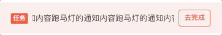

# BrnNoticeBarWithButton

左边标签，右边按钮的通知视图。

## 一、效果总览


## 二、描述

### 适用场景

展示通知、提示或者任务信息，右侧支持按钮展示，整个通知栏也支持点击。

### 交互规则

1. 中间为通知文案，必传。
2. 通知栏文字颜色和背景颜色支持自定义。
3. 左侧为标签，标签文案为空时不显示标签控件。
4. 右侧为按钮，点击有回调。文案为空时不显示按钮，支持自定义文字颜色和边框颜色。
5. 左侧标签区域和右侧按钮区域支持自定义 widget。
6. 文案过长时以 ... 截断展示，也可设置跑马灯展示。

## 三、构造函数及参数说明

### 构造函数

```dart
const BrnNoticeBarWithButton(
    {Key? key,
    required this.content,
    this.backgroundColor,
    this.contentTextColor,
    this.leftTagText,
    this.leftTagBackgroundColor,
    this.leftTagTextColor,
    this.rightButtonBorderColor,
    this.rightButtonText,
    this.rightButtonTextColor,
    this.onRightButtonTap,
    this.marquee = false,
    this.leftWidget,
    this.rightWidget,
    this.padding,
    this.minHeight = 54})
    : super(key: key);
```

### 参数说明

| 参数名                 | 参数类型      | 描述                                                         | 是否必填 | 默认值            |
| ---------------------- | ------------- | ------------------------------------------------------------ | -------- | ----------------- |
| content                | String        | 通知的具体内容                                               | 是       | 无                |
| backgroundColor        | Color?        | 通知的背景颜色                                               | 否       | Color(0x14FA5741) |
| contentTextColor       | Color?        | 通知的文字颜色                                               | 否       | Color(0xFF333333) |
| leftTagText            | String?       | 左边标签的文案，为空或者 null 时不显示标签视图               | 否       | 无                |
| leftTagTextColor       | Color?        | 左边标签文字的颜色                                           | 否       | Colors.white      |
| leftTagBackgroundColor | Color?        | 标签背景的颜色                                               | 否       | Color(0xFFFA5741) |
| leftWidget             | Widget?       | 自定义左侧控件                                               | 否       | 无                |
| rightButtonText        | String?       | 右侧按钮的文案，为空时不显示按钮                             | 否       |                   |
| rightButtonTextColor   | Color?        | 右侧按钮文字颜色                                             | 否       | Color(0xFFFA5741) |
| rightButtonBorderColor | Color?        | 右侧按钮边框颜色                                             | 否       | Color(0xFFFA5741) |
| rightWidget            | Widget?       | 自定义右侧控件                                               | 否       |                   |
| marquee                | bool          | 通知文案是否以跑马灯效果展示                                 | 否       | false             |
| onRightButtonTap       | VoidCallback? | 右侧按钮的点击回调                                           | 否       |                   |
| minHeight              | double        | 最小高度。leftWidget、rightWidget 都为空时，限制的最小高度。可以通过该属性控制组件高度，内容会自动垂直居中。 | 否       | 54                |
| padding                | EdgeInsets?   | 内容的内边距                                                 | 否       | 无                |

## 四、代码演示

### 效果 1：正常显示


```dart
BrnNoticeBarWithButton(
  leftTagText: '任务',
  content: '这是通知内容',
  rightButtonText: '去完成',
  onRightButtonTap: () {
    BrnToast.show('点击右侧按钮', context);
  },
)
```

### 效果 2：自定义文字和背景颜色


```dart
BrnNoticeBarWithButton(
  leftTagText: '任务',
  leftTagBackgroundColor: Color(0xFFE0EDFF),
  leftTagTextColor: Color(0xFF0984F9),
  content: '这是通知内容这是通知内容这是通知内容这是通知内容这是通知内容',
  backgroundColor: Color(0xFFEBFFF7),
  contentTextColor: Color(0xFF00AE66),
  rightButtonText: '去完成',
  rightButtonBorderColor: Color(0xFF0984F9),
  rightButtonTextColor: Color(0xFF0984F9),
  onRightButtonTap: () {
    BrnToast.show('点击右侧按钮', context);
  },
),
```

### 效果 3：跑马灯



```dart
BrnNoticeBarWithButton(
  leftTagText: '任务',
  content: '这是跑马灯的通知内容跑马灯的通知内容跑马灯的通知内容跑马灯的通知内容',
  rightButtonText: '去完成',
  marquee: true,
  onRightButtonTap: () {
    BrnToast.show('点击右侧按钮', context);
  },
),
```
