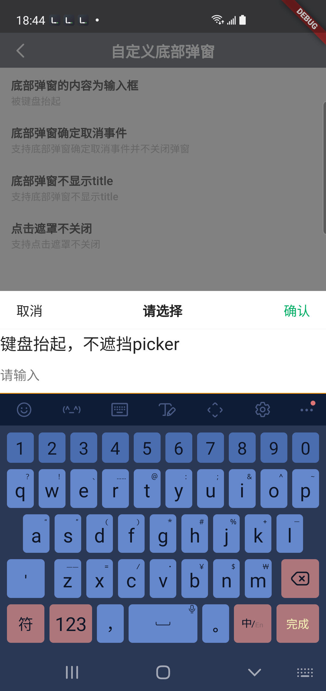
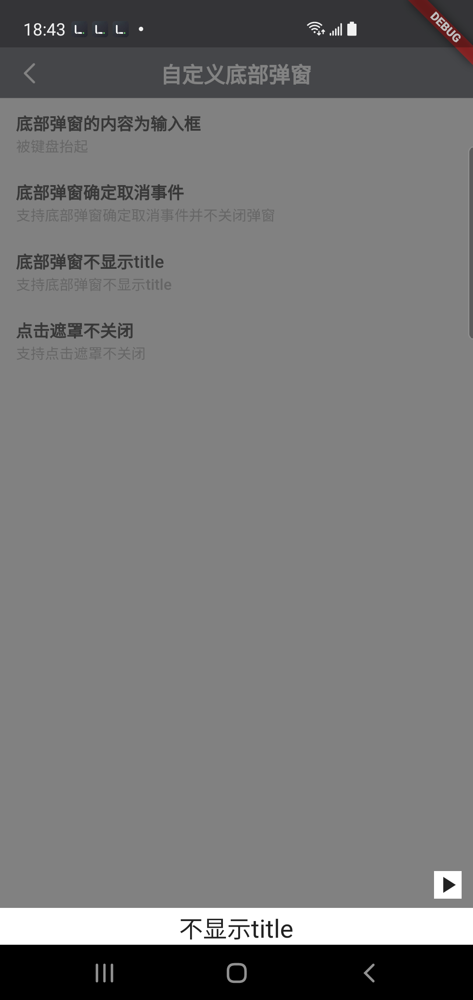

## BrnBottomPicker

自定义的从底部弹出的picker框，支持高度的自定义（内容、头部）。解决了picker中有输入框，键盘遮挡等问题。

## 一、效果总览


<br/>



## 二、描述

解决了普通的picker键盘遮挡以及 Safe 登空的问题。

## 三、构造函数及参数说明

### 调用方法

``` dart
static void show(  
  BuildContext context, {
    required contentWidget,
    String title = '请选择',
    dynamic confirm,
    dynamic cancel,
    VoidCallback? onConfirm,
    VoidCallback? onCancel,
    bool barrierDismissible = true,
    bool showTitle = true,
})
```


### 参数说明

| 参数名 | 参数类型 | 作用 | 是否必填 | 默认值 |
| --- | --- | --- | --- | --- |
| context | BuildContext | 弹窗上下文 | 是 | 无 |
| contentWidget | Widget | 内容的显示UI | 是 | 无 |
| title | String | Picker的标题 | 否 | 请选择 |
| confirm | dynamic | 标题的确认按钮UI，支持传入String或者Widget，默认是确认 | 否 | 确认 |
| cancel | dynamic | 标题的取消按钮UI，支持传入String或者Widget，默认是确认 | 否 | 取消 |
| onConfirm | VoidCallback? | 确认按钮点击的回调 | 否 | 否 |
| onCancel | VoidCallback? | 取消按钮点击的回道 | 否 | 否 |
| rightTextColor | Color | 右侧文案 Color | 否 | 主题色 |
| cursorColor | Color | 光标颜色 | 否 | 主题色 |
| barrierDismissible | bool | 点击对话框外部 是否取消对话框 | 否 | true |
| showTitle | bool | 是否展示标题 | 否 | true |

## 四、效果及代码展示

###  效果1: 标题+输入框


```dart
BrnBottomPicker.show(context,  
  barrierDismissible: false,  
  contentWidget: Column(  
    mainAxisSize: MainAxisSize.min,  
    crossAxisAlignment: CrossAxisAlignment.start,  
    children: <Widget>[  
      Text(  
        '键盘抬起，不遮挡picker',  
        style: TextStyle(  
          color: BrunoColor.instance.F0Color,  
          fontSize: 20,  
        ),  
      ),  
      TextField(  
        decoration: InputDecoration(hintText: '请输入'),  
      )  
    ],  
));
```

### 效果2: 标题+输入框


```dart
BrnBottomPicker.show(context,  
  showTitle: false,  
  contentWidget: Column(  
    mainAxisSize: MainAxisSize.min,  
    crossAxisAlignment: CrossAxisAlignment.start,  
    children: <Widget>[  
      Text(  
        '不显示title',  
        style: TextStyle(  
          color: BrunoColor.instance.F0Color,  
          fontSize: 20,  
        ),  
      ),  
    ],  
));
```