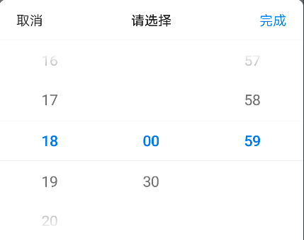
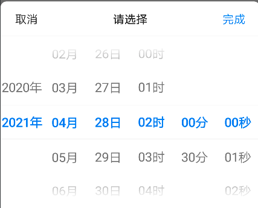

# BrnDatePicker

可用于页面底部弹出选择【单个】时间点的情况。

## 一、效果总览


<br/>

<br/>


## 二、描述

### 适用场景简介

1. 时间选择弹框，适用于从底部弹出的情况，属于 Picker；

2. 可自定义显示的时间格式：年-月-日、年-月-日-时-分。通过 dateFormat 参数进行设置，例如：dateFormat: 'yyyy年,MMMM月,dd日'

### 注意事项

一般通过showDatePicker函数唤起 Picker 的弹出。

## 三、构造函数及参数说明
### 构造函数

```dart
static void showDatePicker(
  BuildContext context, {
  bool rootNavigator = false,
  bool? canBarrierDismissible,
  DateTime? minDateTime,
  DateTime? maxDateTime,
  DateTime? initialDateTime,
  String? dateFormat,
  int minuteDivider: 1,
  DateTimePickerLocale locale: DATETIME_PICKER_LOCALE_DEFAULT,
  BrnDateTimePickerMode pickerMode: BrnDateTimePickerMode.date,
  BrnPickerTitleConfig pickerTitleConfig,
  DateVoidCallback? onCancel,
  DateVoidCallback? onClose,
  DateValueCallback? onChange,
  DateValueCallback? onConfirm,
  BrnPickerConfig? themeData,
}) 
```

### 参数说明

| 参数名 | 参数类型 | 描述 | 是否必填 | 默认值 |
| --- | --- | --- | --- | --- |
| context | Buildcontext |  | 是 |  |
| rootNavigator | bool | 是否使用根路由 | 否 | false |
| canBarrierDismissible | bool? | 点击弹框外部区域能否消失 | 否 |  |
| initialDateTime | DateTime? | 初始选择的时间 | 否 | 当前时间 |
| minDateTime | DateTime? | 能滚动到的最小日期 | 否 | minDateTime ≤ maxDateTime |
| maxDateTime | DateTime? | 能滚动到的最大日期 | 否 | minDateTime ≤ maxDateTime |
| locale | DateTimePickerLocale | 设置本地语言 | 否 | DateTimePickerLocale.zh\_cn |
| pickerMode | BrnDateTimePickerMode | 时间选择组件显示的时间类型 | 否 | BrnDateTimePickerMode.date |
| pickerTitleConfig | BrnPickerTitleConfig | 时间选择组件的主题样式 | 否 | BrnPickerTitleConfig.Default |
| dateFormat | String? | 时间格式化的格式 | 是 |  |
| onConfirm | DateValueCallback? | 点击【完成】回调给调用方的数据 | 否 |  |
| onCancel | DateVoidCallback? | 点击【取消】回调给调用方的回调事件 | 否 |  |
| onClose | DateVoidCallback? | 弹框点击外围消失的回调事件 | 否 |  |
| onChange | DateValueCallback? | 时间滚动选择时候的回调事件 | 否 |  |
| minuteDivider | int | 分钟间切换的差值 | 否 | 1 |
| themeData | BrnPickerConfig? | picker配置 配置详见BrnPickerConfig | 否 |  |

 

## 四、代码展示

### 效果1

 


```dart
BrnDatePicker.showDatePicker(context,
  maxDateTime: DateTime.parse(MAX_DATETIME),
  minDateTime: DateTime.parse(MIN_DATETIME),
  initialDateTime: DateTime.parse('2020-01-01 18:26:59'),
      // 支持DateTimePickerMode.date、DateTimePickerMode.datetime、DateTimePickerMode.time
  pickerMode: DateTimePickerMode.date,
  minuteDivider: 30,
  pickerTitleConfig: BrnPickerTitleConfig.Default,
  dateFormat: format, onConfirm: (dateTime, list) {
    BrnToast.show("onConfirm:  $dateTime   $list", context);
  }, 
	onClose: () {
    print("onClose");
  }, 
	onCancel: () {
    print("onCancel");
  }, 
	onChange: (dateTime, list) {
    print("onChange:  $dateTime    $list");
});
```

