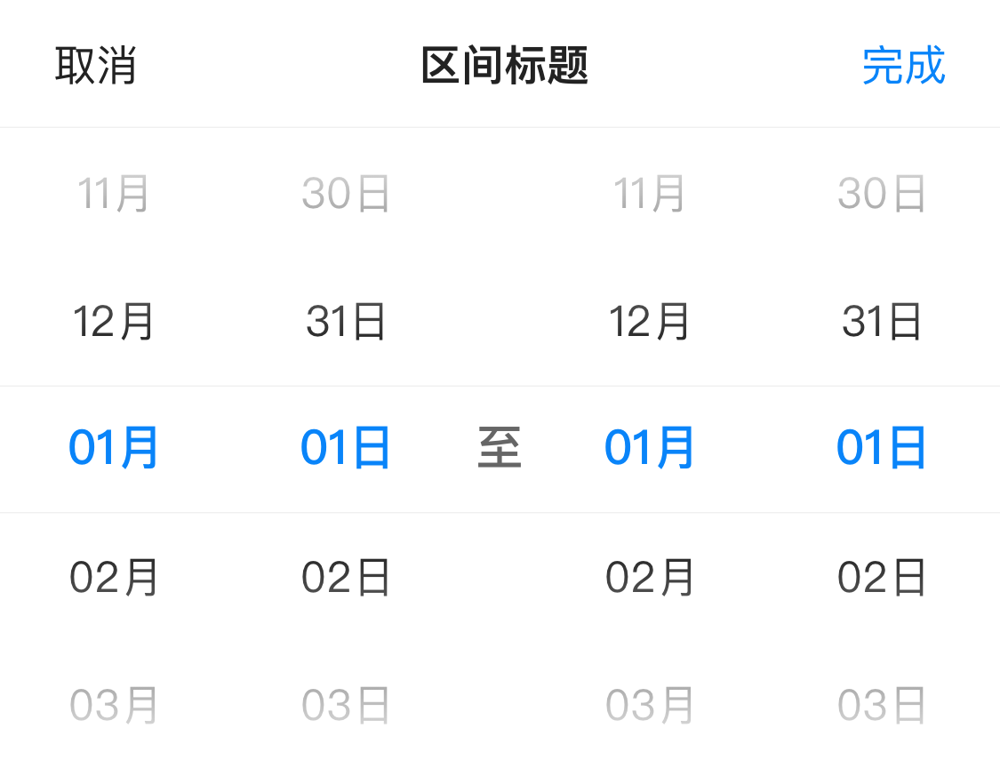

# BrnDateRangePicker

适用于时间范围选择的情况，

## 一、效果图

- 月日时间范围选择效果
 

- 时分时间范围选择效果
 

- yyyy年MM月dd日 时间范围选择效果


## 二、描述

### 适用场景简介

1、日期范围选择。

2、时分范围;可设置 minuteDivider 刻度值，如以十分钟为刻度展示。

3、**注意**：如果是【yyyy年MM月dd日】格式选择时间，可能存在屏幕显示不下的问题。


## 三、构造函数及参数配置

### 构造函数


```dart
static void showDatePicker(  
  BuildContext context, {
    bool isDismissible = true,
    DateTime? minDateTime,
    DateTime? maxDateTime,
    bool isLimitTimeRange = true,
    DateTime? initialStartDateTime,
    DateTime? initialEndDateTime,
    String? dateFormat,
    int minuteDivider = 1,
    DateTimePickerLocale locale = datetimePickerLocaleDefault,
    BrnDateTimeRangePickerMode pickerMode = BrnDateTimeRangePickerMode.date,
    BrnPickerTitleConfig pickerTitleConfig = BrnPickerTitleConfig.Default,
    DateVoidCallback? onCancel,
    DateVoidCallback? onClose,
    DateRangeValueCallback? onChange,
    DateRangeValueCallback? onConfirm,
    BrnPickerConfig? themeData,
  })
```
### 参数配置

| **参数名** | **参数类型** | **作用** | **是否必填** | **默认值** |
| --- | --- | --- | --- | --- |
| isDismissible | bool | 用于控制弹窗是否相应电机外部关闭，true 关闭，false 不关闭 | 否 | true |
| minDateTime? | DateTime | 时间区间最小值 | 否 | "1900-01-01 00:00:00" |
| maxDateTime? | DateTime | 时间区间最大值 | 否 | "2100-12-31 23:59:59" |
| isLimitTimeRange | bool | 是否限制时间选择范围<br />true: 开始时间必须≤结束时间<br />false: 不限制开始时间，结束时间的值大小 | 否 |  true |
| initialStartDateTime | DateTime? | 初始设置选中的开始时间 | 否 | DateTime.now() |
| initialEndDateTime | DateTime? | 初始设置选中的结束时间 | 否 | DateTime.now() |
| dateFormat | String? | 展示格式，仅在pickerMode 为 DateTimeRangePickerMode.date时生效。可设置为”MM月-dd日“、”yyyy-年MM月-dd日“等年月日格式，将数据带上单位显示 | 否 | 'MM-dd' |
| minuteDivider | int | 刻度值，仅在pickerMode 为DateTimeRangePickerMode.time时生效 | 否 | 1 |
| locale | DateTimePickerLocale | 时区 | 否 | DateTimePickerLocale.zh\_cn |
| pickerMode | DateTimeRangePickerMode | 要展示的时间范围选择类型，date 还是 time | 否 | DateTimeRangePickerMode.date |
| pickerTitleConfig | `BrnPickerTitleConfig` | picker title 内容配置 | 否 | BrnPickerTitleConfig.Default |
| onCancel | DateVoidCallback? | 取消回调 | 否 |  |
| onClose | DateVoidCallback? | 关闭回调 | 否 |  |
| onChange | DateRangeValueCallback? | 滚动变化回调 | 否 |  |
| onConfirm | DateRangeValueCallback? | 点击确定选中日期范围回调 | 否 |  |
| themeData | BrnPickerConfig? | 设置 Picker 相关主题 | 否 | BrnDefaultConfigUtils.defaultAllConfig.pickerConfig |

### 其它数据结构

`BrnPickerTitleConfig` 时间范围主题类，用于设置 Picker 的 文案，样式


```dart
const BrnPickerTitleConfig({  
  this.cancel, /// 取消 widget，默认文案【取消】  
  this.confirm,/// 确认 widget，默认文案【完成】  
  this.title,  /// Title widget。  
  this.showTitle: DATETIME_PICKER_SHOW_TITLE_DEFAULT, /// 是否展示 title，默认true 展示  
  this.titleContent:"请选择" /// Title 文案
});  
```


## 四、效果及代码展示


### 效果1: 日期范围选择

  

```dart
String format = 'MM月-dd日';  
String MIN_DATETIME = '2021-01-01 00:00:00';  
String MAX_DATETIME = '2021-12-31 23:59:59';  
BrnPickerTitleConfig pickerTitleConfig = BrnPickerTitleConfig(titleContent: "选择时间范围");
BrnDateRangePicker.showDatePicker(context,  
 canBarrierDismissible: false,  
 minDateTime: DateTime.parse(MIN_DATETIME),  
 maxDateTime: DateTime.parse(MAX_DATETIME),  
 pickerMode: DateTimeRangePickerMode.date,  
 pickerTheme: pickerTitleConfig,  
 dateFormat: format,  
 initialStartDateTime: DateTime(2021, 06, 21, 11, 00, 00),  
 initialEndDateTime: DateTime(2021, 06, 23, 10, 00, 00),  
 onConfirm: (startDateTime, endDateTime, startlist, endlist) {  
   BrnToast.show("onConfirm:  $startDateTime   $endDateTime     $startlist     $endlist", context);  
 }, onClose: () {  
 	print("onClose");  
 }, onCancel: () {  
 	print("onCancel");  
 },   
   onChange: (startDateTime, endDateTime, startlist, endlist) {  
 	BrnToast.show("onChange:  $startDateTime   $endDateTime     $startlist     $endlist", context);  
 });  

```

### 效果2: 时间范围选择

  

```dart
String format = 'HH时:mm分';
const String MIN_DATETIME = '2021-01-01 00:00:00';
const String MAX_DATETIME = '2021-12-31 23:59:59';
BrnPickerTitleConfig pickerTitleConfig = BrnPickerTitleConfig(titleContent: "选择时间范围");
BrnDateRangePicker.showDatePicker(context,
    minDateTime: DateTime.parse(MIN_DATETIME),
    maxDateTime: DateTime.parse(MAX_DATETIME),
    pickerMode: mode,
    minuteDivider: 10,
    pickerTitleConfig: pickerTitleConfig,
    dateFormat: format,
///  设置不限制开始时间必须≤结束时间
///  isLimitTimeRange: false,  
    initialStartDateTime: DateTime(2021, 06, 21, 08, 00, 00),
    initialEndDateTime: DateTime(2021, 06, 23, 10, 00, 00),
    onConfirm: (startDateTime, endDateTime, startlist, endlist) {
  BrnToast.show(
      "onConfirm:  $startDateTime   $endDateTime     $startlist     $endlist", context);
}, onClose: () {
  print("onClose");
}, onCancel: () {
  print("onCancel");
}, onChange: (startDateTime, endDateTime, startlist, endlist) {
  BrnToast.show(
      "onChange:  $startDateTime   $endDateTime     $startlist     $endlist", context);
});
```


### 效果3: 日期范围选择,其他格式

  

```dart
String format = 'yyyy年-MM月-dd日';  
BrnPickerTitleConfig pickerTitleConfig = BrnPickerTitleConfig(titleContent: "选择时间范围");
BrnDateRangePicker.showDatePicker(context,
    isDismissible: false,
    minDateTime: DateTime(2010, 06, 01, 00, 00, 00),
    maxDateTime: DateTime(2029, 07, 24, 23, 59, 59),
    pickerMode: BrnDateTimeRangePickerMode.date,
    minuteDivider: 10,
    pickerTitleConfig: pickerTitleConfig,
    dateFormat: format,
    initialStartDateTime: DateTime(2020, 06, 21, 11, 00, 00),
    initialEndDateTime: DateTime(2020, 06, 23, 10, 00, 00),
    onConfirm: (startDateTime, endDateTime, startlist, endlist) {
  BrnToast.show(
      "onConfirm:  $startDateTime   $endDateTime     $startlist     $endlist", context);
}, onClose: () {
  print("onClose");
}, onCancel: () {
  print("onCancel");
}, onChange: (startDateTime, endDateTime, startlist, endlist) {
  BrnToast.show(
      "onChange:  $startDateTime   $endDateTime     $startlist     $endlist", context);
});
```
