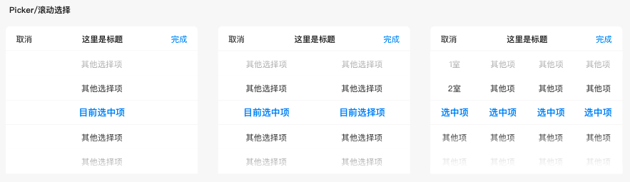
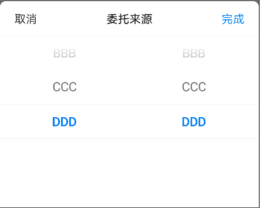

# BrnMultiDataPicker

适用于单列或者多列数据选择的情况

## 一、效果总览



## 二、描述

### 适用场景

1. 滚动选择组件，支持1列、2列、多列，适用于从底部弹出的情况。

2. 支持自定义滚动文本的样式设置等。

## 三、构造函数及参数配置

### 构造函数


```dart
BrnMultiDataPickerWidget(  
 {Key? key,
      required this.context,
      required this.delegate,
      this.title = "",
      this.titleTextStyle,
      this.confirmTextStyle,
      this.cancelTextStyle,
      this.pickerTitles,
      this.pickerTitleFontSize,
      this.pickerTitleColor,
      this.textFontSize,
      this.textColor,
      this.textSelectedColor,
      this.behavior,
      this.confirmClick,
      this.createItemWidget,
      this.themeData,
      this.sync = true})
```

### 参数说明

| 参数名 | 参数类型 | 描述 | 是否必填 | 默认值 |
| --- | --- | --- | --- | --- |
| context | Buildcontext |  | 是 |  |
| delegate | BrnMultiDataPickerDelegate | 滚动组件每一列、每一行的具体内容设置，自定义delegate继承这个类，实现具体方法。 | 是 |  |
| title | String | 滚动选择弹框的标题 | 否 | "" |
| titleTextStyle | TextStyle? | 标题样式 | 否 |  |
| confirmTextStyle | TextStyle? | 确认文案样式 | 否 |  |
| cancelTextStyle | TextStyle? | 取消文案样式 | 否 |  |
| pickerTitles | `List<String>?` | 多级数据选择每一级的默认标题 | 否 | 无 |
| pickerTitleFontSize | double? | 多级数据选择每一级默认标题的字体大小 | 否 | 16 |
| pickerTitleColor | Color? | 多级数据选择每一级默认标题的文案颜色 | 否 | Color(0XFF4A4E59) |
| textFontSize | double? | 多级数据选择数据字体大小 | 否 | 18 |
| textColor | Color? | 多级数据选择数据文案颜色 | 否 | Color(0xff222222) |
| textSelectedColor | Color? | 多级数据选择数据选中文案颜色 | 否 |  |
| behavior | ScrollBehavior? | 选择轮盘的滚动行为 | 否 |  |
| confirmClick | ConfirmButtonClick? | 点击【完成】回调数据给调用方 | 否 |  |
| createItemWidget | BrnMultiDataPickerCreateWidgetCallback? | 返回自定义itemwidget | 否 |  |
| sync | bool | 是否复位数据位置 | 否 | true |
| themeData | BrnPickerConfig? | Picker配置类，配置详情见BrnPickerConfig | 否 |  |

### 其它数据

1. 自定义的填充滚动选择的数据结构（如果是1列只使用list一级数据即可，例如：营销活动、呼叫中心、社区广告...；如果是2列需要使用list一级和二级数据；如果是3列需要使用list中所有数据；更多列需要定义更深层级数据）。


```dart
List<Map<String, List>> list = [  
  {  
    '活动1': [  
      {  
        '活动1-x': ['8', '9']  
      }  
    ]  
  },  
  {  
    '活动二': [  
      {  
        '活动二-x': ['5', '6']  
      }  
    ]  
  },  
  {  
    '活动三': [  
      {  
        '活动三-x': ['3', '4']  
      }  
    ]  
  },  
  {  
    '活动四': [  
      {  
        '活动四-x': ['1', '2']  
      },  
      {  
        '活动四-y': ['11111', '22222']  
      }  
    ]  
  }  
];  
```
2. 自定义Delegate的示例代码（这里使用的list就是1中定义的list）

```dart
class Brn1RowDelegate implements BrnMultiDataPickerDelegate {  
  int firstSelectedIndex = 0;  
  int secondSelectedIndex = 0;  
  int thirdSelectedIndex = 0;  
  
  Brn1RowDelegate({this.firstSelectedIndex = 0, this.secondSelectedIndex = 0});  
  
  @override  
  int numberOfComponent() {  
    return 1;  
  }  
  
  @override  
  int numberOfRowsInComponent(int component) {  
    if (0 == component) {  
      return list.length;  
    } else if (1 == component) {  
      Map<String, List> secondMap = list[firstSelectedIndex];  
      return secondMap.values.first.length;  
    } else {  
      Map<String, List> secondMap = list[firstSelectedIndex];  
      Map<String, List> thirdMap =  
      secondMap.values.first[secondSelectedIndex];  
      return thirdMap.values.first.length;  
    }  
  }  
  
  @override  
  String titleForRowInComponent(int component, int index) {  
    if (0 == component) {  
      return list[index].keys.first;  
    } else if (1 == component) {  
      Map<String, List> secondMap = list[firstSelectedIndex];  
      List secondList = secondMap.values.first;  
      //return secondList[index];  
      return secondList[index].keys.first;  
    } else {  
      Map<String, List> secondMap = list[firstSelectedIndex];  
      Map<String, List> thirdMap =  
      secondMap.values.first[secondSelectedIndex];  
      return thirdMap.values.first[index];  
    }  
  }  
  
  @override  
  double? rowHeightForComponent(int component) {  
    return PICKER_ITEM_HEIGHT;  
  }  
  
  @override  
  selectRowInComponent(int component, int row) {  
    if (0 == component) {  
      firstSelectedIndex = row;  
    } else if (1 == component) {  
      secondSelectedIndex = row;  
    } else {  
      thirdSelectedIndex = row;  
      print ('_thirdSelectedIndex  is selected to $thirdSelectedIndex');  
    }  
  }  
  @override  
  int initSelectedRowForComponent(int component) {  
    if (0 == component) {  
      return firstSelectedIndex;  
    }  
    return 0;  
  }  
}
```
## 四、代码展示

注意示例代码中，Brn1RowDelegate、Brn2RowDelegate 需要自行实现。参考 Demo 代码。

### 效果1：单列滚动选择


```dart
BrnMultiDataPicker(
  context: context,
  title: '来源',
  delegate: Brn1RowDelegate(firstSelectedIndex: 1),
  confirmClick: (list) {
    BrnToast.show(list.toString(), context);
  },
).show(); 
```


```dart
List<Map<String, List>> list = [
  {
    'AAA': [
      {
        'AAA': ['8', '9']
      }
    ]
  },
  {
    'BBB': [
      {
        'BBB': ['5', '6']
      }
    ]
  },
  {
    'CCC': [
      {
        'CCC': ['3', '4']
      }
    ]
  },
  {
    'DDD': [
      {
        'DDD': ['1', '2']
      },
      {
        'DDD1': ['EEE1', 'EEE2']
      }
    ]
  }
];
```
```dart
class Brn1RowDelegate implements BrnMultiDataPickerDelegate {
  int firstSelectedIndex = 0;
  int secondSelectedIndex = 0;
  int thirdSelectedIndex = 0;

  Brn1RowDelegate({this.firstSelectedIndex = 0, this.secondSelectedIndex = 0});

  @override
  int numberOfComponent() {
    return 1;
  }

  @override
  int numberOfRowsInComponent(int component) {
    if (0 == component) {
      return list.length;
    } else if (1 == component) {
      Map<String, List> secondMap = list[firstSelectedIndex];
      return secondMap.values.first.length;
    } else {
      Map<String, List> secondMap = list[firstSelectedIndex];
      Map<String, List> thirdMap = secondMap.values.first[secondSelectedIndex];
      return thirdMap.values.first.length;
    }
  }

  @override
  String titleForRowInComponent(int component, int index) {
    if (0 == component) {
      return list[index].keys.first;
    } else if (1 == component) {
      Map<String, List> secondMap = list[firstSelectedIndex];
      List secondList = secondMap.values.first;
      return secondList[index].keys.first;
    } else {
      Map<String, List> secondMap = list[firstSelectedIndex];
      Map<String, List> thirdMap = secondMap.values.first[secondSelectedIndex];
      return thirdMap.values.first[index];
    }
  }

  @override
  double? rowHeightForComponent(int component) {
    return null;
  }

  @override
  selectRowInComponent(int component, int row) {
    if (0 == component) {
      firstSelectedIndex = row;
    } else if (1 == component) {
      secondSelectedIndex = row;
    } else {
      thirdSelectedIndex = row;
      print('_thirdSelectedIndex  is selected to $thirdSelectedIndex');
    }
  }

  @override
  int initSelectedRowForComponent(int component) {
    if (0 == component) {
      return firstSelectedIndex;
    }
    return 0;
  }
}
```


### 效果2：双列-联动



```dart
BrnMultiDataPicker(
  context: context,
  title: '委托来源',
  delegate: Brn2RowDelegate(firstSelectedIndex: 1, secondSelectedIndex: 0),
  confirmClick: (list) {
    BrnToast.show(list.toString(), context);
  },
).show();
```

```dart
class Brn2RowDelegate implements BrnMultiDataPickerDelegate {
  int firstSelectedIndex = 0;
  int secondSelectedIndex = 0;
  int thirdSelectedIndex = 0;

  Brn2RowDelegate({this.firstSelectedIndex = 0, this.secondSelectedIndex = 0});

  @override
  int numberOfComponent() {
    return 2;
  }

  @override
  int numberOfRowsInComponent(int component) {
    if (0 == component) {
      return list.length;
    } else if (1 == component) {
      Map<String, List> secondMap = list[firstSelectedIndex];
      return secondMap.values.first.length;
    } else {
      Map<String, List> secondMap = list[firstSelectedIndex];
      Map<String, List> thirdMap = secondMap.values.first[secondSelectedIndex];
      return thirdMap.values.first.length;
    }
  }

  @override
  String titleForRowInComponent(int component, int index) {
    if (0 == component) {
      return list[index].keys.first;
    } else if (1 == component) {
      Map<String, List> secondMap = list[firstSelectedIndex];
      List secondList = secondMap.values.first;
      return secondList[index].keys.first;
    } else {
      Map<String, List> secondMap = list[firstSelectedIndex];
      Map<String, List> thirdMap = secondMap.values.first[secondSelectedIndex];
      return thirdMap.values.first[index];
    }
  }

  @override
  double? rowHeightForComponent(int component) {
    return null;
  }

  @override
  selectRowInComponent(int component, int row) {
    if (0 == component) {
      firstSelectedIndex = row;
    } else if (1 == component) {
      secondSelectedIndex = row;
    } else {
      thirdSelectedIndex = row;
      print('_thirdSelectedIndex  is selected to $thirdSelectedIndex');
    }
  }

  @override
  int initSelectedRowForComponent(int component) {
    if (0 == component) {
      return firstSelectedIndex;
    } else if (1 == component) {
      return secondSelectedIndex;
    } else if (2 == component) {
      print('_thirdSelectedIndex  is selected to $thirdSelectedIndex');
      return thirdSelectedIndex;
    }
    return 0;
  }
}
```

```dart
List<Map<String, List>> list = [
  {
    'AAA': [
      {
        'AAA': ['8', '9']
      }
    ]
  },
  {
    'BBB': [
      {
        'BBB': ['5', '6']
      }
    ]
  },
  {
    'CCC': [
      {
        'CCC': ['3', '4']
      }
    ]
  },
  {
    'DDD': [
      {
        'DDD': ['1', '2']
      },
      {
        'DDD1': ['EEE1', 'EEE2']
      }
    ]
  }
];
```

### 效果3：双列-无联动


```dart
BrnMultiDataPicker(
  sync: false,
  context: context,
  title: '委托来源',
  delegate: Brn2RowCustomDelegate(firstSelectedIndex: 1, secondSelectedIndex: 0),
  confirmClick: (list) {
    BrnToast.show(list.toString(), context);
  },
).show();
```

```dart
class Brn2RowCustomDelegate implements BrnMultiDataPickerDelegate {
  int firstSelectedIndex = 0;
  int secondSelectedIndex = 0;

  Brn2RowCustomDelegate({this.firstSelectedIndex = 0, this.secondSelectedIndex = 0});

  @override
  int numberOfComponent() {
    return 2;
  }

  @override
  int numberOfRowsInComponent(int component) {
    if (0 == component) {
      return list.length;
    } else {
      return list.length;
    }
  }

  @override
  String titleForRowInComponent(int component, int index) {
    if (0 == component) {
      return list[index].keys.first;
    } else {
      return list[index].keys.first;
    }
  }

  @override
  double? rowHeightForComponent(int component) {
    return null;
  }

  @override
  selectRowInComponent(int component, int row) {
    if (0 == component) {
      firstSelectedIndex = row;
    } else {
      secondSelectedIndex = row;
    }
  }

  @override
  int initSelectedRowForComponent(int component) {
    if (0 == component) {
      return firstSelectedIndex;
    }
    return secondSelectedIndex;
  }
}
```

```dart
List<Map<String, List>> list = [
  {
    'AAA': [
      {
        'AAA': ['8', '9']
      }
    ]
  },
  {
    'BBB': [
      {
        'BBB': ['5', '6']
      }
    ]
  },
  {
    'CCC': [
      {
        'CCC': ['3', '4']
      }
    ]
  },
  {
    'DDD': [
      {
        'DDD': ['1', '2']
      },
      {
        'DDD1': ['EEE1', 'EEE2']
      }
    ]
  }
];
```

### 效果4：三列-有联动


```dart
BrnMultiDataPicker(
  context: context,
  title: '委托来源',
  delegate: Brn3RowDelegate(
      firstSelectedIndex: 1, secondSelectedIndex: 0, thirdSelectedIndex: 0),
  confirmClick: (list) {
    BrnToast.show(list.toString(), context);
  },
).show();
```

```dart
class Brn3RowDelegate implements BrnMultiDataPickerDelegate {
  int firstSelectedIndex = 0;
  int secondSelectedIndex = 0;
  int thirdSelectedIndex = 0;

  Brn3RowDelegate({
    this.firstSelectedIndex = 0,
    this.secondSelectedIndex = 0,
    this.thirdSelectedIndex = 0,
  });

  @override
  int numberOfComponent() {
    return 3;
  }

  @override
  int numberOfRowsInComponent(int component) {
    if (0 == component) {
      return list.length;
    } else if (1 == component) {
      Map<String, List> secondMap = list[firstSelectedIndex];
      return secondMap.values.first.length;
    } else {
      Map<String, List> secondMap = list[firstSelectedIndex];
      Map<String, List> thirdMap = secondMap.values.first[secondSelectedIndex];
      return thirdMap.values.first.length;
    }
  }

  @override
  String titleForRowInComponent(int component, int index) {
    if (0 == component) {
      return list[index].keys.first;
    } else if (1 == component) {
      Map<String, List> secondMap = list[firstSelectedIndex];
      List secondList = secondMap.values.first;
      //return secondList[index];
      return secondList[index].keys.first;
    } else {
      Map<String, List> secondMap = list[firstSelectedIndex];
      Map<String, List> thirdMap = secondMap.values.first[secondSelectedIndex];
      return thirdMap.values.first[index];
    }
  }

  @override
  double rowHeightForComponent(int component) {
    return null;
  }

  @override
  selectRowInComponent(int component, int row) {
    if (0 == component) {
      firstSelectedIndex = row;
    } else if (1 == component) {
      secondSelectedIndex = row;
    } else {
      thirdSelectedIndex = row;
      print('_thirdSelectedIndex  is selected to $thirdSelectedIndex');
    }
  }

  @override
  int initSelectedRowForComponent(int component) {
    if (0 == component) {
      return firstSelectedIndex;
    } else if (1 == component) {
      return secondSelectedIndex;
    } else if (2 == component) {
      print('_thirdSelectedIndex  is selected to $thirdSelectedIndex');
      return thirdSelectedIndex;
    }
    return 0;
  }
}
```

```dart
List<Map<String, List>> list = [
  {
    'AAA': [
      {
        'AAA': ['8', '9']
      }
    ]
  },
  {
    'BBB': [
      {
        'BBB': ['5', '6']
      }
    ]
  },
  {
    'CCC': [
      {
        'CCC': ['3', '4']
      }
    ]
  },
  {
    'DDD': [
      {
        'DDD': ['1', '2']
      },
      {
        'DDD1': ['EEE1', 'EEE2']
      }
    ]
  }
];
```
