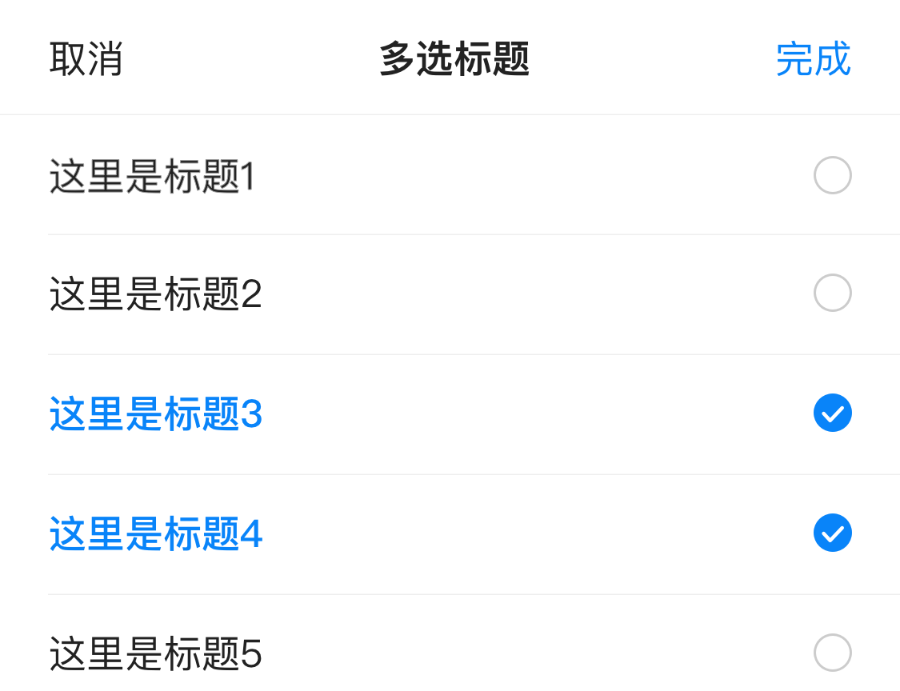

# BrnMultiSelectListPicker

多选底部弹框 ，适用于从页面底部弹出，存在多选列表的情况。

相似组件有：

[BrnMultiSelectTagsPicker](../widgets/brn-multi-select-tags-picker)从底部弹出的 Tag 样式多选。

[BrnMultiSelectDialog](../widgets/brn-multi-select-dialog) 从页面中部弹出多选弹窗。

## 一、效果总览



## 二、描述

### 适用场景

1. 多选列表，适用于从底部弹出的情况，属于 Picker
2. 可设置默认选中状态

## 三、构造函数及参数配置

### 构造函数

```dart
BrnMultiSelectListPicker({
    Key? key,
    this.title,
    required this.items,
    this.pickerTitleConfig = BrnPickerTitleConfig.Default,
    this.onSubmit,
    this.onCancel,
    this.onItemClick,
  }) : super(key: key);
```

### 参数说明

| 参数名            | 参数类型                                                     | 作用                                                         | 是否必填 | 默认值                       |
| ----------------- | ------------------------------------------------------------ | ------------------------------------------------------------ | -------- | ---------------------------- |
| items             | `List<BrnMultiSelectBottomPickerItem>`                       | 数据源                                                       | 是       |                              |
| pickerTitleConfig | BrnPickerTitleConfig                                         | 设置 Picker 主题                                             | 否       | BrnPickerTitleConfig.Default |
| onSubmit          | `BrnMultiSelectListPickerSubmit = bool Function(List<BrnMultiSelectBottomPickerItem> checkedItems)?` | 点击【完成】时回调给外部选中的数据                           | 否       |                              |
| onItemClick       | `BrnMultiSelectListPickerItemClick = void Function(BuildContext context, int index)?` | Item 被点击的回调                                            | 否       |                              |
| isDismissible     | bool                                                         | 是否可电机外部关闭弹窗，true 点击外部关闭弹窗。只在`show`方法里才有 | 否       | true                         |
| onCancel          | VoidCallback?                                                | 点击取消时的回调                                             | 否       |                              |

### 其它数据结构

`BrnMultiSelectBottomPickerItem` 多选 Item 数据结构

```dart
class BrnMultiSelectBottomPickerItem{
 String code; //选项编号
 String content; //选项内容
 bool isChecked; //是否选中
 MultiSelectBottomPickerItem(this.code, this.content,{ this.isChecked:false});
}
```

`BrnPickerTitleConfig` 数据配置

```dart
BrnPickerTitleConfig({
  this.cancel,
  this.confirm,
  this.title,
  this.showTitle: PICKER_SHOW_TITLE_DEFAULT,
  this.titleContent,
});
```

## 四、效果及代码展示

### 效果 1: 页面底部 Picker 多选


```dart
List<BrnMultiSelectBottomPickerItem> items = [];
items.add(new BrnMultiSelectBottomPickerItem("100", "这里是标题1"));
items.add(new BrnMultiSelectBottomPickerItem("101", "这里是标题2"));
items.add(new BrnMultiSelectBottomPickerItem("102", "这里是标题3", isChecked: true));
items.add(new BrnMultiSelectBottomPickerItem("103", "这里是标题4", isChecked: true));
items.add(new BrnMultiSelectBottomPickerItem("104", "这里是标题5"));
items.add(new BrnMultiSelectBottomPickerItem("104", "这里是标题6"));

BrnMultiSelectListPicker.show(
  context,
  items: items,
  pickerTitleConfig: BrnPickerTitleConfig(titleContent: "多选 Picker"),
  onSubmit: (List<BrnMultiSelectBottomPickerItem> data) {
    var str = "";
    data.forEach((item) {
      str = str + item.content + "  ";
    });
    BrnToast.show(str, context);
    Navigator.of(context).pop();
  },
);
```

### 效果 2：页面底部 Picker 多选，限制多选数目，并手动触发 UI 更新


```dart
List<BrnMultiSelectBottomPickerItem> items = [];
items.add(new BrnMultiSelectBottomPickerItem("100", "这里是标题1"));
items.add(new BrnMultiSelectBottomPickerItem("101", "这里是标题2"));
items.add(new BrnMultiSelectBottomPickerItem("102", "这里是标题3", isChecked: true));
items.add(new BrnMultiSelectBottomPickerItem("103", "这里是标题4", isChecked: true));
items.add(new BrnMultiSelectBottomPickerItem("104", "这里是标题5"));
items.add(new BrnMultiSelectBottomPickerItem("104", "这里是标题6"));

showModalBottomSheet(
  context: context,
  backgroundColor: Colors.transparent,
  builder: (BuildContext dialogContext) {
    return StatefulBuilder(builder: (_, setState) {
      return BrnMultiSelectListPicker(
        pickerTitleConfig: BrnPickerTitleConfig(titleContent: "多选 Picker"),
        items: items,
        onItemClick: (_, index) {
          if (items.where((element) => element.isChecked).length > 3) {
            BrnToast.showAutoGravity("选择数目超过了 3 个", context);
            items[index].isChecked = false;
            setState(() {});
          }
        },
        onSubmit: (List<BrnMultiSelectBottomPickerItem> data) {
          var str = "";
          data.forEach((item) {
            str = str + item.content + "  ";
          });
          BrnToast.show(str, context);
          Navigator.of(context).pop();
        },
        onCancel: () {
          BrnToast.show('自定义 cancel 回调', context);
        },
      );
    });
  },
);
```

### 效果 3：页面底部 Picker 多选，自定义数据协议


```dart
List<ExpendMultiSelectBottomPickerItem> items = [];
items.add(new ExpendMultiSelectBottomPickerItem("100", "这里是标题1",attribute1: "第一条自定义参数1"));
items.add(new ExpendMultiSelectBottomPickerItem("101", "这里是标题2",attribute1: "第二条自定义参数2"));
items.add(new ExpendMultiSelectBottomPickerItem("102", "这里是标题3", isChecked: true,attribute1: "第三条自定义参数3"));
items.add(new ExpendMultiSelectBottomPickerItem("103", "这里是标题4", isChecked: true));
items.add(new ExpendMultiSelectBottomPickerItem("104", "这里是标题5"));
items.add(new ExpendMultiSelectBottomPickerItem("104", "这里是标题6"));
BrnMultiSelectListPicker.show<ExpendMultiSelectBottomPickerItem>(
  context,
  items: items,
  pickerTitleConfig: BrnPickerTitleConfig(titleContent: "多选 Picker"),
  onSubmit: (List<ExpendMultiSelectBottomPickerItem> data) {
    var str = "";
    data.forEach((item) {
      String attribute = item.attribute1 ?? ""; //处理自定义字段
      str = str + attribute;
    });
    BrnToast.show(str, context);
    Navigator.of(context).pop();
  },
);
```


自定义数据协议（继承基类：BrnMultiSelectBottomPickerItem）

```dart
class ExpendMultiSelectBottomPickerItem extends BrnMultiSelectBottomPickerItem {
  final String? attribute1;
  final String? attribute2;
  final String? attribute3;
  String code; //选项编号
  String content; //选项内容
  bool isChecked; //是否选中

  ExpendMultiSelectBottomPickerItem(
    this.code,
    this.content, {
    this.attribute1,
    this.attribute2,
    this.attribute3,
    this.isChecked = false,
  }) : super(code, content, isChecked: isChecked);
}
```
