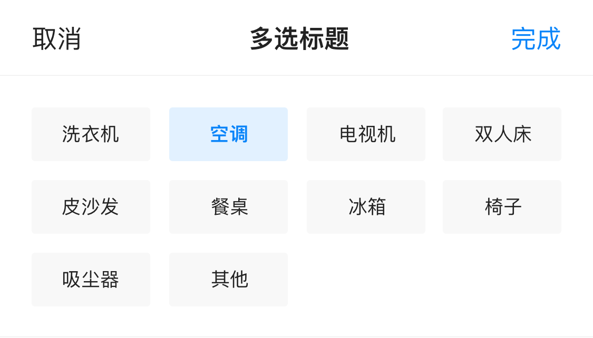

# BrnMultiSelectTagsPicker 

适用于底部弹出 Picker，且选择样式为 Tag 的场景。

### 一、效果总览

 

## 二、描述

### 适用场景

多选标签弹框，适用于从底部弹出的情况，属于 Picker；可自定义标题、默认选中、字体大小等。

## 三、构造函数及参数说明

### 构造函数


```dart
BrnMultiSelectTagsPicker({
    Key? key,
    required this.context,
    required this.onConfirm,
    this.onCancel,
    required this.tagPickerConfig,
    required this.onTagValueGetter,
    this.onMaxSelectClick,
    this.onItemClick,
    this.maxSelectItemCount = 0,
    this.crossAxisCount,
    this.itemHeight = 34.0,
    this.layoutStyle = BrnMultiSelectTagsLayoutStyle.average,
    BrnPickerTitleConfig pickerTitleConfig = BrnPickerTitleConfig.Default,
    BrnPickerConfig? themeData,
  })
```
### 参数说明

| 参数名 | 参数类型 | 描述 | 是否必填 | 默认值 |
| --- | --- | --- | --- | --- |
| context | Buildcontext |  | 是 |  |
| onConfirm | ValueChanged | 点击【完成】时回调给外部选中的数据 | 是 |  |
| onCancel | VoidCallback? | 点击【取消】时回调给外部的事件 | 否 |  |
| tagPickerConfig | BrnTagsPickerConfig | 设置弹框的tags数据，配置详情见BrnTagsPickerConfig | 否 | |
| onTagValueGetter | TagValueGetter | 传入的泛型数据转换为字符串 以填充Widget | 是 |  |
| crossAxisCount | int? | 一行展示多少个item | 否 |  |
| maxSelectItemCount | int | 最大选中多少个item | 否 | 0 |
| layoutStyle | BrnMultiSelectTagsLayoutStyle | 枚举.等分布局流式布局 | 否 | BrnMultiSelectTagsLayoutStyle.average |
| onMaxSelectClick | VoidCallback? | 当点击到最大数目时的点击事件 | 否 |  |
| onItemClick | BrnMultiSelectTagOnItemClick? | 点击某个按钮的回调 | 否 | |
| itemHeight | double | item高度 | 否 | 34.0 |

### 其它数据

`BrnTagsPickerHeaderConfig` 弹框头部信息，用于设置多选弹框的头部信息


```dart
BrnTagsPickerHeaderConfig({
  this.headerHeight = 48,
  this.title = "",
  this.titleColor,
  this.titleFontSize = 18,
  this.confirmTitle = '确定',
  this.confirmColor,
  this.confirmFontSize = 18,
  this.cancelTitle = "取消",
  this.cancelColor,
  this.cancelFontSize = 18,
  this.dividingLineColor,
}) 
```
`BrnTagsPickerConfig`弹框Tag的的数据实体，用于设置弹框Tags的数据内容


```dart
class BrnTagsPickerConfig {
  BrnTagsPickerConfig(
      {this.tagTitleFontSize = 16.0,
      this.tagTitleColor,
      this.selectedTagTitleColor,
      this.tagBackgroudColor,
      this.selectedTagBackgroudColor,
      this.chipPadding,
      this.tagItemSource = const []});

  ///tag 文字大小
  double tagTitleFontSize;

  ///tag 文字颜色
  Color? tagTitleColor;

  ///选中的tag颜色
  Color? selectedTagTitleColor;

  ///tag 背景颜色
  Color? tagBackgroudColor;

  ///选中的颜色
  Color? selectedTagBackgroudColor;

  ///内部item的边距
  EdgeInsets? chipPadding;

  ///数据源
  List<BrnTagItemBean> tagItemSource;
}
```


## 四、代码演示

### 效果1：页面底部Picker多选

 

```dart
///标签选择弹框  
void _showMulSelectTagPicker(BuildContext context) {  
 List tags = [  
   '洗衣机',  
   '电视机',  
   '电冰箱',  
   '双人床',  
   '电茶炉',  
   '洗手池222',  
   '电茶炉333',  
   '洗手池3311',  
   '洗碗机',  
   '挖掘111122机',  
   '抽风机',  
   '可爱多',  
 ];  

 List <BrnTagItemBean>items = [];  
 for (int i = 0; i < tags.length ;i++){  
   String it = tags[i];  
   BrnTagItemBean item = BrnTagItemBean(name: it,code: it,index: i, isSelect: true);  
   items.add(item);  
 }  

 BrnMultiSelectTagsPicker(
    context: context,

    //排列样式 默认 平均分配排序
    layoutStyle: BrnMultiSelectTagsLayoutStyle.average,

    //一行多少个 默认4个
    crossAxisCount: 4,

    //最大选中数目 - 不设置 或者设置为0 则可以全选
    maxSelectItemCount: 5,
    onItemClick: (BrnTagItemBean onTapTag, bool isSelect) {
      BrnToast.show(onTapTag.toString(), context);
    },
    onMaxSelectClick: () {
      BrnToast.show('最大数值不能超过5个', context);
    },
    pickerTitleConfig: BrnPickerTitleConfig(
      titleContent: '多选标题',
    ),
    tagPickerConfig: BrnTagsPickerConfig(
      tagItemSource: items,
      tagTitleFontSize: 12,
      chipPadding: EdgeInsets.only(left: 5, right: 5),
      tagTitleColor: Color(0xFF666666),
      tagBackgroudColor: Color(0xffF8F8F8),
      selectedTagBackgroudColor: Color(0x140984F9),
      selectedTagTitleColor: Color(0xFF0984F9),
    ),
    onConfirm: (value) {
      BrnToast.show(value.toString(), context);
    },
    onCancel: () {
      BrnToast.show('点击了取消按钮', context);
    },
    onTagValueGetter: (choice) {
      return choice.name;
    },
  ).show();
}
```
